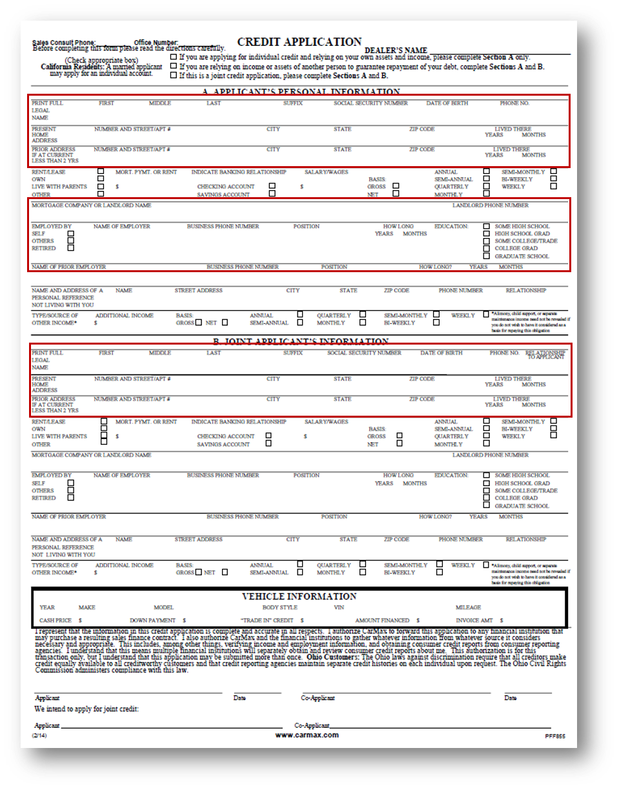
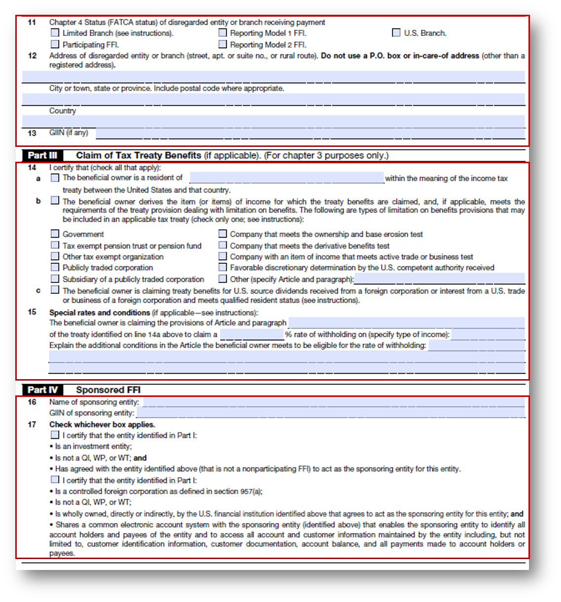
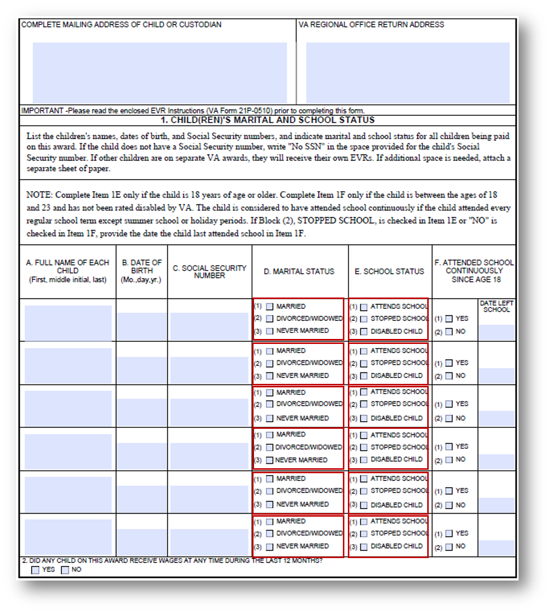

# ベストプラクティスと考慮事項 {#do-not-publish-best-practices-and-considerations}

<!--
[DO NOT PUBLISH]
-->

AEM Forms 自動変換サービスは、PDF フォームをアダプティブフォームに変換します。 このサービスは、人工知能と機械学習アルゴリズムを使用して、ソースフォームのレイアウトとフィールドを理解します。 すべての機械学習サービスは、ソースデータを使用して継続的に学習を行い、すべてのチャーンで改善された出力を生成します。 これらのサービスは、人間と同様に、これまでの経験を基にして学習していきます。

自動フォーム変換サービスは、大量のフォームに基づいて学習していきます。 このサービスにより、ソースフォーム内のフィールドを関単に特定して、アダプティブフォームを生成することができます。 ただし、PDF フォームのフィールドとスタイルには、人間にとっては簡単に区別できても、変換サービスでは認識するのが難しいものもあります。 変換サービスは、正しくないフィールドタイプやパネルを、特定のフィールドやスタイルに割り当てる場合があります。 以下に、こうしたフィールドやスタイルのパターンを示します。

変換サービスは、ソースデータを使用して継続的に学習していくため、ある程度学習が進むと、正しいフィールドやパネルを特定して割り当て、これらのパターンに対応できるようになります。 変換サービスがある程度の学習レベルに到達するまでは、「[レビューと修正](review-correct-ui-edited.md)」エディターを使用して、これらのパターンに対応してください。 以下の説明を読む前に、[アダプティブフォームのコンポーネント](https://helpx.adobe.com/jp/experience-manager/6-5/forms/using/introduction-forms-authoring.html)について理解してください。

## 一般 {#general}

<table border="1" cellpadding="1" cellspacing="0" style="border-collapse: separate; border-spacing: 0px;" width="100%"> 
 <tbody>
  <tr>
   <td width="30%">既知のパターンとその解決方法</td> 
   <td width="70%">例</td> 
  </tr>
   <td>
<strong>パターン</strong>
 
入力済みの PDF フォームがアダプティブフォームに変換されない。
 
 
 
<strong>解決方法</strong>
 
空のアダプティブフォームを使用してください。
 </td> 
   <td style="text-align: left;"></td> 
  </tr>
  <tr>
   <td>
<strong>パターン</strong>
 
複雑なフォーム内のテキストやフィールドが認識されない。
 
 
 
<strong>解決方法</strong>
 
複雑なフォームのテキストとフィールドの幅を広げてから、変換処理を実行してください。
 </td> 
   <td style="text-align: left;"></td> 
  </tr>
  <tr>
   <td>
<strong>パターン</strong>
 
スキャンされたフォームを使用できない。
 
 
 
<strong>解決方法</strong>
 
スキャンされたフォームは使用しないでください。 
 </td> 
   <td></td> 
  </tr>
  <tr>
   <td>
<strong>パターン</strong>
 
画像とその画像内のテキストが抽出されない。 
 
 
 
<strong>解決方法</strong>
 
変換後のフォームに画像とテキストを手動で追加してください。
 </td> 
   <td></td> 
  </tr>
  <tr>
   <td>
<strong>パターン</strong>
 
点線や不明瞭な境界線（または不明瞭な枠線）が含まれているテーブルが変換されない。
 
<strong>解決方法</strong>
 
境界線や枠線が明確に設定されているテーブルを使用してください。  
 </td> 
   <td></td> 
  </tr>
 </tbody>
</table>

## 選択グループ  {#choice-group}

<table border="1" cellpadding="1" cellspacing="0" width="100%"> 
 <tbody>
  <tr>
   <td width="30%">パターン</td> 
   <td width="70%">例</td> 
  </tr>
  <tr>
   <td>
<strong>パターン</strong>
 
四角形と円以外の形状を持つ選択グループのオプションが、対応するアダプティブフォームのコンポーネントに変換されない。 
 
 
 
<strong>解決方法</strong>
 
選択グループオプションの形状を四角形または円に変更するか、「レビューと修正」エディターを使用して、選択グループオプションの形状を特定してください。
 </td> 
   <td> </td> 
  </tr>
 </tbody>
</table>

## フォームフィールド {#form-fields}

<table border="1" cellpadding="1" cellspacing="0" width="100%"> 
 <tbody>
  <tr>
   <td width="30%">パターン</td> 
   <td width="70%">例</td> 
  </tr>
  <tr>
   <td width="25%">
<strong>パターン</strong>
 
境界線が不明瞭なフィールドが認識されない。
 
 
 
<strong>解決方法</strong>
 
「レビューと修正」エディターを使用して、こうしたフィールドを特定してください。
 
 
 
 
 </td> 
   <td width="50%">  </td> 
  </tr>
  <tr>
   <td>
<strong>パターン</strong>
 
下部または右側にキャプションが付いている一部のフォームフィールドが識別されない。
 
 
 
<strong>解決方法</strong>
 
「レビューと修正」エディターを使用して、こうしたフィールドを特定してください。
 </td> 
   <td>    </td> 
  </tr>
  <tr>
   <td>
<strong>パターン</strong>
 
互いに非常に近い位置に配置されているフォームフィールドや、境界線が不明瞭なフォームフィールドに、正しくないタイプが結合されたり割り当てられたりする。 
 
 
 
<strong>解決方法</strong>
 
「レビューと修正」エディターを使用して、こうしたフィールドを特定してください。
 </td> 
   <td></td> 
  </tr>
  <tr>
   <td>
<strong>パターン</strong>
 
離れた位置にキャプションが付いているフィールドや、キャプションと入力フィールドの間に点線が存在するフィールドが認識されない。
 
 
 
<strong>解決方法</strong>
 
境界線が明確に設定されているフォームフィールドを使用するか、「レビューと修正」エディターを使用して、問題のあるフィールドを修正してください。
 </td> 
   <td></td> 
  </tr>
 </tbody>
</table>

## リスト {#lists}

<table border="1" cellpadding="1" cellspacing="0" width="100%"> 
 <tbody>
  <tr>
   <td width="30%">パターン</td> 
   <td width="70%">例</td> 
  </tr>
  <tr>
   <td>
<strong>パターン</strong>
 
フォームフィールドが含まれているリストが結合される、または対応するアダプティブフォームのコンポーネントに変換されない。
 
<strong>解決方法</strong>
 
境界線が明確に設定されているフォームフィールドを使用するか、「レビューと修正」エディターを使用して、問題のあるリストを修正してください。
 </td> 
   <td></td> 
  </tr>
  <tr>
   <td>
<strong>パターン</strong>
 
ネストされた一部のリストが識別されない。
 
 
 
<strong>解決方法</strong>
 
「レビューと修正」エディターを使用して、問題のあるリストを修正してください。
 </td> 
   <td> </td> 
  </tr>
  <tr>
   <td>
<strong>パターン</strong>
 
選択グループが含まれているリスト同士が結合される。
 
<strong>解決方法</strong>
 
「レビューと修正」エディターを使用して、問題のあるリストを修正してください。
 </td> 
   <td> </td> 
  </tr>
 </tbody>
</table>

<!--
Comment Type: draft

<h3>Choice groups</h3>
-->

<!--
Comment Type: draft

<ul>
<li>Lists with form fields, nested lists, and nested choice groups are not supported.</li>
<li>Form fields with captions at bottom or right are not supported.</li>
<li>Form fiields without bordes are not supported.</li>
<li>Hidden form fields are not supported.</li>
<li>Button in PDF forms are not converted to adaptive form buttons.  </li>
<li>Tables with clear explicit boundaries and borders are supported.</li>
<li>Fields with far away captions are not supported.  </li>
<li>Choice groups with only box or circle shaped selectors are supported. </li>
</ul>
-->

