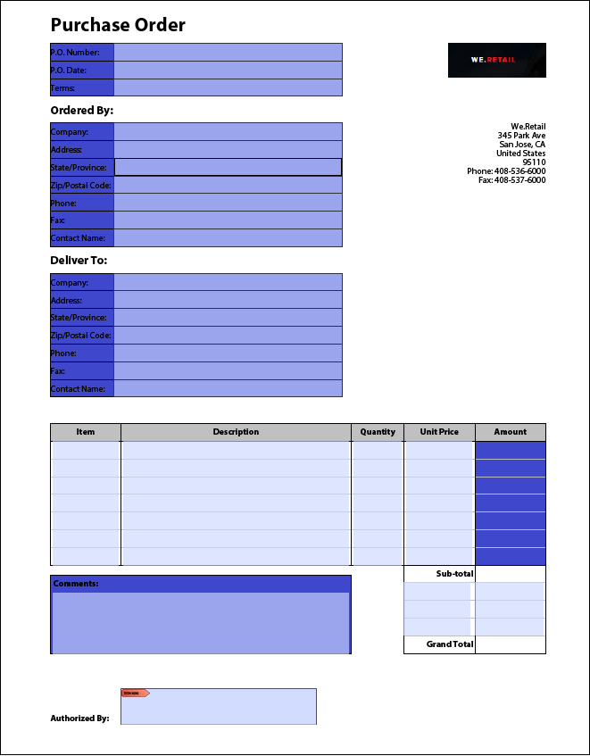
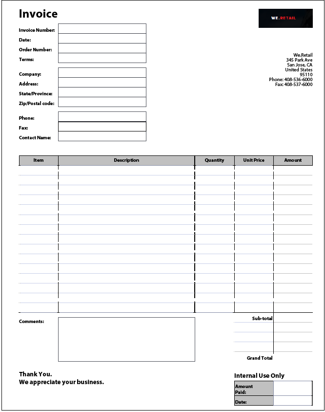
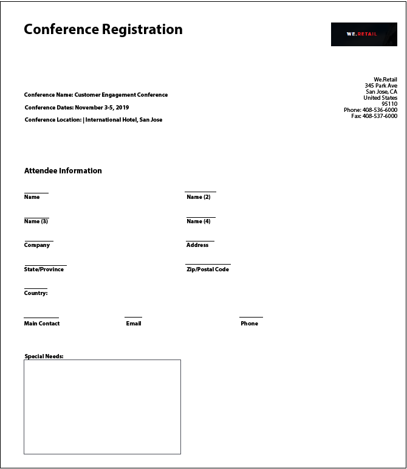

# ベストプラクティスおよび既知の複雑なパターン{#Best-practices-and-considerations2}

This document provides guidelines and recommendations that forms administrator, authors, and developers can benefit from when working with [!DNL Automated Forms Conversion service]. ソースフォームの準備から、自動変換に追加手順を要する複雑なパターンの修正に至るまで、ベストプラクティスを包括的に説明します。 These best practices collectively contribute to the overall performance and output of the [!DNL Automated Forms Conversion service].

## ベストプラクティス

The conversion service converts PDF forms available on your AEM [!DNL Forms] instance to adaptive forms. 以下に示すベストプラクティスは、変換速度と精度の向上に役立ちます。 さらに、これらのベストプラクティスは、変換後のアクティビティにかかる時間の節約に役立ちます。

### ソースをアップロードする前に

必要に応じて、すべての PDF フォームを一度にアップロードすることも、段階的にアップロードすることもできます。 フォームをアップロードする場合は、以下の点に注意してください。

* 1 つのフォルダーに保存するフォームの数は 15 個未満にしてください。また、1 つのフォルダーに保存する合計ページ数は 50 ページ未満にしてください。
* フォルダーのサイズを10 MB未満にします。 サブフォルダー内にフォームを保存しないでください。
* 各フォームのページ数は 15 ページ未満にしてください。
* ソースドキュメントを 8 ～ 15 のドキュメントのバッチに編成します。 共通するアダプティブフォームフラグメントを含むソースフォームを 1 つのバッチで保持します。
* 保護されたフォームをアップロードしないでください。 この変換サービスでは、パスワードで保護されたフォームを変換することはできません。
* [PDF ポートフォリオ](https://helpx.adobe.com/jp/acrobat/using/overview-pdf-portfolios.html)をアップロードしないでください。 この変換サービスでは、PDF ポートフォリオをアダプティブフォームに変換することはできません。
* スキャンされたフォーム、色付きのフォーム、英語以外の言語で作成されたフォーム、フィールドに値が設定されているフォームをアップロードしないでください。こうしたフォームを変換することはできません。
* ファイル名にスペースが含まれているソースファイルをアップロードしないでください。 こうしたファイルをアップロードする場合は、ファイル名に含まれているスペースを削除してからアップロードしてください。

XDP フォームを変換に使用する場合は、ソース XPD フォームをアップロードする前に次の手順を実行します。

* XDP フォームを分析し、視覚的な問題を修正します。 ソースドキュメントが意図したコントロールと構造を使用していることを確認します。 例えば、ソースフォームでは、1 つを選ぶ場合に、ラジオボタンではなくチェックボックスが使用されている場合があります。 チェックボックスをラジオボタンに変更して、意図されたコンポーネントを含むアダプティブフォームを作成します。
* 変換を開始する前に [XDP フォームにバインディングを追加](http://www.adobe.com/go/learn_aemforms_designer_65_jp)します。 ソース XDP フォームでバインディングが使用可能な場合、変換サービスは変換中に対応するアダプティブフォームフィールドにバインディングを自動的に適用します。 バインディングを手動で適用するのに必要な時間を節約できます。
* XDP ファイルに [Adobe Sign タグを追加](https://helpx.adobe.com/jp/sign/using/text-tag.html)します。 このサービスは、Adobe Sign タグを、対応するアダプティブフォームフィールドに自動的に変換します。 アダプティブフォームは、限られた数の Adobe Sign フィールドをサポートしています。 サポートされているフィールドの一覧については、「[アダプティブフォームで Adobe Sign を使用する](https://docs.adobe.com/content/help/jp/experience-manager-65/forms/adaptive-forms-advanced-authoring/working-with-adobe-sign.html)」を参照してください。
* 可能であれば、XDP ドキュメントにある複雑なテーブルを簡単なテーブルに変換します。テーブルセル内のフォームフィールド、サイズが不均等なセル、行または列の連結セル、結合セル、部分的な境界線、または境界線が表示されないテーブルは、複雑なテーブルと見なされます。 上記の項目のいずれかを含むテーブルは、複雑なテーブルと見なされます。
<!-- * Use sub-forms in XDP documents to create panels in adaptive forms. Service converts each sub-form to one or more adaptive form panels during conversion. -->

### 変換を開始する前に

* アダプティブフォームテンプレートを作成します。 テンプレートは、組織または部門のフォームに統一された構造を指定するのに役立ちます。
* アダプティブフォームテンプレートでヘッダーとフッターを指定します。 このサービスでは、ソーステンプレートのヘッダーとフッターが無視され、ドキュメントテンプレートで指定されたヘッダーとフッターが使用されます。
* アダプティブフォームテーマを作成します。テーマは、組織または部門のフォームに統一されたルックアンドフィールを提供するのに役立ちます。
* 保存してデータソースから取得するようにフォームデータモデルを設定します。 フォームデータモデルの読み取りサービスと書き込みサービスを作成して設定します。
* アダプティブフォームフラグメントを作成し、アダプティブフォームフラグメントを使用するようにサービスを設定します。
* ビジネスプロセスの自動化を必要とするフォームに対して、共通のワークフローモデルを準備します。
* 必要に応じて、Adobe Analyticsを設定する

## 既知の複雑なパターン

AEM [!DNL Forms Automated Conversion service] uses artificial intelligence and machine learning algorithms to understand the layout and fields of the source form. すべての機械学習サービスは、ソースデータを使用して継続的に学習を行い、すべてのチャーンで改善された出力を生成します。 これらのサービスは人間のような経験から学ぶ。

[!DNL Automated Forms Conversion service] は、多数のフォームのセットに関するトレーニングを受けています。 このサービスにより、ソースフォーム内のフィールドを関単に特定して、アダプティブフォームを生成することができます。 ただし、PDF フォームのフィールドとスタイルには、人間にとっては簡単に区別できても、変換サービスでは認識するのが難しいものもあります。 このサービスでは、該当するフィールドの種類やパネルとは異なるフィールドやスタイルを割り当てることができます。 以下に、こうしたフィールドやスタイルのパターンを示します。

変換サービスは、ソースデータを使用して継続的に学習していくため、ある程度学習が進むと、正しいフィールドやパネルを特定して割り当て、これらのパターンに対応できるようになります。 変換サービスがある程度の学習レベルに到達するまでは、「[レビューと修正](review-correct-ui-edited.md)」エディターを使用して、これらのパターンに対応してください。 以下の説明を読む前に、[アダプティブフォームのコンポーネント](https://helpx.adobe.com/jp/experience-manager/6-5/forms/using/introduction-forms-authoring.html)について理解してください。

### 一般的なパターン{#general}

| パターン | 例 |
|--- |--- |
| **パターンサービスは**  、色付きのPDFフォームをアダプティブフォームに変換しません。   **解決方法&#x200B;** モノクロまたはグレースケールの PDF フォームを使用してください。 |  |
| **パターンサ** ービスは、入力済みのPDFフォームをアダプティブフォームに変換しません。   **解決方法&#x200B;** 空のアダプティブフォームを使用してください。 |  |
| **パターン**  複雑なフォーム内のテキストやフィールドが認識されない。   **解決方法&#x200B;** 複雑なフォームのテキストとフィールドの幅を広げてから、変換処理を実行してください。 |  |
| **パターン**  スキャンされたフォームを使用できない。   **解決方法&#x200B;** スキャンされたフォームは使用しないでください。 |  |
| **パターン**  画像とその画像内のテキストが抽出されない。   **解決方法&#x200B;** 変換後のフォームに画像とテキストを手動で追加してください。 |  |
| **パターン**  点線や不明瞭な境界線（または不明瞭な枠線）が含まれているテーブルが変換されない。   **解決方法&#x200B;** 境界線や枠線が明確に設定されているテーブルを使用してください。 サポート対象です。 |  |
| **パターン**  ：アダプティブフォームは、標準の縦書きテキストをサポートしていません。 そのため、垂直方向のテキストは対応するアダプティブフォームテキストに変換されません。   **解決方法&#x200B;** 必要な場合はアダプティブフォームエディターを使用し、垂直方向のテキストを追加してください。 |  |

### Choice group  {#choice-group}

| パターン | 解決方法 |
|--- |--- |
| **パターン**   四角形と円以外の形状を持つ選択グループのオプションが、対応するアダプティブフォームのコンポーネントに変換されない。   **解決方法&#x200B;** 選択グループオプションの形状を四角形または円に変更するか、「レビューと修正」エディターを使用して、選択グループオプションの形状を特定してください。 |  |

### フォームフィールド {#form-fields}

| パターン | 解決方法 |
|--- |--- |
| **パターン**   境界線が不明瞭なフィールドが認識されない。   **解決方法&#x200B;** 「レビューと修正」エディターを使用して、こうしたフィールドを特定してください。 |  |
| **パターン**   フォームの下部または右側にキャプションを含む選択グループのフォームフィールドが識別されないことがある。   **解決方法&#x200B;** 「レビューと修正」エディターを使用して、こうしたフィールドを特定してください。 |  |
| **パターン**  サービスは、互いに非常に近くに配置されたフォームフィールドや、明確な境界線を持たない一部のフォームフィールドに誤った種類を結合または割り当てます。   **解決方法&#x200B;** 「レビューと修正」エディターを使用して、こうしたフィールドを特定してください。 |  |
| **パターン**   離れた位置にキャプションが付いているフィールドや、キャプションと入力フィールドの間に点線が存在するフィールドが認識されない。   **解決方法&#x200B;** 境界線が明確に設定されているフォームフィールドを使用するか、「レビューと修正」エディターを使用して、問題のあるリストを修正してください。 |  |

### リスト {#lists}

| パターン | 解決方法 |
|--- |--- |
| **パターン**  フォームフィールドが含まれているリストがマージされる、または対応するアダプティブフォームのコンポーネントに変換されない。  **解決方法&#x200B;** 境界線が明確に設定されているフォームフィールドを使用するか、「レビューと修正」エディターを使用して、問題のあるリストを修正してください。 |  |
| **パターン**  ネストされた一部のリストが認識されない。  **解決方法&#x200B;** 「レビューと修正」エディターを使用して、問題のあるリストを修正してください。 |  |
| **パターン**   選択グループが含まれているリスト同士がマージされる。  **解決方法&#x200B;** 「レビューと修正」エディターを使用して、問題のあるリストを修正してください。 |  |

<!--
Comment Type: draft

<h3>Choice groups</h3>
-->

<!--
Comment Type: draft

<ul>
<li>Lists with form fields, nested lists, and nested choice groups are not supported.</li>
<li>Form fields with captions at bottom or right are not supported.</li>
<li>Form fields without borders are not supported.</li>
<li>Hidden form fields are not supported.</li>
<li>Button in PDF forms are not converted to adaptive form buttons.  </li>
<li>Tables with clear explicit boundaries and borders are supported.</li>
<li>Fields with far away captions are not supported.  </li>
<li>Choice groups with only box or circle shaped selectors are supported. </li>
</ul>
-->
