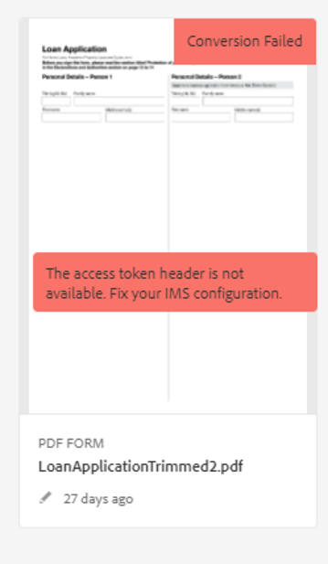
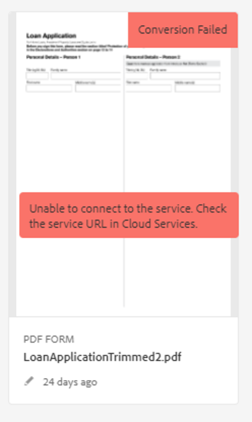

# Automated Forms Conversion Serviceのトラブルシューティング

この記事では、Automated Forms Conversion Serviceの実稼働環境で発生する可能性のある、インストール、設定、管理に関する問題について説明しています。環境 また、このドキュメントでは、基本的なトラブルシューティング手順と、一般的なエラーメッセージの説明も提供されています。

## 一般的なエラー {#commonerrors}

| エラー | 例 |
|--- |--- |
| **エラーメッセージ** :アクセストークン   ・ヘッダーは使用できません。   **理由&#x200B;** 管理者が複数のIMS設定を作成したか、IMS設定がAdobe CloudのAFCSサービスに到達できない。  **解決** ：複数の設定がある場合は、すべての設定を削除し、   新しい設定を作成します 。   設定が1つだけの場合は、を使用して接 **[!UICONTROL Health Check]** 続を確 [認します](configure-service.md#createintegrationoption)。 |  |
| **エラーメッセージ**  ：サービスに接続できません。    **Reason **Incorrect service URL , or no service URL is montioned in Automated Forms Conversion Service cloud services.  **Automated** Forms Conversion Service   Cloudサービスでの解決の正しいサービスURL。 |  |
| **エラーメッセージ**  ：サービスはフォームを変換できませんでした。    **Reason ** Network connectivity issues to your end or the service is down duen ed decured maintenance or outable on Adobe Cloud.  **解決方法**  ：ネットワーク接続に関する問題を解決し、https://status.adobe.com/でサービスの状態を確認し、計画的な停止または予期しない停止が発生したかどうかを確認します。 |  |
| **エラーメッセージ**  ：ページ数が15を超えています。    **理由&#x200B;** ：ソースXDPおよびPDFフォームを含むフォルダーに15個を超えるファイルが含まれています。  **解決**  フォルダー内のフォーム数を15以下にします。 フォルダー内の合計ページ数を50未満にします。 フォルダーのサイズを10 MB未満にします。 サブフォルダー内にフォームを保存しないでください。ソースドキュメントを8 ～ 15個のドキュメントに整理します。 |  |
| **エラーメッセージ**  ：ソースファイルの形式がサポートされていません。    **理由&#x200B;** ：ソースフォームを含むフォルダーに、サポートされていないファイルがいくつか含まれています。  **解決**  ：サービスは.xdpファイルと.pdfファイルのみをサポートします。 その他の拡張子の付いたファイルをフォルダーから削除し、変換を実行します。 |  |
| **Error Message** Scanned forms   are not supported.    **理由&#x200B;** : PDFフォームには、スキャンされたフォームの画像のみが含まれ、コンテンツ構造が含まれていません。  **解決**  ：サービスは、スキャンされたフォームやフォームの画像をアダプティブフォームに変換する機能をサポートしていません。 ただし、Adobe Acrobat を使用して、画像だけのフォームを PDF フォームに変換することはできます。 次に、変換サービスを使用して、この PDF フォームをアダプティブフォームに変換します。 Acrobat で変換を行う場合は、必ず品質の高い画像を使用するようにしてください。 これにより、変換後のフォームの品質が高くなります。 |  |