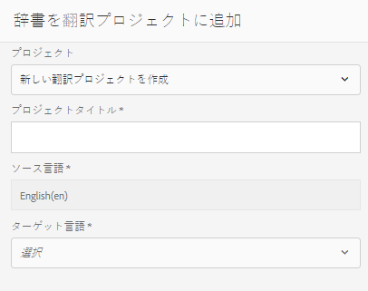

# 自動フォーム変換サービスのトラブルシューティング

ここでは、一般的なエラーの基本的なトラブルシューティング手順について説明します。

<!--The article provides information on installation, configuration and administration issues that may arise in an Automated Forms Conversion Service production environment. -->

## 一般的なエラー {#commonerrors}

| エラー | 例 |
|--- |--- |
| **エラーメッセージ**   アクセストークンヘッダーを使用できません。    **原因**   管理者が複数の IMS 設定を作成しているか、IMS 設定を使用して Adobe Cloud 上 の AFCS サービスにアクセスできません。   **解決方法**   設定が複数存在する場合は、すべての設定を削除して、[新しい設定を作成](configure-service.md#obtainpubliccertificates)してください。   設定が 1 つのみの場合は、 **ヘルスチェック** を使用して、[接続状態を確認](configure-service.md#createintegrationoption)してください。 |  |
| **エラーメッセージ**   サービスに接続できません。    **原因**   サービス URL が正しくないか、自動フォーム変換サービスのクラウドサービスでサービス URL が指定されていません。   **解決方法**   自動フォーム変換サービスのクラウドサービスで[サービス URL](configure-service.md#configure-the-cloud-service) を修正してください。 |  |
| **エラーメッセージ**   フォームの変換が失敗しました。    **原因**   ユーザー側にネットワーク接続の問題が発生しているか、定期メンテナンスのためサービスが停止されているか、Adobe Cloud が停止しています。   **解決方法**   ユーザー側でネットワーク接続の問題を解決し、https://status.adobe.com/ でサービスが（計画的または計画外に）停止されていないか確認してください。 |  |
| **エラーメッセージ**   ページ数が 15 ページを超えています。    **原因**   ソースフォームのページ数が 15 ページを超えています。    **解決方法**   Adobe Acrobat を使用して、15 ページを超えているフォームを分割してください。 各フォームのページ数は 15 ページ未満にしてください。 |  |
| **エラーメッセージ**   ファイル数が 15 個を超えています。    **原因**    フォルダーに 15 個を超えるフォームが含まれています。   **解決方法**   フォルダー内のフォーム数を 15 個以内にしてください。 1 つのフォルダーに保存する合計ページ数は 50 ページ未満にしてください。 フォルダーのサイズは 10 MB 未満にしてください。 サブフォルダー内にフォームを保存しないでください。ソースフォームは 8 ～ 15 個のフォームに編成してください。 |  |
| **エラーメッセージ**   ソースファイル形式がサポートされていません。    **原因**   ソースフォームが含まれているフォルダーには、サポートされていないファイルがいくつか存在します。   **解決方法**   このサービスでは .xdp ファイルと .pdf ファイルのみがサポートされます。 その他の拡張子を持つファイルをフォルダーから削除した後、変換を実行してください。 |  |
| **エラーメッセージ**   スキャンされたフォームはサポートされていません。    **原因**   PDF フォームにスキャンされたフォームの画像のみが含まれており、コンテンツ構造が存在しません。   **解決方法**   スキャンされたフォームや画像だけのフォームを、すぐに使用できる形式のアダプティブフォームに変換することはできません。ただし、Adobe Acrobat を使用して、画像だけのフォームを PDF フォームに変換することはできます。 次に、変換サービスを使用して、この PDF フォームをアダプティブフォームに変換します。 Acrobat で変換を行う場合は、必ず品質の高い画像を使用するようにしてください。 これにより、変換後のフォームの品質が高くなります。 |  |
| **エラーメッセージ**  暗号化された PDF フォームはサポートされていません。    **原因**  フォルダーに暗号化された PDF フォームが含まれています。   **解決方法**   暗号化された PDF フォームをアダプティブフォームに変換することはできません。 暗号を解除し、暗号化されていないフォームをアップロードして、変換を実行してください。 |  |
| **エラーメッセージ**   メタモデル JSON スキーマを解析できません。    **原因**   サービスに使用されている JSON スキーマが正しい形式ではないか、無効な文字が含まれているか、無効な構文を使用してコンポーネントをマッピングしています。    **解決方法**   JSON ファイルの形式を確認してください。 任意のオンライン JSON バリデーターを使用して、スキーマの形式と構造を確認できます。 メタモデル構文の詳細については、「[デフォルトメタモデルの拡張](extending-the-default-meta-model.md)」の記事を参照してください。 |  |
| **エラー（オンプレミス環境のみ）**   「ソー **[!UICONTROL ス言語」オ]** プションにアダプティブフォームの正しい言語がリストされない。  ****   原因アダプティブフォームのjcr:languageプロパティが正しく設定されていません。  ****   解決方法CRX-DE liteを開き、に移動し `/content/forms/af/`てノードを開 `jcr:content` き、ノードの値を正しい言語に設定します。サポートされる言語の一覧については、[サポートされていないロケールのローカライゼーションサポートの追加](https://experienceleague.adobe.com/docs/experience-manager-65/forms/manage-administer-aem-forms/supporting-new-language-localization.html#add-localization-support-for-non-supported-locales)を参照してください。 |  |

<!--

<table>
<thead>
<tr>
<th>Error</th>
<th>Example</th>
</tr>
</thead>
<tbody>
<tr>
<td><strong>Error Message</strong> 
 The access token header is not available. 
 <strong>Reason</strong>   An administrator has created multiple IMS configurations or IMS configuration is not able to reach AFCS service on Adobe Cloud.   <strong>Resolution</strong>   If there are multiple configurations, delete all the configurations and <a href="configure-service.md#obtainpubliccertificates">create a new configuration</a>.   If there is a single configuration, use <strong> Health Check </strong> to <a href="configure-service.md#createintegrationoption">check connectivity</a>.</td>
<td></td>
</tr>
<tr>
<td><strong>Error Message</strong>   Unable to connect to the service.    <strong>Reason</strong>   Incorrect service URL or no service URL is mentioned in Automated Forms Conversion Service cloud services.   <strong>Resolution</strong>   Correct <a href="configure-service.md#configure-the-cloud-service">Service URL</a> in Automated Forms Conversion Service Cloud services.</td>
<td></td>
</tr>
<tr>
<td><strong>Error Message</strong>   The service failed to convert the form.    <strong>Reason</strong>   Network connectivity issues at your end, the service is down due to scheduled maintenance, or outage on Adobe Cloud.   <strong>Resolution</strong>   Resolve network connectivity issues at your end and check the status of the service on <a href="https://status.adobe.com/">https://status.adobe.com/</a> for a planned or unplanned outage.</td>
<td></td>
</tr>
<tr>
<td><strong>Error Message</strong>   The number of pages is more than 15.    <strong>Reason</strong>   The source form is more than 15 pages long.    <strong>Resolution</strong>   Use Adobe Acrobat to split forms with more than 15 pages. Bring the number of pages in a form to less than 15.</td>
<td></td>
</tr>
<tr>
<td><strong>Error Message</strong>   The number of files is more than 15.    <strong>Reason</strong>    The folder contains more than 15 forms.   <strong>Resolution</strong>   Bring the number of forms in a folder to less than or equal to 15. Bring the total number of pages in a folder less than 50. Bring the size of the folder to less than 10 MB. Do not keep forms in a sub-folder. Organize source forms into a batch of 8-15 forms.</td>
<td></td>
</tr>
<tr>
<td><strong>Error Message</strong>   The source file format is not supported.    <strong>Reason</strong>   The folder containing source forms have some unsupported files.   <strong>Resolution</strong>   The service supports only .xdp and .pdf files. Remove files with any other extension from the folder and run the conversion.</td>
<td></td>
</tr>
<tr>
<td><strong>Error Message</strong>   Scanned forms are not supported.    <strong>Reason</strong>   The PDF form contains only scanned images of the form and contains no content structure.   <strong>Resolution</strong>   The service does not support converting scanned forms or an image of a form to an adaptive out-of-the-box. However, you use Adobe Acrobat to convert the image of a form to a PDF Form. Then, use the service to convert the PDF Form to an adaptive form. Always use a high-quality image of the form for conversion in Acrobat. It improves the quality of the conversion.</td>
<td></td>
</tr>
<tr>
<td><strong>Error Message</strong>   Encrypted PDF form is not supported.    <strong>Reason</strong>   The folder contains encrypted PDF forms.   <strong>Resolution</strong>   The service does not support converting an encrypted PDF form to an adaptive form. Remove the encryption, upload the non-encrypted form, and run the conversion.</td>
<td></td>
</tr>
<tr>
<td><strong>Error Message</strong>   Unable to parse meta-model JSON schema.    <strong>Reason</strong>   The JSON schema supplied to the service is not properly formatted, contains invalid characters, or uses invalid syntax to map components.    <strong>Resolution</strong>   Check the formatting of the JSON file. You can use any online JSON validator to check the formatting and structure of the schema. See, <a href="extending-the-default-meta-model.md">Extend the default meta-model</a> article for information on meta-model syntax.</td>
<td></td>
</tr>
</tbody>
</table>
-->
