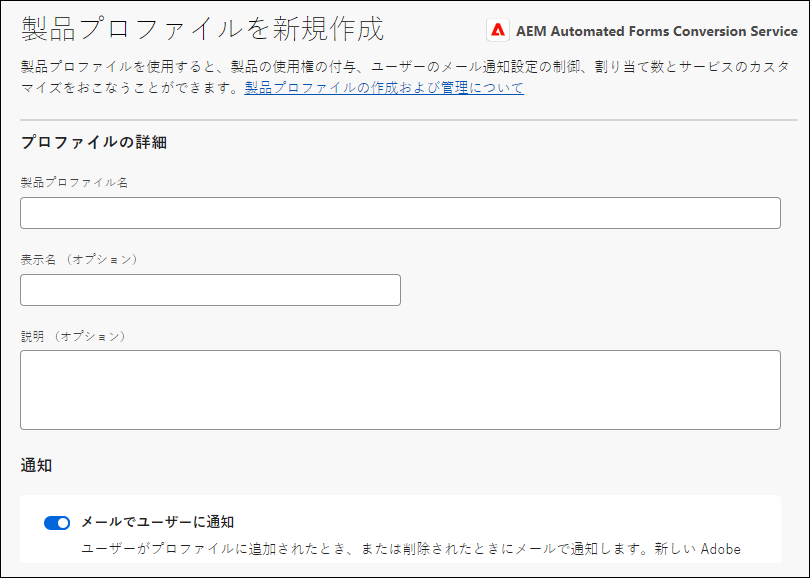
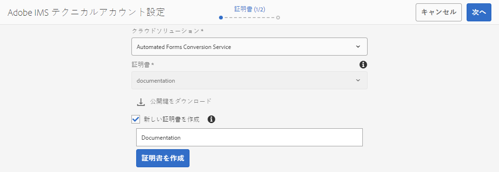
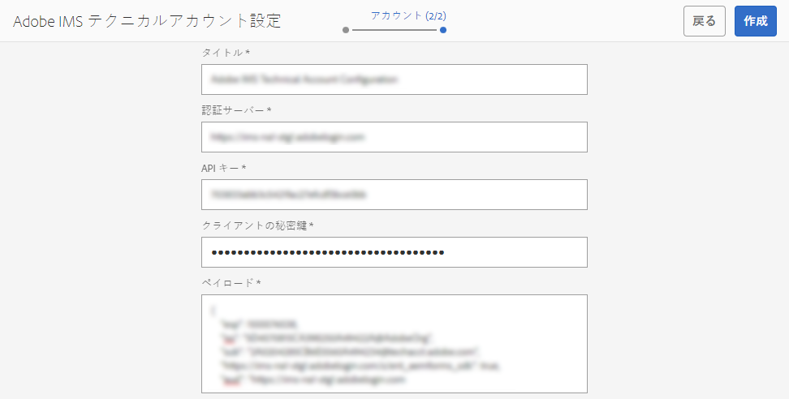
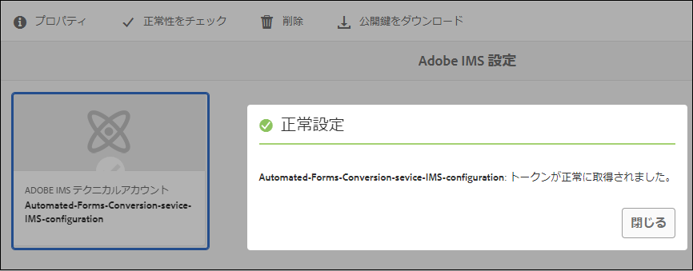

# automated forms conversionサービス（AFCS）の設定 {#about-this-help}

このヘルプでは、AEM管理者がAutomated forms conversionサービス（AFCS）を設定して、アダプティブフォームへのPDF formsの変換を自動化する方法について説明します。 このヘルプ記事は、組織内の IT 管理者と AEM 管理者を対象としています。具体的には、以下の操作に関する十分な知識があるユーザーを対象としています。

* Adobe Experience Manager パッケージと AEM パッケージのインストール、設定、管理

* Linux® オペレーティングシステムと Microsoft® Windows® オペレーティングシステムの使用

* SMTP メールサーバーの設定

<!--- >[!VIDEO](https://video.tv.adobe.com/v/29267/) 

**Watch the video or read the article to configure Automated Forms Conversion service (AFCS)** -->

## オンボーディング {#onboarding}

AEM 6.4 Forms と AEM 6.5 Forms のオンプレミスユーザーと、Adobe Managed Service のエンタープライズユーザーは、自動フォーム変換サービスを無料で使用することができます。変換サービスを使用する場合は、アドビのセールスチームまたはアドビの営業担当者に問い合わせてください。また、AEM Forms as a Cloud Service のお客様は無料でご利用いただけ、事前に有効化されています。

お客様の組織で変換サービスを使用できるように設定し、組織の管理者に対して必要な権限を設定します。必要な権限を設定された管理者は、変換サービスに接続するためのアクセス権限を、組織内の AEM Forms 開発ユーザーに付与することができます。

## 前提条件 {#prerequisites}

automated forms conversionサービス（AFCS）を使用するには、以下が必要です。

* Automated forms conversionサービス （AFCS）が有効になっています
* 変換サービス用の管理者権限が設定された Adobe ID アカウントが作成されていること
* 最新の AEM Service Pack または最新のアップデートを含む AEM 6.4、AEM 6.5、または AEM Forms as a Cloud Service オーサーインスタンスがインストールおよび導入されていること。
* AEM インスタンス上の AEM ユーザーが forms-user グループのメンバーになっていること

## 環境を設定する {#setuptheservice}

変換サービスを使用する前の準備として、Adobe Cloud 上で稼働しているサーバーに AEM オーサーインスタンスを接続する必要があります。このインスタンスの準備を行うには、以下の手順を上から順に実行します。

1. [AEM 6.4 および AEM 6.5 をダウンロードしてインストールするか、AEM Forms as a Cloud Service にオンボーディングする](#aemquickstart)
1. [最新の AEM サービスパックをダウンロードしてインストールする](#servicepack)
1. [最新の AEM Forms アドオンパッケージをダウンロードしてインストールする](#downloadaemformsaddon)
1. （オプション）[最新のコネクターパッケージをダウンロードしてインストールする](#installConnectorPackage)
1. [カスタムのテーマとテンプレートを作成する](#referencepackage)

### AEM 6.4 および AEM 6.5 をダウンロードしてインストールするか、AEM Forms as a Cloud Service をにオンボーディングする {#aemquickstart}


Automated forms conversionサービス（AFCS）は、AEM オーサーインスタンスで実行されます。 AEM オーサーインスタンスを設定するには、AEM 6.4、AEM 6.5、または AEM Forms as a Cloud Service が必要です。

* AEM 6.4 または AEM 6.5 以降が稼働していない場合は、以下の場所からダウンロードしてください。AEM をダウンロードしたら、[デプロイとメンテナンス](https://helpx.adobe.com/jp/experience-manager/6-5/sites/deploying/using/deploy.html#defaultlocalinstall)の説明に従い、AEM オーサーインスタンスの設定を行ってください。

   * 既に AEM を使用している場合は、[アドビライセンス Web サイト](http://licensing.adobe.com)から AEM 6.4 または AEM 6.5 をダウンロードしてください。

   * アドビパートナーの場合は、[アドビパートナートレーニングプログラム](https://adobe.allegiancetech.com/cgi-bin/qwebcorporate.dll?idx=82357Q)から AEM 6.4 または AEM 6.5 を申し込んでください。

* AEM Forms as a Cloud Service をお使いの場合は、[AEM Forms as a Cloud Service](https://experienceleague.adobe.com/docs/experience-manager-forms-cloud-service/forms/setup-environment/setup-forms-cloud-service.html?lang=ja#setup-environment) へのオンボーディングを参照し、[ローカル開発環境](https://experienceleague.adobe.com/docs/experience-manager-forms-cloud-service/forms/setup-environment/setup-local-development-environment.html?lang=ja#setup-environment)を設定します。

### （AEM 6.4 および AEM 6.5 のみ）AEM の最新のサービスパックをダウンロードしてインストールする  {#servicepack}

最新の AEM サービスパックをダウンロードしてインストールしてください。詳しい手順については、「[AEM 6.4 サービスパックリリースノート](https://helpx.adobe.com/jp/experience-manager/6-4/release-notes/sp-release-notes.html)」、「[AEM 6.5 サービスパックリリースノート](https://helpx.adobe.com/jp/experience-manager/6-5/release-notes/sp-release-notes.html)」のいずれかを参照してください。

### （AEM 6.4 および AEM 6.5 のみ）AEM Forms アドオンパッケージをダウンロードしてインストールする  {#downloadaemformsaddon}

AEM インスタンスには、基本的なフォーム機能が付属しています。変換サービスを使用するには、AEM Forms のすべての機能が必要になります。AEM Forms のすべての機能を使用するには、AEM Forms アドオンパッケージをダウンロードしてインストールする必要があります。変換サービスを設定して使用するには、このパッケージが必要になります。詳しい手順については、「[データ取得機能をインストールして設定する](https://helpx.adobe.com/jp/experience-manager/6-5/forms/using/installing-configuring-aem-forms-osgi.html)」を参照してください。

>[!NOTE]
> アドオンパッケージをインストールしたら、設定手順を実行する必要があります。
>

<!-- ### (Optional) Download and install connector package  {#installConnectorPackage}

The connector package provides early access to the [Auto-detect logical sections](convert-existing-forms-to-adaptive-forms.md#run-the-conversion) features and improvements delivered in release AFC-2020.03.1. Do not install the package if you do not require feature and improvements delivered in AFC-2020.03.1.  You can [download the connector package from AEM Package Share](https://www.adobeaemcloud.com/content/marketplace/marketplaceProxy.html?packagePath=/content/companies/public/adobe/packages/cq650/featurepack/AFCS-Connector-2020.03.1). -->


### カスタムのテーマとテンプレートを作成する {#referencepackage}

AEM 6.4 または AEM 6.5 を[実稼動モード](https://helpx.adobe.com/jp/experience-manager/6-5/sites/administering/using/production-ready.html)（nosamplecontent 実行モード）で起動した場合、参照パッケージはインストールされません。参照パッケージには、サンプルのテーマとテンプレートが含まれています。Automated forms conversionサービス（AFCS）では、PDFフォームをアダプティブフォームに変換するために、少なくとも 1 つのテーマと 1 つのテンプレートが必要です。 変換サービスを使用する前に、専用のカスタムテーマとカスタムテンプレートを作成し、それらのテーマとテンプレートを使用するように[変換サービスを設定](#configure-the-cloud-service)してください。

また、[AEM Forms リファレンスアセット](https://experience.adobe.com/#/downloads/content/software-distribution/jp/aemcloud.html)パッケージをダウンロードして、オーサーインスタンスにインストールすることもできます。参照テーマとテンプレートが作成されます。

## サービスの設定 {#configure-the-service}

Adobe Cloud 上で稼働するサービスの設定を行い、そのサービスにローカルインスタンスを接続する前に、サービスの接続時に必要となるユーザーと権限について説明します。サービスを接続する場合、管理者と開発者という 2 種類のユーザーが必要になります。

* **管理者**：管理者は、組織内で使用するアドビソフトウェアとアドビサービスの管理を担当します。管理者は、組織内の開発者に、Adobeクラウド上で動作するAutomated forms conversionサービス（AFCS）に接続するアクセス権を付与します。 管理者を組織に対してプロビジョニングすると、「**[!UICONTROL アドビのソフトウェアとサービスを組織内で管理するための管理者権限が付与されました]**」という内容のメールが管理者に送信されます。管理者は、このタイトルのメールを受信していることを確認し、[組織内の開発者に権限を付与](#adduseranddevs)する必要があります。


* **開発者**：開発者は、ローカルのAEM Forms オーサーインスタンスをAdobeクラウド上で動作するAutomated forms conversionサービス（AFCS）に接続します。 管理者がAutomated forms conversionサービス（AFCS）に接続する権限をデベロッパーに付与すると、「You now have be manage developer API integrations for your organization」というタイトルのメールがデベロッパーに送信されます。このメールには、Adobeの API 統合を管理する権限が付与されています。 開発者は、このタイトルのメールを受信していることを確認し、[ローカルの AEM インスタンスを Adobe Cloud 上の自動フォーム変換サービスに接続](#connectafcadobeio)する必要があります。


### （AEM 6.4 および AEM 6.5 の管理者のみ）組織の開発者にアクセス権を付与する  {#adduseranddevs}

組織と管理者に対する権限の設定が完了したら（この処理はアドビ側で行います）、管理者は、Admin Console にログインしてプロファイルを作成し、そのプロファイルに開発者を追加する必要があります（詳しい手順については、これ以降の説明を参照してください）。開発者は、AEM FormsのローカルインスタンスをAdobeクラウド上のAutomated forms conversionサービス（AFCS）に接続できます。

開発者とは、変換サービスの実行を担当する組織内のメンバーのことです。Adobe開発サービス（AFCS）プロファイルに追加されたAutomated forms conversion者のみが、Automated forms conversionサービス（AFCS）を使用する権限を持ちます。 プロファイルを作成して開発者をそのプロファイルに登録するには、以下の手順を実行します。組織の開発者に必要なアクセスを付与するには、少なくとも 1 つのプロファイルが必要です。

1. [Admin Console](https://adminconsole.adobe.com/) にログインします。使用方法 **Adobe ID** automated forms conversionサービス（AFCS）を使用してログインするためにプロビジョニングされた管理者の それ以外の ID や Federated ID は使用しないでください。
1. 「**[!UICONTROL 自動フォーム変換]**」オプションをクリックします。
1. 「**[!UICONTROL 製品]**」タブで「**[!UICONTROL 新しいプロファイル]**」をクリックします。
1. プロファイルの&#x200B;**[!UICONTROL 名前]**、**[!UICONTROL 表示名]**、**[!UICONTROL 説明]**&#x200B;を入力します。「**[!UICONTROL 完了]**」をクリックします。プロファイルが作成されます。

   

1. プロファイルに開発者を追加します。プロファイルに開発者を追加するには、以下の手順を実行します。
   1. [Admin Console](https://adminconsole.adobe.com/enterprise) で「概要」タブに移動します。
   1. 目的の製品カードで、「**[!UICONTROL 開発者の割り当て]**」をクリックします。
   1. 開発者のメールアドレスを入力し、必要に応じて姓名を入力します。
   1. 製品プロファイルを選択します。「**[!UICONTROL 保存]**」をタップします。

すべての開発者について、上記の手順を繰り返します。  開発者の詳しい追加手順については、「[開発者の管理](https://helpx.adobe.com/jp/enterprise/using/manage-developers.html)」を参照してください。

管理者が Adobe I/O プロファイルに開発者を追加すると、その管理者にメール通知が送信されます。メール通知を受け取った開発者は、[ローカルの AEM Forms インスタンスを Adobe Cloud 上の自動フォーム変換サービスに接続する](#connectafcadobeio)必要があります。

### （開発者向け）ローカルのAEM Forms インスタンスをAdobeクラウド上のAutomated forms conversionサービス（AFCS）に接続する {#connectafcadobeio}

管理者から開発者アクセスが提供されたら、ローカルのAEM Forms インスタンスを、Adobeクラウドで動作しているAutomated forms conversionサービス（AFCS）に接続できます。 AEM Forms インスタンスを変換サービスに接続するには、以下の手順を上から順に実行します。

* [メール通知を設定する](configure-service.md#configureemailnotification)
* [ユーザーを forms-users グループに追加する](#adduserstousergroup)
* [公開証明書を取得する](#obtainpubliccertificates)
* [Adobe デベロッパーコンソールでサービス API を設定する](#createintegration)
* [Cloud Service を設定する](configure-service.md#configure-the-cloud-service)

#### メール通知を設定する {#configureemailnotification}

Automated forms conversionサービス（AFCS）は、Day CQ メールサービスを使用してメール通知を送信します。 このメール通知には、変換処理の成否に関する情報が記載されています。メール通知を受信しない場合は、以下の手順をスキップしてください。Day CQ メールサービスを設定するには、以下の手順を実行します。

* AEM 6.4 Forms または AEM 6.5 Forms の場合：

   1. AEM Configuration Manager（`http://localhost:4502/system/console/configMgr`）に移動します。
   1. Day CQ メールサービスの設定を開きます。「**[!UICONTROL SMTP サーバーのホスト名]**」フィールド、「**[!UICONTROL SMTP サーバーポート]**」フィールド、「**[!UICONTROL 送信元アドレス]**」フィールドの値を指定します。「**[!UICONTROL 保存]**」をクリックします。

      SMTP サーバーのホスト名とポートが不明な場合は、メールサービスプロバイダーまたは IT 部門の管理者に問い合わせてください。「送信元アドレス」フィールドには、任意のメールアドレスを入力することができます。例えば、notification@example.com や donotreply@example.com などのアドレスを入力できます。

   1. 「**[!UICONTROL Day CQ Link Externalizer]**」の設定を開きます。「**[!UICONTROL ドメイン]**」フィールドで、ローカルインスタンス、オーサーインスタンス、パブリッシュインスタンスの実際のホスト名または IP アドレスとポートを指定します。「**[!UICONTROL 保存]**」をクリックします。

* AEM Forms as a Cloud Service の場合、[サポートチケットをログに記録して、メールサービスを有効にします](https://experienceleague.adobe.com/docs/experience-manager-cloud-service/implementing/developing/development-guidelines.html?lang=ja#sending-email)。

#### ユーザーを forms-users グループに追加する {#adduserstousergroup}

変換サービスの実行を許可する AEM ユーザーのプロファイル内でメールアドレスを指定します。このユーザーは、[forms user](https://experienceleague.adobe.com/docs/experience-manager-65/forms/manage-administer-aem-forms/forms-groups-privileges-tasks.html?lang=ja) グループにメンバーとして属している必要があります。変換サービスの実行を許可されたユーザーのメールアドレスにメールが送信されます。ユーザーのメールアドレスを指定し、そのユーザーを forms-user グループに追加するには、以下の手順を実行します。

1. AEM 管理者として、AEM Forms のオーサーインスタンスにログインします。ローカルの AEM 資格情報を使用してログインします。Adobe ID を使用してログインしないでください。**[!UICONTROL Adobe Experience Manager]**／**[!UICONTROL ツール]**／**[!UICONTROL セキュリティ]**／**[!UICONTROL ユーザー]**&#x200B;の順にタップします。

1. 変換サービスの実行を許可するユーザーを選択して「**[!UICONTROL プロパティ]**」をタップします。「ユーザー設定を編集」ページが開きます。
1. 「**[!UICONTROL メール]**」フィールドでメールアドレスを入力して「**[!UICONTROL 保存]**」をタップします。指定のメールアドレスに、変換処理の成否が記載されたメール通知が送信されます。
1. 「**グループ**」タブをタップします。「グループを選択」タブで「**forms-users**」と入力し、このグループを選択します。「**保存して閉じる**」をタップします。これで、ユーザーが forms-users グループのメンバーとして登録されました。

#### （AEM 6.4 および AEM 6.5 のみ）公開証明書を取得する  {#obtainpubliccertificates}

公開証明書により、Adobe I/O でプロファイルを認証できます。

1. AEM Forms オーサーインスタンスにログインします。**[!UICONTROL ツール]**／**[!UICONTROL セキュリティ]**／**[!UICONTROL Adobe IMS 設定]**&#x200B;に移動します。「**[!UICONTROL 作成]**」をタップします。「**[!UICONTROL Adobe IMS テクニカルアカウント設定]**」ページが表示されます。

   

1. クラウドソリューションで「**[!UICONTROL 自動フォーム変換サービス]**」を選択します。

1. 「**[!UICONTROL 新しい証明書を作成]**」チェックボックスを選択してエイリアスを入力します。ここで入力したエイリアスが、ダイアログ名として表示されます。「**[!UICONTROL 証明書の作成]**」をタップします。ダイアログが表示されます。「**[!UICONTROL OK]**」をクリックします。証明書が作成されます。

1. 「**[!UICONTROL 公開鍵をダウンロード]**」をタップし、*AEM-Adobe-IMS.crt* 証明書ファイルをローカルマシンに保存します。この証明書ファイルを使用して、[Adobe デベロッパーコンソールでサービス API を設定](#createintegration)します。「**[!UICONTROL 次へ]**」をタップします。

1. 以下の情報を入力します。

   * 「タイトル」フィールドにタイトルを入力します。
   * 認証サーバー： [https://ims-na1.adobelogin.com](https://ims-na1.adobelogin.com)\

   その他のフィールドは現時点では空白のままにします（後で指定します）。ページは開いたままにしてください。

   <!--
   Comment Type: draft

   <li> </li>
   -->

   <!--
   Comment Type: draft

   <li>Step text</li>
   -->

#### （AEM 6.4 および AEM 6.5 のみ）Adobe デベロッパーコンソールでサービス API を設定  {#createintegration}

automated forms conversionサービス（AFCS）を使用するには、プロジェクトを作成して、Adobe Developer コンソールのプロジェクトに自動Forms設定サービス API を追加します。 この統合環境により、API キー、クライアント秘密鍵、ペイロード（JWT）が生成されます。

1. [https://console.adobe.io/](https://console.adobe.io/) にログインします。Adobe ID と、管理者がプロビジョニングした開発者アカウントを使用して、Adobe I/O コンソールにログインします。
1. 右上隅で組織を選択します。自分がどの組織に属しているかわからない場合は、管理者に問い合わせてください。
1. 「**[!UICONTROL 新規プロジェクトを作成]**」をタップします。新規プロジェクトを作成する画面が表示されます。「**[!UICONTROL API を追加]**」をタップします。お使いのアカウントで有効になっているすべての API を示す画面が表示されます。
1. 「**[!UICONTROL 自動フォーム変換サービス]**」を選択し、「**[!UICONTROL 次へ]**」をタップします。API を設定する画面が表示されます。
1. 「[!UICONTROL 公開鍵をアップロード]」オプションを選択し、「[公開証明書を取得する](#obtainpubliccertificates)」セクションでダウンロードした AEM-Adobe-IMS.crt ファイルをアップロードして、「**[!UICONTROL 次へ]**」をタップします。「新しいサービスアカウント (JWT) を作成」秘密鍵証明書オプションが表示されます。「**[!UICONTROL 次へ]**」をタップします。
1. 製品プロファイルを選択し、「**[!UICONTROL 設定した API を保存]**」をタップします。[組織内の開発者に権限を付与](#adduseranddevs)する際に作成したプロファイルを選択します。選択するプロファイルがわからない場合は、管理者に問い合わせてください。
1. タップ **[!UICONTROL サービスアカウント（JWT）]** API キー、クライアントの秘密鍵、およびローカル AEM インスタンスをAutomated forms conversionサービス（AFCS）に接続するために必要なその他の情報を表示します。 これらの情報を使用して、ローカルマシン上に IMS の設定データが作成されます。

1. ローカルインスタンスで IMS の設定ページを開きます（このページは、「[公開証明書を取得する](#obtainpubliccertificates)」セクションの最後で開いたままにしておいたページです）。

   

1. この画面で、API キーとクライアント秘密鍵を指定します。Adobe デベロッパーコンソールページのサービスアカウント（JWT）で指定した値を使用します。

   >[!NOTE]
   >
   >
   >ペイロードには、Adobe デベロッパーコンソールのサービスアカウント（JWT）ページの「JWT を生成」タブに指定したコードを使用します。

1. 「**[!UICONTROL 保存]**」をタップします。IMS 設定が作成されます。

   >[!CAUTION]
   >
   >IMS 設定は 1 つだけ作成してください。複数の IMS 設定を作成しないでください。

1. 作成した IMS 設定を選択して「**[!UICONTROL ヘルスチェック]**」をタップします。ダイアログボックスが表示されます。「**[!UICONTROL チェック]**」をタップします。接続が成功すると、*トークンが正常に取得された*&#x200B;ことを示すメッセージが表示されます。

   

   <br/> <br/>

#### Cloud Service を設定する {#configure-the-cloud-service}

AEM インスタンスを変換サービスに接続するには、クラウドサービス設定を作成する必要があります。この設定を作成すると、変換用のテンプレート、テーマ、フォームフラグメントも指定できるようになります。フォームの各セットとは独立した複数のクラウドサービス設定を作成することができます。例えば、販売部門用のフォームや顧客サポート用のフォームとは独立した設定を作成することができます。クラウドサービス設定を作成するには、以下の手順を実行します。

1. AEM Forms インスタンスで、**[!UICONTROL Adobe Experience Manager]**／**[!UICONTROL ツール]**／**[!UICONTROL Cloud Services]**／**[!UICONTROL 自動フォーム変換設定]**&#x200B;の順にタップします。
1. **[!UICONTROL Global]** フォルダーをタップしてから「**[!UICONTROL 作成]**」をタップします。自動フォーム変換設定の作成ページが表示されます。Global フォルダー内に変換設定が作成されます。別のフォルダー内に設定を作成することも、フォルダーを作成して設定を保存することもできます。

1. 「**[!UICONTROL 自動フォーム変換設定の作成]**」ページで、以下のフィールドに値を入力して「**[!UICONTROL 次へ]**」をタップします。

   | フィールド | 説明 |
   |--- |--- |
   | タイトル | 一意の設定タイトル。このタイトルが、変換処理を開始する UI に表示されます。 |
   | 名前 | 一意の設定名。この名前で、CRX-Repository ディレクトリに設定が保存されます。設定名と設定タイトルは、同じ値にすることができます。 |
   | サムネイルの場所 | 設定のサムネイルの場所。 |
   | サービス URL | AdobeクラウドのAutomated forms conversionサービス（AFCS）の URL。 「`https://aemformsconversion.adobe.io/`」を入力してください。 |
   | テンプレート | 変換後のフォームに適用されるデフォルトのテンプレート。変換処理を開始する前であれば、いつでも別のテンプレートを指定することができます。テンプレートには、アダプティブフォーム用の基本的な構成情報と初期コンテンツが含まれています。すぐに使用できる一連のテンプレートから、任意のテンプレートを選択することができます。また、カスタムテンプレートを作成することもできます。 |
   | テーマ | 変換後のフォームに適用されるデフォルトのテーマ。変換処理を開始する前であれば、いつでも別のテーマを指定することができます。  アイコンをクリックすると、すぐに使用できるテーマを選択することができます。また、カスタムテーマを作成することもできます。 |
   | 既存のフラグメント | 既存のフラグメントの場所（存在する場合）。 |
   | カスタムメタモデル | カスタムメタモデルの .schema.json ファイルのパス。英語、フランス語、ドイツ語、スペイン語、イタリア語、ポルトガル語の各言語用に個別のメタモデルを作成できます。 |

1. 「**[!UICONTROL 自動フォーム変換設定の作成]**」ページの「**[!UICONTROL 詳細]**」タブで、以下のフィールドに値を入力します。

   <table>
   <thead>
   <tr>
   <th>フィールド</th>
   <th>説明</th>
   </tr>
   </thead>
   <tbody>
   <tr>
   <td >レコードのドキュメントを生成</td>
   <td>変換後のフォームに対してレコードのドキュメントを自動的に生成するには、このオプションを選択します。これは、XFA ベースフォーム（XDP フォームと PDF フォーム）専用のオプションです。このオプションを有効にしてフォームを送信すると、フォームに入力した情報のレコードを、印刷形式またはドキュメント形式で、今後の参照用に保存することができます。これを、レコードのドキュメントといいます。</td>
   </tr>
   <tr>
   <td>Analytics を有効にする</td>
   <td>（AEM 6.4 および AEM 6.5 のみ）変換されたすべてのフォームで Adobe Analytics を有効にする場合は、このオプションを選択します。このオプションを選択する前に、AEM Forms インスタンスで Adobe Analytics が有効になっているかどうかを確認してください。</td>
   </tr>
   </tbody>
   </table>

   * 「.XDP」という拡張子が付いている XFA ベースフォームをソースとして使用する場合、XFA レイアウトが出力 DOR に保存されます。それ以外の場合、変換サービスは付属のテンプレートを使用して、その他の XFA ベースフォーム用の DOR を生成します。
   * XFA フォームを送信すると、そのフォームの送信データが XML 要素または属性として保存されます。例えば、`<Amount currency="USD"> 10.00 </Amount>` のようになります。この場合、「currency」は属性と金額として保存され、「10.00」は要素として保存されます。アダプティブフォームの送信データに含まれているのは要素だけで、属性は含まれていません。そのため、XFA ベースフォームをアダプティブフォームに変換すると、アダプティブフォームの送信データの各属性には要素が保管されます。例：

   ```css
      {
         "Type": "Principal",
   
         "Amount": "10.00",
   
         "currency": "USD"
      }
   ```

1. 「**[!UICONTROL 作成]**」をタップします。クラウド設定が作成されます。これで、AEM Forms インスタンスを使用して、従来のフォームをアダプティブフォームに変換する準備が整いました。
