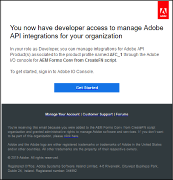
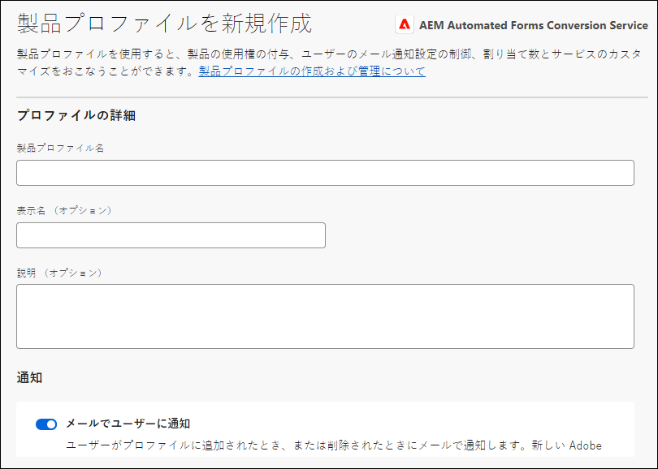
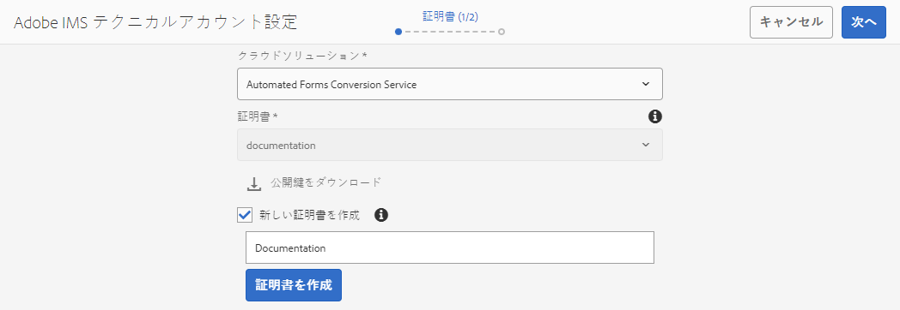

# 自動フォーム変換サービス（AFCS）の設定 {#about-this-help}

この記事では、AEM の管理者が自動フォーム変換サービス（AFCS）を設定して、PDF フォームを自動的にアダプティブフォームに変換する方法について説明します。 この記事は、組織内の IT 管理者と AEM 管理者を対象としています。 提供される情報は、この記事を読んでいる人が次の技術に精通していることを前提としています。

* Adobe Experience Manager パッケージと AEM パッケージのインストール、設定、管理

* Linux® オペレーティングシステムと Microsoft® Windows® オペレーティングシステムの使用

* SMTP メールサーバーの設定
=======
<!--
>[!VIDEO](https://video.tv.adobe.com/v/29267/) 

**Watch the video or read the article to configure Automated Forms Conversion service (AFCS)**
-->

## オンボーディング{#onboarding}

このサービスは、AEM 6.5 FormsおよびAEM 6.5 LTS Forms オンプレミス期間のお客様とAdobe Managed Service エンタープライズ版のお客様が無料で利用できます。 変換サービスを使用する場合は、アドビのセールスチームまたはアドビの営業担当者に問い合わせてください。 また、AEM Forms as a Cloud Service のお客様は無料でご利用いただけ、事前に有効化されています。

お客様の組織で変換サービスを使用できるように設定し、組織の管理者に対して必要な権限を設定します。 必要な権限を設定された管理者は、変換サービスに接続するためのアクセス権限を、組織内の AEM Forms 開発ユーザーに付与することができます。

## 前提条件 {#prerequisites}

自動フォーム変換サービス（AFCS）を使用するには、以下の条件を満たしている必要があります。

* 組織で自動フォーム変換サービス（AFCS）が有効になっていること
* 変換サービス用の管理者権限が設定された Adobe ID アカウントが作成されていること
* 最新のAEM サービスパックまたは最新のアップデートが適用された、稼働中のAEM 6.5、AEM 6.5 LTS、またはAEM Forms as a Cloud Service オーサーインスタンス。
* AEM インスタンス上の AEM ユーザーが forms-user グループのメンバーになっていること

## 環境を設定する {#setuptheservice}

変換サービスを使用する前の準備として、Adobe Cloud 上で稼働しているサーバーに AEM オーサーインスタンスを接続する必要があります。 このインスタンスの準備を行うには、以下の手順を上から順に実行します。


1. [AEM 6.5またはAEM 6.5 LTSをダウンロードしてインストールするか、AEM Forms as a Cloud Serviceをオンボードします](#aemquickstart)
1. （AEM 6.5およびAEM 6.5 LTSの場合のみ） [最新のAEM サービスパックをダウンロードしてインストール &#x200B;](#servicepack)
1. （AEM 6.5およびAEM 6.5 LTSの場合のみ） [最新のAEM Forms アドオンパッケージをダウンロードしてインストール &#x200B;](#downloadaemformsaddon)
1. （オプション） [最新のコネクタパッケージをダウンロードしてインストール &#x200B;](#installConnectorPackage)
1. [カスタムテーマとテンプレートの作成（AEM 6.5 / 6.5 LTS）またはデフォルトの使用（Cloud Service）](#referencepackage)

### AEM 6.5またはAEM 6.5 LTSをダウンロードしてインストールするか、AEM Forms as a Cloud Serviceをオンボードします {#aemquickstart}


自動フォーム変換サービス（AFCS）は、AEM オーサーインスタンス上で稼働します。 AEM オーサーインスタンスを設定するには、AEM 6.5、AEM 6.5 LTS、またはAEM Forms as a Cloud Serviceが必要です。

* AEM 6.5またはAEM 6.5 LTSが稼働していない場合は、以下の場所からダウンロードしてください。 AEM をダウンロードしたら、[デプロイとメンテナンス](https://helpx.adobe.com/jp/experience-manager/6-5/sites/deploying/using/deploy.html#defaultlocalinstall)の説明に従い、AEM オーサーインスタンスの設定を行ってください。

   * 既存のAEMをご利用の場合は、[Adobe ライセンス web サイト &#x200B;](http://licensing.adobe.com)からAEM 6.5またはAEM 6.5 LTSをダウンロードしてください。

   * Adobe パートナーの場合は、[Adobe パートナートレーニング プログラム &#x200B;](https://adobe.allegiancetech.com/cgi-bin/qwebcorporate.dll?idx=82357Q)を使用して、AEM 6.5またはAEM 6.5 LTSをリクエストしてください。

* AEM Forms as a Cloud Service を使用している場合は、[AEM Forms as a Cloud Service](https://experienceleague.adobe.com/docs/experience-manager-forms-cloud-service/forms/setup-environment/setup-forms-cloud-service.html?lang=ja#setup-environment) へのオンボードを参照し、[ローカル開発環境を設定](https://experienceleague.adobe.com/docs/experience-manager-forms-cloud-service/forms/setup-environment/setup-local-development-environment.html?lang=ja#setup-environment)してください。


### （AEM 6.5およびAEM 6.5 LTSの場合のみ） AEMの最新のサービスパックをダウンロードしてインストールします {#servicepack}

最新のAEM サービスパックをダウンロードしてインストールします。 手順について詳しくは、[AEM 6.5 サービスパックリリースノート](https://helpx.adobe.com/experience-manager/6-5/release-notes/sp-release-notes.html)を参照してください。

### （AEM 6.5およびAEM 6.5 LTSのみ）AEM Forms アドオンパッケージをダウンロードしてインストールします  {#downloadaemformsaddon}

AEM インスタンスには、基本的なフォーム機能が付属しています。 変換サービスを使用するには、AEM Forms のすべての機能が必要になります。 AEM Forms のすべての機能を使用するには、AEM Forms アドオンパッケージをダウンロードしてインストールする必要があります。 変換サービスを設定して使用するには、このパッケージが必要になります。 詳細な手順については、[&#x200B; データキャプチャ機能のインストールと設定を参照してください。](https://experienceleague.adobe.com/ja/docs/experience-manager-65/content/forms/install-aem-forms/osgi-installation/installing-configuring-aem-forms-osgi)

>[!NOTE]
> アドオンパッケージをインストールしたら、設定手順を実行する必要があります。
>

<!--
### (Optional) Download and install connector package  {#installConnectorPackage}

The connector package provides early access to the [Auto-detect logical sections](convert-existing-forms-to-adaptive-forms.md#run-the-conversion) features and improvements delivered in release AFC-2020.03.1. Do not install the package if you do not require feature and improvements delivered in AFC-2020.03.1.  You can [download the connector package from AEM Package Share](https://www.adobeaemcloud.com/content/marketplace/marketplaceProxy.html?packagePath=/content/companies/public/adobe/packages/cq650/featurepack/AFCS-Connector-2020.03.1).
-->


### カスタムのテーマとテンプレートを作成 {#referencepackage}

**AEM Forms as a Cloud Service:**&#x200B;すぐに使えるテンプレートを使用するか、カスタム テンプレートを作成して[&#x200B; サービス設定](#configure-the-cloud-service)を指定できます。

**（AEM 6.5およびAEM 6.5 LTSの場合のみ）**&#x200B;自動フォーム変換サービス（AFCS）では、PDF フォームをアダプティブフォームに変換するには、少なくとも1つのテーマと1つのテンプレートが必要です。 コアコンポーネントベースのテンプレートとテーマを使用する場合は、[&#x200B; アダプティブフォームのコアコンポーネントを有効にする](https://experienceleague.adobe.com/docs/experience-manager-65/forms/adaptive-forms-core-components/enable-adaptive-forms-core-components.html?lang=ja)必要があります。手順は、こちらに記載されています。 AEM 6.5またはAEM 6.5 LTSを[実稼動モード &#x200B;](https://helpx.adobe.com/experience-manager/6-5/sites/administering/using/production-ready.html) （nosamplecontent実行モード）で起動した場合、参照パッケージはインストールされません。 独自のカスタムテーマとテンプレートを作成するか、オーサーインスタンスに[AEM Forms参照Assets](https://experience.adobe.com/#/downloads/content/software-distribution/jp/aemcloud.html) パッケージをダウンロードしてインストールし、参照テーマとテンプレートを取得します。 次に、[&#x200B; サービス設定](#configure-the-cloud-service)をポイントして、サービスを使用する前にテンプレートとテーマを使用します。

## アクセスと権限の設定

Adobe Cloud 上で稼働するサービスの設定を行い、そのサービスにローカルインスタンスを接続する前に、サービスの接続時に必要となるペルソナと権限について説明します。 サービスを接続する場合、管理者と開発者という 2 種類のユーザーが必要になります。

* **管理者**：管理者は、組織内で使用するアドビソフトウェアとアドビサービスの管理を担当します。 管理者は、組織内の開発者に、Adobe Cloud 上で実行されている自動フォーム変換サービス（AFCS）に接続するためのアクセス権を付与します。 管理者を組織に対してプロビジョニングすると、「**[!UICONTROL アドビのソフトウェアとサービスを組織内で管理するための管理者権限が付与されました]**」というタイトルのメールが管理者に送信されます。 管理者は、このタイトルのメールを受信していることを確認し、[組織内の開発者に権限を付与](#adduseranddevs)する必要があります。


* **開発者**：開発者は、AEM Forms オーサーインスタンスを Adobe Cloud 上で稼働する自動フォーム変換サービス（AFCS）に接続します。 管理者が開発者に対して自動フォーム変換サービス（AFCS）に接続する権限を付与すると、「組織の Adobe API 統合を管理するための開発者アクセス権が付与されました」というタイトルのメールが開発者に送信されます。 開発者は、このタイトルのメールを受信していることを確認し、[ローカルの AEM インスタンスを Adobe Cloud 上の自動フォーム変換サービスに接続](#connectafcadobeio)する必要があります。



### 組織の開発者へのアクセス権の付与

組織に対するアクセスを有効化と、管理者に対する必要な権限の付与がアドビによって行われたら、管理者は、Admin Console にログインして（詳しい手順については、以下の説明を参照してください）、プロファイルを作成し、そのプロファイルに開発者を追加できます。 開発者は、AEM Forms のインスタンスを Adobe Cloud 上の自動フォーム変換サービス（AFCS）に接続できます。

開発者は、コンバージョンサービスを実行するように指定された組織のメンバーです。Adobe自動フォーム変換サービス（AFCS）プロファイルに追加された開発者のみが、自動フォーム変換サービス（AFCS）を使用する権限を持ちます。
次の手順を実行してプロファイルを作成し、プロファイルに開発者を追加します。組織の開発者に必要なアクセス権を付与するには、少なくとも1つのプロファイルが必要です。

1. [Admin Console](https://adminconsole.adobe.com/) にログインします。 プロビジョニングされた管理者の **Adobe ID** で自動フォーム変換サービス（AFCS）を使用してログインします。
1. 「**[!UICONTROL 自動フォーム変換]**」オプションをクリックします。
1. 「**[!UICONTROL 製品]**」タブで「**[!UICONTROL 新しいプロファイル]**」をクリックします。
1. プロファイルの&#x200B;**[!UICONTROL 名前]**、**[!UICONTROL 表示名]**、**[!UICONTROL 説明]**&#x200B;を入力します。 「**[!UICONTROL 完了]**」をクリックします。 例えば、プロファイルを **AFC_Flamingo_Test_Dev** として作成します。

   

1. プロファイルに開発者を追加します。 プロファイルに開発者を追加するには、以下の手順を実行します。
   1. [Admin Console](https://adminconsole.adobe.com/enterprise) で「概要」タブに移動します。
   1. 目的の製品カードで、「**[!UICONTROL 開発者の割り当て]**」をクリックします。
   1. 開発者のメールアドレスを入力し、必要に応じて姓名を入力します。
   1. 製品プロファイルを選択します。 「**[!UICONTROL 保存]**」をクリックします。

すべての開発者について、上記の手順を繰り返します。 開発者の詳しい追加手順については、「[開発者の管理](https://helpx.adobe.com/jp/enterprise/using/manage-developers.html)」を参照してください。

管理者が Adobe I/O プロファイルに開発者を追加すると、その管理者にメール通知が送信されます（設定されている場合）。

<!--
### Configure email notification for local AEM Forms instance

Automated Forms Conversion service (AFCS) uses the Day CQ mail service to send email notifications. These email notifications contain information about successful or failed conversions. If you choose not receive notification, skip these steps. Perform the following steps to configure the Day CQ Mail Service:

* For AEM 6.5 Forms or AEM 6.5 LTS Forms:

   1. Go to AEM configuration manager at `http://[server]:[port]/system/console/configMgr`
   2. Open the Day CQ Mail Service configuration. Specify a value for the **[!UICONTROL SMTP server host name]**, **[!UICONTROL SMTP server port]**, and **[!UICONTROL From address]** fields. Click **[!UICONTROL Save]**.

      You can contact your email service provider or IT administrator for information about host name and port of SMTP server. You can use any valid email address in the from field. For example, notification@example.com or donotreply@example.com.

   3. Open the **[!UICONTROL Day CQ Link Externalizer]** configuration. In the **[!UICONTROL Domains]** field, specify the actual host name or IP address and port number for local, author, and publish instances. Click **[!UICONTROL Save]**.

* For AEM Forms as a Cloud Service, [log a support ticket to enable the email service](https://experienceleague.adobe.com/docs/experience-manager-cloud-service/implementing/developing/development-guidelines.html?lang=en#sending-email).
-->

### ユーザーを forms-users グループに追加する {#adduserstousergroup}

変換サービスの実行を許可する AEM ユーザーのプロファイル内でメールアドレスを指定します。 ユーザーが **forms-users** グループのメンバーであることを確認してください。 変換サービスの実行を許可されたユーザーのメールアドレスにメールが送信されます。 ユーザーのメールアドレスを指定し、そのユーザーを forms-user グループに追加するには、以下の手順を実行します。

1. AEM 管理者として、AEM Forms のオーサーインスタンスにログインします。 ローカルの AEM 資格情報を使用してログインします。
1. **[!UICONTROL Adobe Experience Manager]**／**[!UICONTROL ツール]**／**[!UICONTROL セキュリティ]**／**[!UICONTROL ユーザー]**&#x200B;をクリックします。
1. 変換サービスを実行するように指定されたユーザーを選択し、「**[!UICONTROL プロパティ]**」をクリックします。 **ユーザー設定を編集**&#x200B;ページが開きます。
1. 「**[!UICONTROL メール]**」フィールドにメールアドレスを指定して、「**[!UICONTROL 保存]**」をクリックします。 指定のメールアドレスに、変換処理の成否が記載されたメール通知が送信されます。

   
1. 「**グループ**」タブをクリックします。 「グループを選択」タブで、**forms-users** グループを入力して選択します。
1. 「**保存して閉じる**」をクリックします。 これで、ユーザーが forms-users グループのメンバーとして登録されました。

#### （AEM 6.5およびAEM 6.5 LTSの場合のみ）公開証明書を取得 {#obtainpubliccertificates}


## Adobe Cloud 上の自動フォーム変換サービス（AFCS）への AEM Forms インスタンスの接続

管理者が開発者アクセス権を付与すると、Adobe Cloudで実行中のAutomated Forms conversion service （AFCS）にAEM Forms インスタンスを接続できます。
AEM Forms インスタンスをAutomated Forms Conversion サービスに接続するには、次の手順を実行します。

[&#x200B;1. Adobe Developer Consoleでのサービス APIの設定](#configure-the-service-apis-on-adobe-developer-console)

[&#x200B;2. Adobe IMS設定の作成](#2-create-adobe-ims-configurations)

[&#x200B;3. 自動フォームコンバージョン設定を作成](#3-create-automated-forms-conversion-configuration)

### &#x200B;1. Adobe Developer Consoleでのサービス APIの設定

Automated Forms Conversion Service （AFCS）を使用するには、プロジェクトを作成し、Adobe Developer Console上のプロジェクトに&#x200B;**Automated Forms Configuration Service** APIを追加します。統合により、API キー、クライアントシークレット、テクニカルアカウント ID、スコープ、組織IDが生成されます。
Adobe Developer Consoleで自動フォーム変換サービス APIを設定するには、次の手順を実行します。

1. https://developer.adobe.com/console にログインします 。 Adobe ID と、管理者がプロビジョニングした開発者アカウントを使用して、Adobe I/O コンソールにログインします。
1. 右上隅で組織を選択します。 自分がどの組織に属しているかわからない場合は、管理者に問い合わせてください。
1. 「**[!UICONTROL 新規プロジェクトを作成]**」をクリックします。 新規プロジェクトを開始する画面が表示されます。

   

1. 「**[!UICONTROL APIを追加]**」をクリックします。アカウントで有効なすべてのAPIのリストが表示される画面が表示されます。
   

1. **[!UICONTROL 自動フォーム変換サービス]**&#x200B;を選択し、**[!UICONTROL 次へ]**&#x200B;をクリックします。APIを設定する画面が表示されます。
   

1. **OAuth サーバー間**&#x200B;認証方式を選択します。
1. **[!UICONTROL 資格情報名]**&#x200B;を指定して、「**[!UICONTROL 次へ]**」をクリックします。
   
1. **製品プロファイル**&#x200B;を作成します。 例えば、プロファイルを **AFC_Flamingo_Test_Dev** として選択します。
1. 「**[!UICONTROL 設定済み API を保存]**」をクリックします。
   

   >[!NOTE]
   >
   > 組織の開発者にアクセス権を付与する際に作成されたプロファイルを選択します。 選択するプロファイルがわからない場合は、管理者に問い合わせてください。

1. 「**[!UICONTROL OAuth サーバー間]**」をクリックすると、AEM インスタンスを自動フォーム変換サービス（AFCS）に接続するのに必要な API キー、クライアント秘密鍵、その他の情報が表示されます。
   

   IMS 設定の作成に使用されるページについて詳しくは、[AEM オーサーインスタンスでの IMS テクニカル設定の作成](#2-create-ims-technical-configuration-on-aem-author-instance)の節を参照してください。

   

### &#x200B;2. Adobe IMS設定の作成


オーサーインスタンスにログインして、Adobe IMS 設定を作成します。 **OAuth 資格情報の詳細**&#x200B;を使用して、API キー、クライアント秘密鍵、テクニカルアカウント ID、スコープ、組織 ID を取得します。

1. AEM Forms オーサーインスタンスにログインします。 **[!UICONTROL ツール]**／**[!UICONTROL セキュリティ]**／**[!UICONTROL Adobe IMS 設定]**&#x200B;に移動します。
1. 「**[!UICONTROL 作成]**」をクリックします。

   

1. 「**[!UICONTROL Adobe IMS テクニカルアカウント設定]**」ページが表示されます。

   
1. **クラウドソリューション**&#x200B;で「**[!UICONTROL 自動フォーム変換サービス]**」を選択します。
1. 以下の情報を入力します。

   * **タイトル**：タイトルを指定します。
   * **認証サーバー**：[https://ims-na1.adobelogin.com](https://ims-na1.adobelogin.com)
   * [Adobe Developer Console でサービス API を設定](#1-configure-the-service-apis-on-adobe-developer-console)の節から次の情報を取得します。
      * **クライアント ID**：**API キー（クライアント ID）**&#x200B;をコピー＆ペーストします。
      * **クライアント秘密鍵**：**クライアント秘密鍵**&#x200B;をコピー＆ペーストします。
      * **スコープ**：**スコープ**&#x200B;をコピー＆ペーストします。
      * **組織ID**: **組織ID**&#x200B;をコピーして貼り付けます。

     

1. 「**[!UICONTROL 保存]**」をクリックします。 Adobe IMS 設定が作成されます。

   >[!CAUTION]
   >
   > IMS 設定は 1 つだけ作成してください。 複数の IMS 設定を作成しないでください。

1. **Adobe IMS設定**&#x200B;を選択し、**[!UICONTROL 正常性を確認]**&#x200B;をクリックします。ダイアログボックスが表示されます。
   

   **チェック**&#x200B;ダイアログボックスが表示されます。

1. 「**[!UICONTROL チェック]**」をクリックします。

   

   接続が成功すると、*トークンが正常に取得された*&#x200B;ことを示すメッセージが表示されます。

   

1. 「**閉じる**」をクリックします。

### &#x200B;3. 自動フォームコンバージョン設定を作成

フォーム自動変換設定を作成して、AEM インスタンスをコンバージョンサービスに接続します。また、コンバージョン用のテンプレート、テーマ、フォームフラグメントを指定することもできます。複数のクラウドサービス設定を、フォームのセットごとに個別に作成できます。
たとえば、営業部門のフォーム用に別個の設定を設定し、カスタマーサポートフォーム用に別個の設定を設定することができます。クラウドサービス設定を作成するには、次の手順を実行します。

1. AEM Forms インスタンスで、**[!UICONTROL Adobe Experience Manager]**／**[!UICONTROL ツール]**／**[!UICONTROL Cloud Services]**／**[!UICONTROL 自動フォーム変換設定]**&#x200B;をクリックします。
1. **[!UICONTROL グローバル]** フォルダーを選択し、**[!UICONTROL 作成]**&#x200B;をクリックします。
**自動フォーム変換設定の作成**&#x200B;のページが表示されます。設定は&#x200B;**Global** フォルダーに作成されます。存在する別のフォルダーに設定を作成したり、設定用のフォルダーを作成したりすることもできます。
   
1. **[!UICONTROL 自動フォーム変換設定を作成]**&#x200B;ページで、次のフィールドに値を指定し、「**[!UICONTROL 次へ]**」をクリックします。

   

   | フィールド | 説明 |
   |--- |--- |
   | タイトル | 一意の設定タイトル。 このタイトルが、変換処理を開始する UI に表示されます。 |
   | 名前 | 一意の設定名。 この名前で、CRX-Repository ディレクトリに設定が保存されます。 設定名と設定タイトルは、同じ値にすることができます。 |
   | サムネイルの場所 | 設定のサムネイルの場所。 |
   | サービス URL | Adobe Cloud 上の自動フォーム変換サービス（AFCS）の URL。 「`https://aemformsconversion.adobe.io/`」を入力してください。 |
   | テンプレート | 変換後のフォームに適用されるデフォルトのテンプレート。 変換処理を開始する前であれば、いつでも別のテンプレートを指定することができます。 テンプレートには、アダプティブフォーム用の基本的な構成情報と初期コンテンツが含まれています。 すぐに使用できる一連のテンプレートから、任意のテンプレートを選択することができます。 また、カスタムテンプレートを作成することもできます。 |
   | テーマ | 変換後のフォームに適用されるデフォルトのテーマ。 変換処理を開始する前であれば、いつでも別のテーマを指定することができます。  アイコンをクリックすると、すぐに使用できるテーマを選択することができます。 また、カスタムテーマを作成することもできます。 |
   | 既存のフラグメント | 既存のフラグメントの場所（存在する場合）。 |
   | カスタムメタモデル | カスタムメタモデルの .schema.json ファイルのパス。 英語、フランス語、ドイツ語、スペイン語、イタリア語、ポルトガル語の各言語用に個別のメタモデルを作成できます。 |

1. 「**[!UICONTROL 自動フォーム変換設定の作成]**」ページの「**[!UICONTROL 詳細]**」タブで、以下のフィールドに値を入力します。
   

   <table>
   <thead>
   <tr>
   <th>フィールド</th>
   <th>説明</th>
   </tr>
   </thead>
   <tbody>
   <tr>
   <td >レコードのドキュメントを生成</td>
   <td>変換後のフォームに対してレコードのドキュメントを自動的に生成するには、このオプションを選択します。 これは、XFA ベースフォーム（XDP フォームと PDF フォーム）専用のオプションです。 このオプションを有効にしてフォームを送信すると、フォームに入力した情報のレコードを、印刷形式またはドキュメント形式で、今後の参照用に保存することができます。 これを、レコードのドキュメントといいます。</td>
   </tr>
   <tr>
   <td>Analytics を有効にする</td>
   <td>（AEM 6.5およびAEM 6.5 LTSの場合のみ）変換したすべてのフォームでAdobe Analyticsを有効にするオプションを選択します。 このオプションを選択する前に、AEM Forms インスタンスで Adobe Analytics が有効になっているかどうかを確認してください。</td>
   </tr>
   </tbody>
   </table>

   * 「.XDP」という拡張子が付いている XFA ベースフォームをソースとして使用する場合、XFA レイアウトが出力 DOR に保存されます。それ以外の場合、変換サービスは付属のテンプレートを使用して、その他の XFA ベースフォーム用の DOR を生成します。
   * XFA フォームを送信すると、そのフォームの送信データが XML 要素または属性として保存されます。 例えば、`<Amount currency="USD"> 10.00 </Amount>` のようになります。 この場合、「currency」は属性と金額として保存され、「10.00」は要素として保存されます。 アダプティブフォームの送信データに含まれているのは要素だけで、属性は含まれていません。 そのため、XFA ベースフォームをアダプティブフォームに変換すると、アダプティブフォームの送信データの各属性には要素が保管されます。 例：

   ```css
      {
         "Type": "Principal",
   
         "Amount": "10.00",
   
         "currency": "USD"
      }
   ```

1. 「**[!UICONTROL 作成]**」をクリックします。 クラウド設定が作成されます。 これで、AEM Forms インスタンスを使用して、従来のフォームをアダプティブフォームに変換する準備が整いました。

