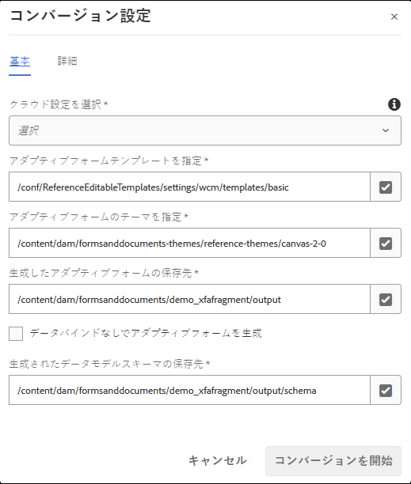

# アダプティブフォームへの PDF フォームの変換 {#convert-print-forms-to-adaptive-forms}

Adobe Sensei を活用した AEM Forms 自動フォーム変換サービス（AFCS）では、PDF フォームを、デバイスに対応したレスポンシブなアダプティブフォームに自動的に変換します。自動フォーム変換サービス（AFCS）を使用すると、非インタラクティブ PDF フォーム、AcroForms、XFA ベースの PDF フォームなど、各種フォームを簡単にアダプティブフォームに変換することができます。この変換サービスの機能、変換ワークフロー、オンボーディング情報については、[自動フォーム変換](introduction.md)サービスのトピックを参照してください。

## 前提条件 {#pre-requisites}

* [**変換サービスの設定を行う**](configure-service.md)

* **変換後のフォームに[テンプレート](https://helpx.adobe.com/jp/experience-manager/6-5/forms/using/template-editor.html)を適用するための準備を行う**：テンプレートを使用すると、統一されたブランディングをすべてのアダプティブフォームに適用することができます。 さらに、自動フォーム変換サービス（AFCS）では、ソース PDF ドキュメントのヘッダーとフッターを抽出して使用しません。アダプティブフォームのテンプレートを使用して、ヘッダーとフッターを指定することができます。変換サービスを実行すると、テンプレートで指定したヘッダーとフッターがアダプティブフォームに適用されます。テンプレート用のフォルダーを作成する場合は、全員に対して「**[!UICONTROL 設定を参照]**」オプションを選択します。

* **変換後のフォームに適用される[テーマ](https://helpx.adobe.com/jp/experience-manager/6-5/forms/using/themes.html)を準備する**：テーマを使用すると、統一されたスタイルを組織内のすべてのアダプティブフォームに適用することができます。

* **（オプション）** [**変換元の PDF フォームを Adobe Signフォームに変換する**](frequently-asked-questions.md)

## 変換処理を開始 {#start-the-conversion-process}

AEM インスタンスを AEM Forms 変換サービスに接続すると、PDF フォームをアダプティブフォームに変換できるようになります。 フォームを変換するには、以下の手順を上から順に実行します。

* [PDF フォームを AEM Forms サーバーにアップロード](convert-existing-forms-to-adaptive-forms.md#upload-pdf-forms-to-your-aem-forms-server)
* [変換処理を実行](convert-existing-forms-to-adaptive-forms.md#run-the-conversion)
* [変換後のフォームを確認して修正](review-correct-ui-edited.md)

### PDF フォームを AEM Forms サーバーにアップロード {#upload-pdf-forms-to-your-aem-forms-server}

変換サービスを実行すると、AEM Forms インスタンス上の PDF フォームがアダプティブフォームに変換されます。 必要に応じて、すべての PDF フォームを一度にアップロードすることも、段階的にアップロードすることもできます。 フォームをアップロードする場合は、以下の点に注意してください。

* 1 つのフォルダーに保存するフォームの数は 15 個未満にしてください。また、1 つのフォルダーに保存する合計ページ数は 50 ページ未満にしてください。
* フォルダーのサイズは 10 MB 未満にしてください。 サブフォルダー内にフォームを保存しないでください。
* 各フォームのページ数は 15 ページ未満にしてください。
* 保護されたフォームをアップロードしないでください。 この変換サービスでは、パスワードで保護されたフォームを変換することはできません。
* ファイル名にスペースが含まれているソースフォームをアップロードしないでください。 こうしたファイルをアップロードする場合は、ファイル名に含まれているスペースを削除してからアップロードしてください。
* [PDF ポートフォリオ](https://helpx.adobe.com/jp/acrobat/using/overview-pdf-portfolios.html)をアップロードしないでください。この変換サービスでは、PDF ポートフォリオをアダプティブフォームに変換することはできません。
* 推奨されるフォームの修正方法について、「[既知の問題](known-issues.md)」セクションと「[ベストプラクティスと考慮事項](styles-and-pattern-considerations-and-best-practices.md)」セクションを確認してください。

変換するフォームを AEM Forms インスタンス上のフォルダーにアップロードするには、以下の手順を実行します。

1. AEM Forms インスタンスにログインします。

1. **[!UICONTROL Adobe Experience Manager]**  ／**[!UICONTROL ナビゲーション]**  ／**[!UICONTROL フォーム]**／**[!UICONTROL フォームとドキュメント]**&#x200B;の順にタップします。
1. **[!UICONTROL 作成]**／**[!UICONTROL フォルダー]**&#x200B;の順にタップします。フォルダーの&#x200B;**タイトル**&#x200B;と&#x200B;**名前**&#x200B;を指定します。 「**[!UICONTROL 作成]**」をタップします。フォルダーが作成されます。
1. 作成されたフォルダーをタップして開きます。
1. **[!UICONTROL 作成]**／**[!UICONTROL ファイルのアップロード]**&#x200B;の順にタップします。アップロードするフォームを選択して「**[!UICONTROL 開く]**」をクリックし、次に「**[!UICONTROL アップロード]**」をクリックします。 フォームがアップロードされます。

### 変換処理を実行 {#run-the-conversion}

フォームのアップロードと変換サービスの設定が完了したら、以下の手順で変換処理を実行します。

1. AEM Forms インスタンスで、**[!UICONTROL Adobe Experience Manager]** ／**[!UICONTROL ナビゲーション]**  ／**[!UICONTROL フォーム]**／**[!UICONTROL フォームとドキュメント]**&#x200B;の順にタップします。
1. フォームを選択するか、変換する PDF フォームが保管されているフォルダーを選択して「**[!UICONTROL 自動変換を開始]**」をタップします。 **[!UICONTROL 変換設定]**&#x200B;ダイアログが表示されます。

   

1. 変換設定ダイアログの「**[!UICONTROL 基本]**」タブで、以下の操作を行います。

   * **[!UICONTROL クラウド設定を選択します]**。 選択した設定に対して、デフォルトのテンプレートとテーマが指定されます。 必要に応じて、別のテンプレートやテーマを指定することができます。
   * 変換後のアダプティブフォームの保存場所と対応するスキーマを指定します。 デフォルトのパスをそのまま使用することも、別のパスを指定することもできます。
   * データモデルをバインドせずにアダプティブフォームを生成する場合は、「**データモデルをバインドせずにアダプティブフォームを生成**」オプションを選択します。
このオプションを選択せずに変換サービスを実行すると、アダプティブフォームが自動的に JSON スキーマに関連付けられ、アダプティブフォームと JSON スキーマのフィールド間でデータバインディングが作成されます。「**[!UICONTROL 生成されたデータモデルスキーマの保存先]**」フィールドには、生成された JSON スキマーのデフォルトの保存場所が表示されます。 この場所は変更することができます。
既に説明したように、「データモデルをバインドせずにアダプティブフォームを生成」オプションを選択すると、データモデルがバインドされていない状態でアダプティブフォームが生成されます。 変換処理が正常に完了したら、フォームデータモデル、XML スキーマ、または JSON スキーマにアダプティブフォームを関連付けることができます。 詳しくは、「[アダプティブフォームの作成](https://helpx.adobe.com/jp/experience-manager/6-5/forms/using/creating-adaptive-form.html)」を参照してください。

   <!--

   Comment Type: draft

   <note type="note">
   
The XDP or XFA-based PDF form is not used to generate the Document of Record. The conversion service auto-generates the Document of Record only if you enable the Tools &gt; Cloud Services &gt; Automated Forms Conversion Configuration &gt; <strong>&lt;Properties of selected configuration&gt; &gt;</strong> Advanced &gt; Generate Document of Record option.

   
 

   </note>
   -->

1. 変換設定ダイアログの「**[!UICONTROL その他]**」タブで、以下の操作を行います。
   * 変換後のフォームで、フォームフラグメントの識別、抽出、ダウンロードを行う場合は、「**[!UICONTROL アダプティブフォームのフラグメントを抽出]**」オプションを選択します。 「**[!UICONTROL アダプティブフォームのフラグメントを抽出]**」オプションを選択すると、抽出されたフォームフラグメントとそれに対応するフォームフラグメントスキーマの保存先を指定するためのオプションが有効になります。
   * JSON スキーマベースのアダプティブフォームフラグメントと、JSON スキーマのないアダプティブフォームフラグメントを使用して、アダプティブフォームを自動的に生成する場合は、それらの「**[!UICONTROL アダプティブフォームフラグメント]**」の場所を指定します。変換サービスを実行すると、使用可能な JSON スキーマベースのアダプティブフォームフラグメントと JSON スキーマがないアダプティブフォームフラグメントが入力 PDF フォーム（非インタラクティブ PDF フォームのみ）と比較され、一致するフラグメントが見つかった場合は、対応するアダプティブフォーム内でそのフラグメントが使用されます。

   >[!NOTE]
   >
   >
   > * 「**[!UICONTROL フラグメントを抽出]**」オプションと「**[!UICONTROL 既存のアダプティブフォームフラグメントを使用]**」オプションを同時に選択することはできません。 どちらか一方のオプションだけを選択してください。
   > * 「**[!UICONTROL 既存のアダプティブフォームフラグメントを使用]**」オプションを使用できるのは、非インタラクティブ PDF フォームの場合だけです。 現時点では、その他のフォームタイプでこのオプションを使用することはできません。
   > * 自動変換サービスで使用できるのは、JSON スキーマにバインドされていないフラグメントと JSON スキーマにバインドされているフラグメントだけです。 XFA フラグメントは使用しないでください。 XFA フラグメントはサポートされていません。
   >

   * デスクトップコンピューターやノートパソコンなど、大きな画面を使用してソースフォームのレイアウトを保存する場合は、「**[!UICONTROL 入力フォームの複数列レイアウトを自動的に検出]**」オプションを選択します。 このオプションは、ソースフォームの複数列レイアウトを保存する場合に使用すると便利です。 例えば、ソース PDF フォームのレイアウトが 2 列になっている状態でこのオプションを選択すると、画面が大きなデバイスの場合は 2 列のレイアウトのままアダプティブフォームが生成され、携帯電話などの画面の小さなデバイスの場合は 1 列のレイアウトでアダプティブフォームが生成されます。 この機能には、データソーススキーマの構造に関する既知の問題が存在します。 詳しくは、「[既知の問題](known-issues.md)」を参照してください。
   * デフォルトでは、このサービスは PDF フォームの各ページに個別のトップレベルパネルを作成します。 これで、**[!UICONTROL 自動検出論理セクション]**&#x200B;オプションを使用して、ページレベルのパネル（ページ番号ベースのパネル）を作成せず、論理パネルのみを作成できるようになりました。 また、先行する論理セクションを持つセクションに属さないフィールドと、隣接する 2 ページにまたがる論理セクションのフィールドを 1 つの論理セクションにまとめます。 例えば、論理セクションの一部のフィールドが 1 ページ目の終わりにあり、一部が 2 ページ目の最初にある場合、そのようなフィールドはすべて 1 つの論理セクションにまとめられます。

     >[!NOTE]
     >   **[!UICONTROL 自動検出論理セクション]**&#x200B;機能を使用するには、コネクターパッケージ 1.1.38 以降が必要です。

* （AEM Forms as a Cloud Service のみ）[セクションをフラグメントに自動変換]オプションは、15 ページを超える PDF forms に適用されます。 検出された最上位セクションがフラグメントに変換されます。 また、作成されたすべてのフラグメントに対して遅延読み込みを有効にします。 これにより、変換後のフォームのレンダリング速度が向上し、アダプティブフォームエディターで大きなフォームを簡単に読み込むことができるようになります。

  >[!NOTE]
  > 「セクションをフラグメントに自動変換」オプションを使用する際は、レスポンシブレイアウトテンプレートを使用しないでください。
  > レビューと正しいエディターを使用して、小さなパネルを大きなパネルにマージします。これにより、変換後のアダプティブフォーム内のフラグメントの数を減らすことができます。
  > 「呼び出し数が多すぎる」例外が発生した場合、
  >
  > * フォームを再構築してシンプルな階層を作成
  > * 例外がなくなるまで、[sling.max.calls パラメーターの値]を、十分な数に増やします。
  > * [キャッシュのサイズを増やす](https://experienceleague.adobe.com/docs/experience-manager-65/forms/install-aem-forms/configure-aem-forms/configure-adaptive-forms-cache.html?lang=ja)このエラーは、フォームが複雑すぎて、多数のテーブルが含まれ、複数レベルの階層構造を持つ場合に発生します。

1. 「**[!UICONTROL 変換を開始]**」をタップします。 変換処理が開始されます。 変換処理の進行状況は、該当するフォルダーまたはフォームに表示されます。 変換処理が完了すると、結果を示すメッセージ（「変換されました」、「部分的に変換されました」、「変換が失敗しました」）が表示されます。 また、結果が記載されたメールも、指定のメールアドレスに送信されます。

   * 変換処理が正常に完了すると、変換後のアダプティブフォームとそれに関連するスキーマが、変換ダイアログの「**[!UICONTROL 基本]**」タブで指定したパスにダウンロードされます。 変換処理を開始する前に「フラグメントを抽出」オプションを選択した場合にのみ、フォームフラグメントとそれに対応するスキーマがダウンロードされます。
   * 変換処理が失敗した場合は、エラーメッセージが表示されます。すべての入力フォームで変換処理が失敗した場合は「**[!UICONTROL 変換が失敗しました]**」という内容のメッセージが表示され、一部の入力フォームで変換処理が失敗した場合は、「**[!UICONTROL 一部が失敗しました]**」という内容のメッセージが表示されます。 また、変換処理の結果が記載されたメールが[指定のメールアドレス](configure-service.md#configureemailnotification)に送信され、エラーの内容が error.log ファイルに記録されます。

   XFA ベースの PDF フォームをアダプティブフォームに変換すると、その PDF フォームが「レコードのドキュメント」テンプレートとして自動的に変換後のアダプティブフォームに関連付けられます。 変換処理が完了したら、アダプティブフォームのプロパティを開き、「**[!UICONTROL フォームモデル]**」タブの「**[!UICONTROL レコードのドキュメントのテンプレート設定]**」セクションで、「レコードのドキュメント」テンプレートを表示することができます。 

   **[!UICONTROL ツール]**／**[!UICONTROL クラウドサービス]**／**[!UICONTROL 自動フォーム変換の設定]**／**[!UICONTROL 選択した設定のプロパティ]**／**[!UICONTROL 詳細]**&#x200B;で「**[!UICONTROL レコードのドキュメントを生成]**」オプションを選択した場合にのみ、PDF フォームが「レコードのドキュメント」テンプレートとして自動的に変換後のアダプティブフォームにアップロードされます。

   <!--

   Comment Type: draft

   <note type="note">
   
By default, the adaptive form produces a JSON schema instead of XML schema on submission. JSON schema of a converted adaptive form is complaint with XML schema of an XFA-based form. You can use the <a href="https://sling.apache.org/apidocs/sling5/org/apache/sling/commons/json/xml/XML.html#toString">org.apache.sling.commons.json.xml API</a> to convert a JSON schema to XML schema. You can also use the following sample code for conversion:

   
<code class="code">import org.apache.sling.commons.json.JSONException;
   <discoiqbr /> import org.apache.sling.commons.json.JSONObject;
   <discoiqbr /> import org.apache.sling.commons.json.xml.XML;
   <discoiqbr />
   <discoiqbr /> public class ConversionUtils {
   <discoiqbr />
   <discoiqbr /> public static String jsonToXML(String jsonString) throws JSONException {
   <discoiqbr /> //https://sling.apache.org/apidocs/sling5/org/apache/sling/commons/json/xml/XML.html#toString(java.lang.Object)
   <discoiqbr /> //jar - http://maven.ibiblio.org/maven2/org/apache/sling/org.apache.sling.commons.json/2.0.18/
   <discoiqbr /> //Note: Need to extract boundData part before converting to XML
   <discoiqbr /> return XML.toString(new JSONObject(jsonString));
   <discoiqbr /> }
   <discoiqbr /> }</code>  

   </note>
   -->

   >[!NOTE]
   >
   >変換処理の時間が 60 分を超えても PDF フォームがアダプティブフォームに変換されない場合は、AEM Forms インスタンス上にフォルダーを作成し、そのフォルダーに PDF フォームをアップロードしてから、変換処理を再開してください。

## 変換後のフォームを確認して修正 {#review-and-correct-the-converted-forms}

実際にフォームを作成する場合は、複雑なデータをキャプチャしなければならないことがあります。 自動変換処理が完了したら、変換後のフォームの内容を確認し、必要な変更を行います。 AEM Forms には、こうした変更を行うための[「レビューと修正」エディター](review-correct-ui-edited.md)が用意されています このエディターを使用すると、自動的に識別されたフォームフィールドを修正したり、フィールドタイプを変更したりすることができます。 例えば、レイアウトが 2 列になっているフォームを特定したり、ラジオボタンとして自動的に識別されたフィールドを複数選択フィールドに変更したりすることができます。
