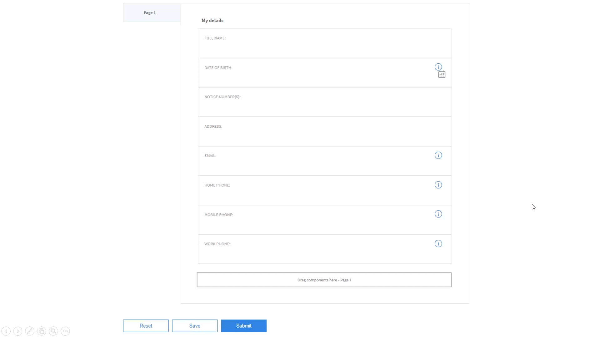
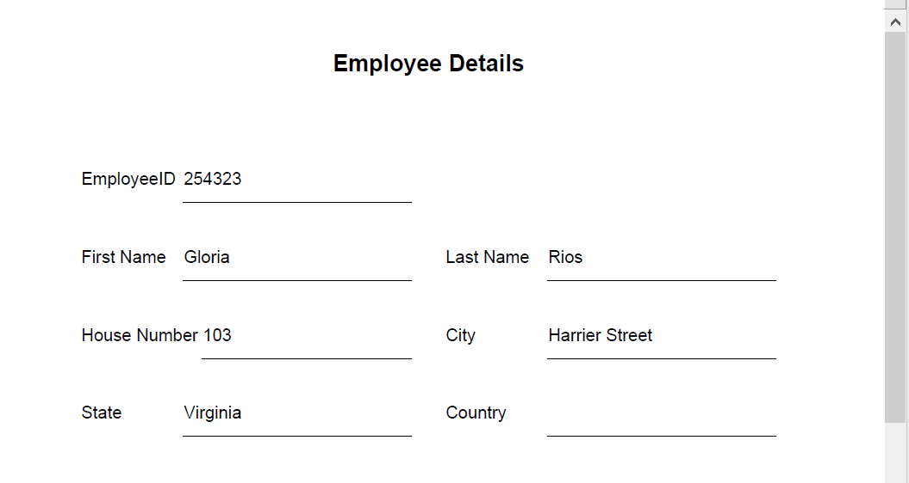
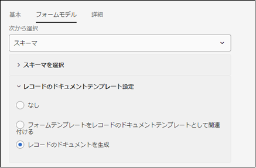
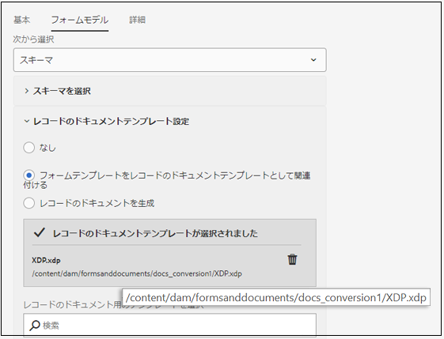

# アダプティブフォームのレコードのドキュメントを生成するための推奨ワークフロー {#recommended-workflows-dor-generation}

レコードのドキュメント（DoR）には、アダプティブフォームへの変換時に入力した情報が記録されるため、後で確認することができます。
DoR では、ベーステンプレートを使用してレイアウトが定義されます。 デフォルトのテンプレートを使用して DoR を生成することも、別のテンプレートをアダプティブフォームに関連付けることによって DoR を生成することもできます。

DoR の生成方法については、「[アダプティブフォームにおけるレコードのドキュメントの生成](https://helpx.adobe.com/jp/experience-manager/6-5/forms/using/generate-document-of-record-for-non-xfa-based-adaptive-forms.html)」を参照してください。

[自動フォーム変換サービス](/help/using/introduction.md)では、以下のソースフォームをアダプティブフォームに変換することができます。

* 非対話型 PDF フォーム
* AcroForms
* XFA ベースの PDF フォーム

変換するソースフォームに応じて、以下の方法で DoR を生成することができます。

* デフォルトのテンプレートを使用する。
* ソースフォームをテンプレートとして使用する。この方法の場合、変換サービスにより、ソースフォームが DoR テンプレートとして変換後のアダプティブフォームに自動的に関連付けられます。
* 別のテンプレートを変換後のアダプティブフォームに関連付ける。

以下の図で、DoR テンプレートが生成後の DoR のレイアウトにどのように影響するかについて説明します。

<table> 
 <tbody>
 <tr>
  <td>
<strong>ソースフォーム</strong>
</td>
  <td>
<strong>生成後の DoR</strong>
</td> 
   </tr>
  <tr>
   <td></td>
   <td>
デフォルトのテンプレートを使用して DoR を生成した場合： </td>
   </tr>
   <tr>
   <td></td>
   <td>
ソースフォームをテンプレートとして使用して DoR を生成した場合： 
</td>
   </tr>
  </tbody>
</table>

この図を見てわかるように、ソースフォームをテンプレートとして使用した場合、ソースフォームのレイアウトが DoR でも維持されます。
ここでは、3 種類のソースフォームについて、DoR を生成するための推奨ワークフローを説明します。

<table> 
 <tbody> 
  <tr> 
   <th><strong>ソースフォーム</strong></th> 
   <th><strong>DoR の生成方法</strong></th> 
  </tr> 
  <tr> 
   <td>
非対話型 PDF フォーム
</td> 
   <td> 
    <ul> 
     <li><a href="#generate-document-of-record-using-cloud-configuration">アダプティブフォームに変換する前に DoR の生成機能を有効にして、デフォルトのテンプレートを使用して DoR を生成する</a></li> 
     <li><a href="#edit-adaptive-form-properties-generate-document-of-record">アダプティブフォームへの変換後にアダプティブフォームのプロパティを編集し、デフォルトのテンプレートまたは別のテンプレートを使用して DoR を生成する</a></li> 
    </ul> </td> 
  </tr>
  <tr> 
   <td>
AcroForms または XFA ベースの PDF フォーム
</td> 
   <td> 
    <ul> 
     <li><a href="#use-input-form-as-template-to-generate-document-of-record">アダプティブフォームに変換する前に DoR の生成機能を有効にして、ソースフォームをテンプレートとして使用して DoR を生成する</a></li> 
     <li><a href="#edit-adaptive-form-properties-to-generate-document-of-record">アダプティブフォームへの変換後にアダプティブフォームのプロパティを編集し、デフォルトのテンプレートまたは別のテンプレートを使用して（または、ソースフォームをテンプレートとして使用して）DoR を生成する</a></li> 
    </ul> </td> 
  </tr>    
 </tbody> 
</table>

## 非対話型 PDF フォーム用の DoR を生成する {#generate-document-of-record-non-interactive-pdf}

非対話型 PDF フォームをソースフォームとして使用して自動フォーム変換サービスを実行する場合、以下に示すいずれかの方法で DoR を生成することができます。

* アダプティブフォームに変換する前に DoR の生成機能を有効にして、デフォルトのテンプレートを使用して DoR を生成する
* アダプティブフォームへの変換後にアダプティブフォームのプロパティを編集し、デフォルトのテンプレートまたは別のテンプレートを使用して DoR を生成する

### アダプティブフォームに変換する前に DoR の生成機能を有効にして、デフォルトのテンプレートを使用して DoR を生成する {#generate-document-of-record-using-cloud-configuration}

1. **[!UICONTROL ツール]**／**[!UICONTROL クラウドサービス]**／**[!UICONTROL 自動フォーム変換の設定]**／変換処理で使用するクラウド設定のプロパティ／**[!UICONTROL 詳細]**／**[!UICONTROL レコードのドキュメントを生成]**&#x200B;の順に選択して、設定を行います。

   

1. 「**[!UICONTROL 保存して閉じる]**」をタップして設定を保存します。

1. [変換処理を実行](/help/using/convert-existing-forms-to-adaptive-forms.md)します。 その際、必ず手順 1 で編集したクラウド設定を使用してください。
変換後のアダプティブフォームを送信すると、デフォルトのテンプレートを使用して自動的に DoR が生成されます。

### 変換後にアダプティブフォームのプロパティを編集し、DoR の生成機能を有効にする {#edit-adaptive-form-properties-generate-document-of-record}

変換処理の前に DoR の生成機能を有効にしなかった場合でも、変換後に有効にすることができます。

1. 非対話型 PDF フォームで[変換処理を実行](/help/using/convert-existing-forms-to-adaptive-forms.md)して、アダプティブフォームを生成します。

1. 生成されたアダプティブフォームを **[!UICONTROL output]** フォルダーで選択して「**[!UICONTROL プロパティ]**」をタップします。

1. 「**[!UICONTROL フォームモデル]**」タブの「**[!UICONTROL レコードのドキュメントのテンプレート設定]**」セクションを展開して「**[!UICONTROL レコードのドキュメントを生成]**」を選択します。

   

1. 「**[!UICONTROL 保存して閉じる]**」をタップして設定を保存します。

変換後のアダプティブフォームを送信すると、デフォルトのテンプレートを使用して自動的に DoR が生成されます。 別の DoR テンプレートを変換後のアダプティブフォームに関連付ける場合は、「**[!UICONTROL フォームテンプレートをレコードのドキュメントテンプレートとして関連付ける]**」オプションを選択します。

## AcroForms または XFA ベース PDF フォーム用のレコードのドキュメントを生成する {#generate-document-of-record-acroform-xfaform}

AcroForms または XFA ベース PDF フォームをソースフォームとして使用して自動フォーム変換サービスを実行する場合、以下に示すいずれかの方法で DoR を生成することができます。

* アダプティブフォームに変換する前に DoR の生成機能を有効にして、ソースフォームをテンプレートとして使用して DoR を生成する

* アダプティブフォームへの変換後にアダプティブフォームのプロパティを編集し、デフォルトのテンプレートまたは別のテンプレートを使用して（または、ソースフォームをテンプレートとして使用して）DoR を生成する

### アダプティブフォームに変換する前に DoR の生成機能を有効にして、ソースフォームをテンプレートとして使用して DoR を生成する {#use-input-form-as-template-to-generate-document-of-record}

1. **[!UICONTROL ツール]**／**[!UICONTROL クラウドサービス]**／**[!UICONTROL 自動フォーム変換の設定]**／変換処理で使用するクラウド設定のプロパティ／**[!UICONTROL 詳細]**／**[!UICONTROL レコードのドキュメントを生成]**&#x200B;の順に選択して、設定を行います。

1. 「**[!UICONTROL 保存して閉じる]**」をタップして設定を保存します。

1. [変換処理を実行](/help/using/convert-existing-forms-to-adaptive-forms.md)します。 その際、必ず手順 1 で編集したクラウド設定を使用してください。
変換サービスにより、AcroForms または XFA ベース PDF フォームが DoR テンプレートとして変換後のアダプティブフォームに自動的に関連付けられます。
アダプティブフォームのプロパティを開くと、「**[!UICONTROL フォームモデル]**」タブの「**[!UICONTROL レコードのドキュメントのテンプレート設定]**」セクションに DoR テンプレートが表示されます。

   

   変換後のアダプティブフォームを送信すると、ソースフォームをテンプレートとして使用して、自動的に DoR が生成されます。

### 変換後にアダプティブフォームのプロパティを編集し、DoR の生成機能を有効にする {#edit-adaptive-form-properties-to-generate-document-of-record}

1. 非対話型 PDF フォームで[変換処理を実行](/help/using/convert-existing-forms-to-adaptive-forms.md)して、アダプティブフォームを生成します。

1. 生成されたアダプティブフォームを **[!UICONTROL output]** フォルダーで選択して「**[!UICONTROL プロパティ]**」をタップします。

1. 「**[!UICONTROL フォームモデル]**」タブの「**[!UICONTROL レコードのドキュメントのテンプレート設定]**」セクションを展開して「**[!UICONTROL レコードのドキュメントを生成]**」を選択し、デフォルトのテンプレートを使用して DoR の生成機能を有効にします。
または、「**[!UICONTROL フォームテンプレートをレコードのドキュメントテンプレートとして関連付ける]**」オプションを選択し、ソースフォームをテンプレートとして使用して、または別のフォームテンプレートを使用して、DoR の生成機能を有効にすることもできます。

1. 「**[!UICONTROL 保存して閉じる]**」をタップして設定を保存します。
