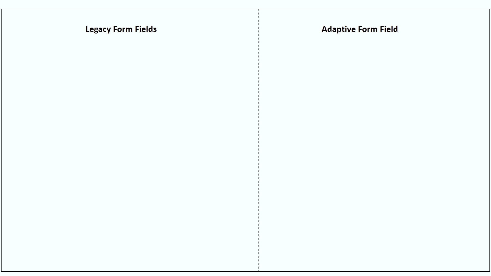
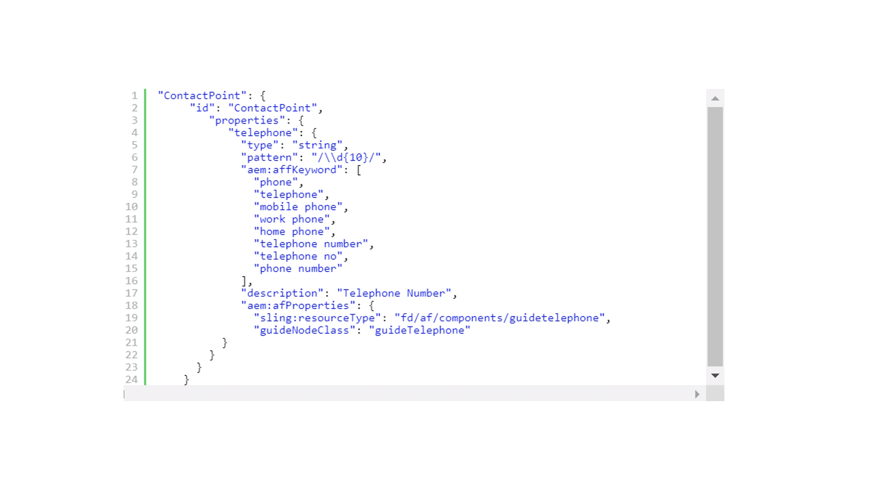
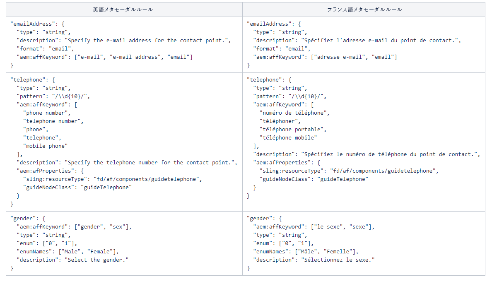

# デフォルトのメタモデルの拡張 {#extend-the-default-meta-model}

自動フォーム変換サービス（AFCS）では、ソースフォームからフォームオブジェクトを識別して抽出します。 自動フォーム変換サービスでセマンティックマッパーを使用すると、抽出したオブジェクトがアダプティブフォーム内でどのように表示されるのかを確認することができます。 例えば、ソースフォームには、表示形式の異なる様々な日付オブジェクトが含まれている場合があります。 こうした場合にセマンティックマッパーを使用すると、ソースフォーム内の日付オブジェクトのすべての表示形式を、アダプティブフォームの日付コンポーネントにマップすることができます。 また、変換処理の実行中にセマンティックマッパーを使用して、検証設定、ルール、データパターン、ヘルプテキスト、アクセシビリティのプロパティをアダプティブフォームコンポーネントに対して事前に設定して適用することもできます。



メタモデルとは、JSON スキーマのことです。 メタモデルを使用するには、JSON について理解する必要があります。 具体的には、JSON 形式で保存されたデータの作成、編集、読み取りに関する知識と経験が必要になります。

## デフォルトのメタモデル {#default-meta-model}

自動フォーム変換サービス（AFCS）には、デフォルトのメタモデルがあります。 これは JSON スキーマで、自動フォーム変換サービス（AFCS）の他のコンポーネントと共に Adobe Cloud 上に存在します。 メタモデルのコピーは、ローカル AEM サーバーの http://&lt;server>:&lt;port>/aem/forms.html/content/dam/formsanddocuments/metamodel/`global.schema.json` で確認できます。 英語のスキーマにアクセスする、またはダウンロードするには、[ここをクリック](assets/en.globalschema.json)します。 [フランス語](assets/fr.globalschema.json)、[ドイツ語](assets/de.globalschema.json)、[スペイン語](assets/es.globalschema.json)、[イタリア語](assets/it.globalschema.json)、[ポルトガル語](assets/pt_br.globalschema.json)のメタモデルもダウンロードできます。

メタモデルのスキーマは、https://schema.org/docs/schemas.html のスキーマエンティティから継承されます。 このスキーマエンティティには、https://schema.org で定義された各種エンティティ（Person、PostalAddress、LocalBusiness など）が含まれています。 メタモデルのすべてのエンティティは、JSON スキーマオブジェクトに従属します。 以下のコードは、サンプルのメタモデル構造を示しています。

```
   "Entity": {
      "id": "Entity",
      "properties": {
        "name": {
          "type": "string"
        },

        "description": {
          "type": "string",
          "description": "Description of the item"
        }
      }
    }
```

## デフォルトメタモデルのダウンロード {#download-the-default-meta-model}

デフォルトのメタモデルをローカルファイルシステムにダウンロードするには、以下の手順を実行します。

1. AEM Forms インスタンスにログインします。
1. **[!UICONTROL フォーム]**／**[!UICONTROL フォームとドキュメント]****／****[!UICONTROL メタモデル]**&#x200B;フォルダーに移動します。
1. **[!UICONTROL global.schema.json]** ファイルを選択して「**[!UICONTROL ダウンロード]**」をタップします。 ダウンロード用のダイアログボックスが表示されます。 「**[!UICONTROL アセットをバイナリファイルとしてダウンロード]**」オプションを選択します。 「**[!UICONTROL ダウンロード]**」をタップします。 アーカイブファイルがダウンロードされます。

   <!--
   Comment Type: draft

   <li><p>Extract the archive and open the global.schema.json file for editing. </p> </li>
   -->

   <!--
   Comment Type: draft

   <li>Step text</li>
   -->

## メタモデルについて {#understanding-the-meta-model}

メタモデルとは、各種エンティティが保管された JSON スキーマファイルのことです。 JSON スキーマファイル内のすべてのエンティティに、名前と ID が設定されています。 各エンティティに複数のプロパティを設定することができます。 エンティティとそのプロパティは、ドメインによって異なる場合があります。 キーワードとフィールド設定を使用してスキーマファイルを拡張することにより、スキーマのプロパティをアダプティブフォームのコンポーネントにマップすることができます。

```
"Event": {
      "id": "Eventid",
      "allOf": [
        {
          "$ref": "#Entity"
        },
        {
          "properties": {
            "startDate": {
              "type": "string",
              "format": "date",
              "description": "Specify the start date and time of the event in ISO 8601 date format."
            },
            "endDate": {
              "type": "string",
              "format": "date",
              "description": "Specify the end date and time of the event in ISO 8601 date format."
            },
            "location": {
              "$ref": "#PostalAddress",
              "description": "Specify the location of the event."
            }
          }
        }
      ]
    }
```

このサンプルコードでは、**Event** がエンティティ名を表し、**id** の値が **Eventid** に設定されています。 Event エンティティには、以下に示す複数のプロパティが含まれています。

* startDate
* endDate
* location

メタモデル内の **allOf** コンストラクターにより、エンティティ間での継承が可能になります。

各プロパティには、さらに以下のものを含めることができます。

* [JSON スキーマのプロパティ](#jsonschemaproperties)
* [生成後のアダプティブフォームフィールドにプロパティを適用するためのキーワードベース検索](#keywordsearch)
* [追加のプロパティ](#additionalproperties)



**aem:affKeyword**&#x200B;を使用して参照されたキーワードに基づいて、変換サービスはソースフォームフィールドに対して検索操作を実行します。 変換サービスにより、JSON スキーマのプロパティと追加のプロパティが、検索条件に一致するフィールドに適用されます。

上記のサンプルコードでは、変換サービスを使用して、ソースフォーム内のキーワード（phone、telephone、mobile phone、work phone、home phone、telephone number、telephone no、phone number）を検索しています。 変換サービスは、これらのキーワードを含むフィールドに基づいて、変換後のアダプティブフォームフィールドにタイプ、パターン、およびaem:afPropertiesを適用します。

### 生成後のアダプティブフォームフィールドに対する JSON スキーマプロパティ {#jsonschemaproperties}

メタモデルでは、自動フォーム変換サービス（AFCS）を使用して生成されたアダプティブフォームフィールドの次の JSON スキーマ共通プロパティをサポートします。

<table> 
 <tbody> 
  <tr> 
   <th><strong>プロパティ名</strong></th> 
   <th><strong>説明</strong></th> 
  </tr> 
  <tr> 
   <td><p>タイトル</p></td> 
   <td> 
    <p>メタモデルの title プロパティ内で指定されたテキストは、生成後のアダプティブフォームフィールドで操作を実行するためのキーワードとして機能します。 例えば、アダプティブフォームフィールドのラベルを変更する場合などに、その変更操作のキーワードとして機能します。 詳しくは、「<a href="#custommetamodelexamples">カスタムメタモデルの例</a>」の「<strong>フォームフィールドのラベルを変更する</strong>」セクションを参照してください。</p> </td> 
  </tr>
  <td><p>description</p></td> 
   <td> 
    <p>description プロパティにより、生成後のアダプティブフォームフィールドのヘルプテキストが設定されます。 詳しくは、「<a href="#custommetamodelexamples">カスタムメタモデルの例</a>」の「<strong>フォームフィールドにヘルプテキストを追加する</strong>」セクションを参照してください。</p> </td> 
  </tr>
  <td><p>タイプ</p></td> 
   <td> 
    <p>type プロパティにより、生成後のアダプティブフォームフィールドのデータタイプが定義されます。 type プロパティで指定できる値は以下のとおりです。</p>
    <ul> 
     <li>string：アダプティブフォームフィールドがテキストデータタイプとして生成されます。</li> 
     <li>number：アダプティブフォームフィールドが数値データタイプとして生成されます。</li>
     <li>integer：アダプティブフォームフィールドが数値データタイプとして生成され、サブタイプとして整数データタイプが設定されます。</li>
     <li>boolean：切り替え式アダプティブフォームコンポーネントが生成されます。</li>
     </ul><p>メタモデルで type プロパティを使用する方法については、「<a href="#custommetamodelexamples">カスタムメタモデルの例</a>」の「<strong>フォームフィールドのタイプを変更する</strong>」セクションを参照してください。</p></td> 
  </tr>
  <td><p>pattern</p></td> 
   <td> 
    <p>pattern プロパティでは、正規表現に基づいて、生成後のアダプティブフォームフィールドの値が制限されます。 例えば、メタモデルの次のコードは、生成されたアダプティブフォームフィールドの値を10桁に制限します。<br>"pattern": "/\\d{10}/"<br>同様に、メタモデルの次のコードは、フィールドの値を特定の日付形式に制限します。<br> "pattern": "date{DD MMMM, YYYY}",</p> </td> 
  </tr>
  <td><p>format</p></td> 
   <td> 
    <p>format プロパティでは、正規表現ではなく指定されたパターンに基づいて、生成後のアダプティブフォームフィールドの値が制限されます。 format プロパティで指定できる値は以下のとおりです。<ul><li>email：アダプティブフォームのメールコンポーネントが生成されます。</li><li>hostname：アダプティブフォームフィールドのテキストボックスコンポーネントが生成されます。</li></ul>メタモデルで format プロパティを使用する方法については、「<a href="#custommetamodelexamples">カスタムメタモデルの例</a>」の「<strong>フォームフィールドの形式を変更する</strong>」セクションを参照してください。</p> </td> 
  </tr>
  <td><p>enum と enumNames</p></td> 
   <td> 
    <p>enum プロパティと enumNames プロパティでは、ドロップダウンフィールド、チェックボックスフィールド、ラジオボタンフィールドの値が、事前に設定した値に制限されます。 enumNames プロパティで指定した値は、ユーザーインターフェイスに表示されます。 enum プロパティで指定した値は、計算処理で使用されます。<br>詳しくは、「<a href="#custommetamodelexamples">カスタムメタモデルの例</a>」の「<strong>フォームフィールドをアダプティブフォーム内の複数選択チェックボックスに変換する</strong>」セクション、「<strong>テキストフィールドをアダプティブフォーム内のドロップダウンリストに変換する</strong>」セクション、「<strong>ドロップダウンリストにその他のオプションを追加する</strong>」セクションを参照してください。</p> </td> 
  </tr>
 </tbody> 
</table>

### 生成後のアダプティブフォームフィールドにプロパティを適用するためのキーワードベース検索 {#keywordsearch}

自動フォーム変換サービス（AFCS）では、変換中にソースフォームでキーワード検索を実行します。 変換サービスは、検索条件に一致するフィールドをフィルタリングしてから、メタモデル内のそれらのフィールドに対して定義されているプロパティを、生成後のアダプティブフォームフィールドに適用します。

キーワードは、**aem:affKeyword** プロパティを使用して参照されます。

```
{
  "numberfields": {
      "type": "number",
      "aem:affKeyword": ["Bank account number"]
 }
}
```

この例では、変換サービスは&#x200B;**aem:affKeyword**&#x200B;内のテキストを検索キーワードとして使用します。 検索サービスは、フォーム内の「**Bank account number**」テキストフィールドを取得し、**type** プロパティを使用して、このテキストフィールドを&#x200B;**数値**&#x200B;タイプに変換します。

### 生成後のアダプティブフォームフィールドに対する追加のプロパティ {#additionalproperties}

メタモデルで&#x200B;**aem:afProperties** プロパティを使用すると、自動フォーム変換サービス（AFCS）を使用して生成されたアダプティブフォームフィールドに対して、次の追加プロパティを定義できます。

<table> 
 <tbody> 
  <tr> 
   <th><strong>プロパティ名</strong></th> 
   <th><strong>説明</strong></th> 
  </tr> 
  <tr> 
   <td><p>multiLine</p></td> 
   <td> 
    <p>multiLine プロパティにより、変換処理の完了後に、ソースフォームフィールドがアダプティブフォーム内の複数行フィールドに変換されます。 詳しくは、「<a href="#custommetamodelexamples">カスタムメタモデルの例</a>」の「<strong>文字列フィールドを複数行フィールドに変換する</strong>」セクションを参照してください。</p> </td> 
  </tr>
  <td><p>mandatory</p></td> 
   <td> 
    <p>mandatory プロパティにより、変換処理の完了後に、アダプティブフォームフィールドの入力が必須入力として設定されます。<br>詳しくは、「<a href="#custommetamodelexamples">カスタムメタモデルの例</a>」の「<strong>アダプティブフォームフィールドに検証機能を追加する</strong>」セクションを参照してください。</p>
    </td> 
  </tr>
  <td><p>jcr:title</p></td> 
   <td> 
    <p>jcr:title プロパティを JSON スキーマの title プロパティとともに指定すると、変換処理の完了後に、アダプティブフォームフィールドのラベルを変更することができます。<br>詳細については、<a href="#custommetamodelexamples"> カスタムメタモデルの例</a><br>の「<strong> フォームフィールドのラベルを変更する</strong>」を参照してください。JSON スキーマを使用してアダプティブフォームフィールドに適用できるプロパティについて詳しくは、<a href="https://helpx.adobe.com/jp/experience-manager/6-5/forms/using/adaptive-form-json-schema-form-model.html" target="_blank">JSON スキーマを使用したアダプティブフォームの作成</a>を参照してください。</p>
    <p></p></td> 
  </tr>
  <td><p>sling:resourceType と guideNodeClass</p></td> 
   <td> 
    <p>sling:resourceType プロパティと guideNodeClass プロパティを使用して、対応するアダプティブフォームコンポーネントにフォームフィールドをマップすることができます。<br>詳しくは、「<a href="#custommetamodelexamples">カスタムメタモデルの例</a>」の「<strong>フォームフィールドをアダプティブフォーム内の複数選択チェックボックスに変換する</strong>」セクションと「<strong>テキストフィールドをアダプティブフォーム内のドロップダウンリストに変換する</strong>」セクションを参照してください。</p> </td> 
  </tr>
  <td><p>validatePictureClause</p></td> 
   <td> 
    <p>validatePictureClause プロパティにより、変換処理の完了後に、アダプティブフォームフィールドで許可されている形式に対する検証処理が設定されます。<br>詳しくは、「<a href="#custommetamodelexamples">カスタムメタモデルの例」の「<strong>アダプティブフォームフィールドに検証機能を追加する</strong>」セクションを参照してください。</p> </td> 
  </tr>
 </tbody> 
</table>

## 自身の言語でのカスタムメタモデルの作成{#language-specific-meta-model}

言語固有のメタモデルを作成できます。 このようなメタモデルを使用すると、選択した言語でマッピングルールを作成するのに役立ちます。 自動フォーム変換サービス（AFCS）を使用すると、以下の言語でメタモデルを作成できます。

* 英語 (en)
* フランス語（fr）
* ドイツ語（de）
* スペイン語（es）
* イタリア語（it）
* ポルトガル語（pt-br）

*aem:Language* メタタグ タグをメタモデルの上部に追加して、その言語を指定します。 例：

```JSON
"metaTags": {
        "aem:Language": "fr"
    }
```

言語が指定されていない場合、サービスはメタモデルを英語と見なします。

### 言語固有のメタモデルを作成する際の考慮事項

* すべてのキーの名前が英語であることを確認します。 例えば、emailAddress と指定します。
* すべての id キーのエンティティ参照と事前定義値が ASCII 文字のみで構成されていることを確認します。 例：&quot;id&quot;: &quot;ContactPoint&quot; / &quot;$ref&quot;: &quot;#ContactPoint&quot;。
* 次のキーに対応するすべての値が、指定したメタモデル言語になっていることを確認します。
   * aem:affKeyword
   * title
   * description
   * enumNames
   * shortDescription
   * validatePictureClauseMessage

  例えば、meta-modelの言語がフランス語（「aem:Language」:「fr」）の場合、すべての説明とメッセージがフランス語であることを確認します。

* すべての[JSON スキーマのプロパティ](#jsonschemaproperties)で、サポートされている値のみを使用するようにします。 例えば、type プロパティは、文字列、数値、整数およびブール値の選択された値にのみ適用されます。

次の画像には、英語のメタモデルと、対応するフランス語のメタモデルの例が表示されています。



## カスタムメタモデルを使用してアダプティブフォームフィールドを変更する {#modify-adaptive-form-fields-using-custom-meta-model}

デフォルトのメタモデルで登録されているパターンと検証機能のほかに、組織内でパターンと検証機能を設定することができます。 デフォルトのメタモデルを拡張することにより組織固有のパターン、検証機能、エンティティを追加することができます。 自動フォーム変換サービス（AFCS）では、変換中にカスタムメタモデルをフォームフィールドに適用します。 組織固有の新しいパターン、検証機能、エンティティが検出されるたびに、メタモデルを継続的に更新することができます。

自動フォーム変換サービス（AFCS）では、次の場所に保存されているデフォルトのメタモデルを使用して、変換中にソースフォームフィールドをアダプティブフォームフィールドにマッピングします。

http://<server>:<port>/aem/forms.html/content/dam/formsanddocuments/metamodel/global.schema.json

ただし、カスタムメタモデルを特定のフォルダーに保存して変換サービスのプロパティを変更することにより、変換処理の実行時にカスタムメタモデルを使用することができます。

### 変換処理の実行時にカスタムメタモデルを使用する {#use-custom-meta-model-during-conversion}

変換処理の実行時にカスタムメタモデルを使用するには、以下の手順を実行します。

1. **[!UICONTROL フォーム]**／**[!UICONTROL フォームとドキュメント]**&#x200B;でフォルダーを作成し、このフォルダーにカスタムメタモデルの JSON スキーマファイルをアップロードします。
1. 以下のオプションを使用して、変換サービスを起動します。

   **[!UICONTROL ツール]**／**[!UICONTROL クラウドサービス]**／**[!UICONTROL 自動フォーム変換の設定]**／**&lt;選択した設定のプロパティ>**

1. 「**[!UICONTROL 基本]**」タブの「**[!UICONTROL カスタムメタモデル]**」フィールドでカスタムメタモデルの場所を指定し、「**[!UICONTROL 保存して閉じる]**」をタップします。
1. [変換処理を実行](convert-existing-forms-to-adaptive-forms.md#start-the-conversion-process)し、カスタムメタモデルを変換処理に適用します。

### カスタムメタモデルの例 {#custommetamodelexamples}

ここでは、カスタムメタモデルを使用してアダプティブフォームフィールドを変更する場合の一般的な例について説明します。以下のようなケースが考えられます。

* フォームフィールドのラベルを変更する
* フォームフィールドのタイプを変更する
* フォームフィールドにヘルプテキストを追加する
* フォームフィールドをアダプティブフォーム内の複数選択ラジオボタンに変換する
* フォームフィールドの形式を変更する
* アダプティブフォームフィールドに検証機能を追加する
* フォームフィールドをアダプティブフォーム内のドロップダウンリストオプションに変換する
* ドロップダウンリストにその他のオプションを追加する
* 文字列フィールドを複数行フィールドに変換する

#### フォームフィールドのラベルを変更する {#modify-the-label-of-a-form-field}

**例：**&#x200B;変換処理の完了後に、アダプティブフォーム内の「Bank account number」というラベルを「Customer account number」に変更する

このカスタムメタモデルの場合、変換サービスは **title** プロパティを検索キーワードとして使用します。 フォーム内の&#x200B;**銀行口座番号** テキストを取得した後、コンバージョンサービスは、そのテキストを&#x200B;**aem:afProperties** セクションの&#x200B;**jcr:title** プロパティに記載されている&#x200B;**顧客口座番号**&#x200B;文字列に置き換えます。

```
{
  "numberfields": {
      "type": "number",
   "title": "Bank account number",
   "aem:afProperties" : {
    "jcr:title" : "Customer account number"
   }
   }
}
```

#### フォームフィールドのタイプを変更する {#modify-the-type-of-a-form-field}

**例**：変換処理の完了後に、アダプティブフォーム内の「**Bank account number**」というテキストタイプフィールドを変更してから数値タイプフィールドに変換する

このカスタムメタモデルでは、変換サービスは&#x200B;**aem:affKeyword**&#x200B;内のテキストを検索キーワードとして使用します。 検索サービスは、フォーム内の「**Bank account number**」テキストフィールドを取得し、**type** プロパティを使用して、このテキストフィールドを数値タイプに変換します。

```
{
  "numberfields": {
      "type": "number",
      "aem:affKeyword": ["Bank account number"]
 }
}
```

#### フォームフィールドにヘルプテキストを追加する {#add-help-text-to-a-form-field}

**例**：アダプティブフォーム内の「**Bank account number**」フィールドにヘルプテキストを追加する

このカスタムメタモデルでは、変換サービスは&#x200B;**aem:affKeyword**&#x200B;内のテキストを検索キーワードとして使用します。 変換サービスは、フォーム内の「**Bank account number**」テキストフィールドを取得し、**description** プロパティを使用して、このテキストフィールドにヘルプテキストを追加します。

```
{
  "numberfields": {
      "type": "number",
      "aem:affKeyword": ["Bank account number"],
   "description": "Specify your bank account number."
 }
}
```

#### フォームフィールドをアダプティブフォーム内の複数選択チェックボックスに変換する {#convert-a-form-field-to-multiple-choice-check-boxes-in-the-adaptive-form}

**例**：変換処理の完了後に、アダプティブフォーム内の「**Country**」文字列タイプフィールドをチェックボックスに変換する

このカスタムメタモデルでは、変換サービスは&#x200B;**aem:affKeyword**&#x200B;内のテキストを検索キーワードとして使用します。 変換サービスは、変換処理の完了後、フォーム内の「**Country**」テキストフィールドを取得し、**列挙**&#x200B;プロパティを使用して、このテキストフィールドを以下のチェックボックスに変換します。

* India
* England
* Australia
* New Zealand

**sling:resourceType**&#x200B;および&#x200B;**guideNodeClass**&#x200B;のプロパティは、フォームフィールドをチェックボックスのアダプティブフォームコンポーネントにマッピングします。

```
{
"title": {
    "aem:affKeyword": [
      "country"
    ],
    "type" : "string",
    "enum": [
      "India",
      "England",
      "Australia",
      "New Zealand"
    ],
    "aem:afProperties": {
      "sling:resourceType": "fd/af/components/guidecheckbox",
      "guideNodeClass": "guidecheckbox"
    }
  }
}
```

#### フォームフィールドの形式を変更する {#modify-the-format-of-a-form-field}

**例**：「**Email Address**」フィールドの形式をメールフォーマットに変換する

このカスタムメタモデルでは、変換サービスは&#x200B;**aem:affKeyword**&#x200B;内のテキストを検索キーワードとして使用します。 変換サービスは、フォーム内の「**Email Address**」テキストフィールドを取得し、**format** プロパティを使用して、このテキストフィールドをメールフォーマットに変換します。

```
{
   "additionalDetails" : {
      "aem:affKeyword": ["E-mail Address"],
       "type" : "string",
       "format" : "email"
  } 
}
```

#### アダプティブフォームフィールドに検証機能を追加する {#add-validations-to-adaptive-form-fields}

**例 1**：アダプティブフォームの「**Postal Code**」フィールドに検証機能を追加する

このカスタムメタモデルでは、変換サービスは検索キーワードとして&#x200B;**aem:affKeyword**&#x200B;内のテキストを使用します。 変換サービスは、フォーム内の&#x200B;**郵便番号** テキストを取得した後、**aem:afProperties** セクションで定義されている&#x200B;**validatePictureClause** プロパティを使用して、フィールドに検証を追加します。 追加された検証機能に従い、変換後のアダプティブフォーム内の「**Postal Code**」フィールドに値を指定する場合は、6 文字の値を指定する必要があります。

```
{
   "postalCode" : {
      "aem:affKeyword": ["Postal Code"],
      "type" : "string",
      "aem:afProperties" : {
        "validatePictureClause" : "\\d{6}"
      } 
   }
}
```

**例 2**：アダプティブフォームの「**Bank account number**」フィールドに検証機能を追加する

このカスタムメタモデルでは、変換サービスは検索キーワードとして&#x200B;**aem:affKeyword**&#x200B;内のテキストを使用します。 コンバージョンサービスは、フォーム内の&#x200B;**銀行口座番号** テキストを取得した後、**aem:afProperties** セクションで定義されている&#x200B;**必須** プロパティを使用して、フィールドに検証を追加します。 追加された検証機能に従い、変換後のフォームを送信する前に、「**Bank account number**」フィールドに値を指定する必要があります。

```
{
  "numberfields": {
      "type": "number",
      "aem:affKeyword": ["Bank account number"],
   "aem:afProperties" : {
        "mandatory": "true"
      }   
   }
}
```

#### テキストフィールドをアダプティブフォーム内のドロップダウンリストに変換する {#convert-a-text-field-to-drop-down-list-in-the-adaptive-form}

**例**：変換処理の完了後に、アダプティブフォーム内の「**Country**」文字列タイプフィールドをドロップダウンオプションに変換する

このカスタムメタモデルでは、変換サービスは検索キーワードとして&#x200B;**aem:affKeyword**&#x200B;内のテキストを使用します。 変換サービスは、フォーム内の「**Country**」テキストフィールドを取得し、**列挙**&#x200B;プロパティを使用して、このテキストフィールドを以下のドロップダウンリストに変換します。

* India
* England
* Australia
* New Zealand

**sling:resourceType**&#x200B;および&#x200B;**guideNodeClass**&#x200B;のプロパティは、フォームフィールドをドロップダウンアダプティブフォームコンポーネントにマッピングします。

```
{
"title": {
    "aem:affKeyword": [
      "country"
    ],
    "type" : "string",
    "enum": [
      "India",
      "England",
      "Australia",
      "New Zealand"
    ],
    "aem:afProperties": {
      "sling:resourceType": "fd/af/components/guidedropdownlist",
      "guideNodeClass": "guideDropDownlist"
    }
  }
}
```

#### ドロップダウンリストにその他のオプションを追加する {#add-additional-options-to-the-drop-down-list}

**例**：カスタムメタモデルを使用して、追加のオプションとして「**Sri Lanka**」を既存のドロップダウンリストに追加する

オプションをさらに追加するには、そのオプションを使用して **enum** プロパティを更新します。 以下のサンプルコードでは、**Sri Lanka** を追加のオプションとして使用して **enum** プロパティを更新しています。 **列挙**&#x200B;プロパティに登録された値は、ドロップダウンリスト内の項目として表示されます。

```
{
"title": {
    "aem:affKeyword": [
      "country"
    ],
    "type" : "string",
    "enum": [
      "India",
      "England",
      "Australia",
      "New Zealand",
   "Sri Lanka"
    ],
    "aem:afProperties": {
      "sling:resourceType": "fd/af/components/guidecheckbox",
      "guideNodeClass": "guidecheckbox"
    }
  }
}
```

#### 文字列フィールドを複数行フィールドに変換する {#convert-a-string-field-to-a-multi-line-field}

**例**：変換処理の完了後に、「**Address**」文字列タイプフィールドをフォーム内の複数行フィールドに変換する

このカスタムメタモデルでは、変換サービスは検索キーワードとして&#x200B;**aem:affKeyword**&#x200B;内のテキストを使用します。 フォーム内の&#x200B;**Address** テキストを取得した後、サービスは、**aem:afProperties** セクションで定義されている&#x200B;**multiLine** プロパティを使用して、テキストフィールドを複数行フィールドに変換します。

```
{
 "multiLine" : {
   "aem:affKeyword": [
      "Address"
    ],
    "type" : "string",
    "aem:afProperties": {
      "multiLine": "true"
    }
  }
}
```
