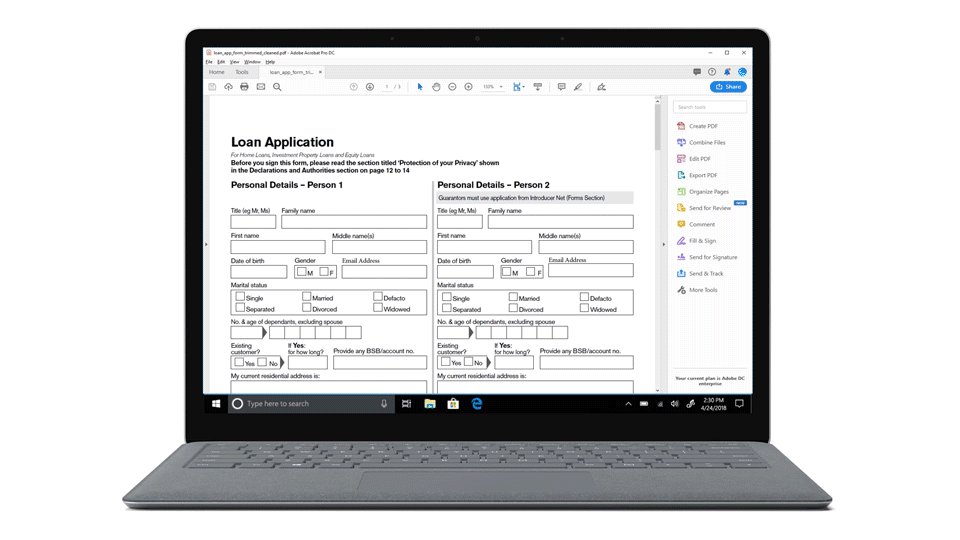

# 自動フォーム変換サービス（AFCS） {#introduction-to-automated-forms-conversion-service}

フォーム自動変換サービス（AFCS）は、PDF formsをアダプティブフォームに自動変換することで、データキャプチャ体験のデジタル化と近代化を加速させるのに役立ちます。 Adobe Sensei をベースとして開発されたこの変換サービスにより、使用しているデバイスに合わせて、PDF フォームが自動的に HTML5 ベースのアダプティブフォームに変換されます。 この変換サービスは PDF フォームと XFA の既存の技術を活用します。また、アダプティブフォームに合った検証機能、スタイル設定機能、レイアウト機能を適用して変換処理を実行します。 この変換サービスの特長を以下に示します。

* 印刷フォームをアダプティブフォームに変換する際の手動作業が大幅に減る
* 変換時に各種のパターンが適用され、適切な検証処理が実行される
* 変換時に「レコードのドキュメント」が生成される
* 使用頻度の高いフィールドが再利用可能な「フォームフラグメント」としてグループ化される
* Adobe Analytics の技術を活用して変換処理が実行される

## オンボーディング {#onboarding}

このサービスは、AEM 6.5 FormsおよびAEM 6.5 LTS Forms オンプレミス期間のお客様とAdobe Managed Service エンタープライズ版のお客様が無料で利用できます。 変換サービスを使用する場合は、アドビのセールスチームまたはアドビの営業担当者に問い合わせてください。 また、AEM Forms as a Cloud Service のお客様は無料でご利用いただけ、事前に有効化されています。

お客様の組織で変換サービスを使用できるように設定し、組織の管理者に対して必要な権限を設定します。 必要な権限を設定された管理者は、変換サービスに接続するためのアクセス権限を、組織内の AEM Forms 開発ユーザーに付与することができます。 詳しくは、「[自動フォーム変換サービスの設定](configure-service.md)」を参照してください。

## サポート対象の PDF フォームと言語 {#supported-languages-and-pdf-forms}

このサービスで変換できるフォームは、非対話型 PDF フォーム、Adobe Acrobat で作成されたフォーム（AcroForms といいます）、AEM Forms または Adobe LiveCycle で作成された XFA ベースフォームです。

このサービスは、Adobe Sign が有効になっている PDF フォームもサポートしています。 変換元の PDF フォームに Adobe Sign のテキストタグが付いている場合、サービスは変換時に Adobe Sign に関するすべての情報を保持し、変換元 PDF の署名者情報を対応するアダプティブフォームのフィールドに関連付けます。 この機能は、AcroForms でのみ使用できます。

サービスを実行すると、英語、フランス語、ドイツ語、スペイン語、イタリア語、ポルトガル語の各言語フォームをアダプティブフォームに変換することができます。 また、[AEM 翻訳ワークフロー](https://helpx.adobe.com/jp/experience-manager/6-5/forms/using/using-aem-translation-workflow-to-localize-adaptive-forms.html)を使用して変換後のアダプティブフォームを別の言語に翻訳することもできます。

## 変換ワークフロー  {#conversion-workflow}

自動フォーム変換サービス（AFCS）は、Adobe Cloud 上で稼働します。 AEM インスタンスを変換サービスに接続し、変換するフォームを AEM インスタンスにアップロードして、変換処理を開始してください。 変換プロセスの詳細なフローは、以下のようになります。

### &#x200B;1. 環境を設定する {#set-up-the-environment}

自動フォーム変換サービス（AFCS）は、Adobe Cloud 上で稼働します。 [組織の Adobe I/O アカウントを設定し、ローカルの AEM インスタンスを Adobe Cloud 上で稼働している変換サービスに接続](configure-service.md)します。 AEM 6.5およびAEM 6.5 LTSの場合、コアコンポーネントベースのテンプレートとテーマを使用する場合は、アダプティブフォームのコアコンポーネントを有効にする必要があります。[ サービスの設定](configure-service.md#referencepackage)を参照してください。

### &#x200B;2. アダプティブフォームへの PDF フォームの変換 {#use-the-conversion-service}

AEM Forms の環境を設定したら、[PDF フォームを AEM インスタンスにアップロード](convert-existing-forms-to-adaptive-forms.md)して[変換処理を開始](convert-existing-forms-to-adaptive-forms.md#run-the-conversion)します。 フォームをアップロードする場合は、以下の点に注意してください。

* 保護されたフォームをアップロードしないでください。 この変換サービスでは、パスワードで保護されたフォームや暗号化されたフォームを変換することはできません。
* スキャンされたフォーム、色付きのフォーム、入力済みのフォーム、英語、フランス語、ドイツ語、スペイン語、イタリア語、ポルトガル語以外の言語のフォームをアップロードしないでください。 こうしたフォームを変換することはできません。
* ファイル名にスペースが含まれている PDF フォームをアップロードしないでください。
* [PDF ポートフォリオ](https://helpx.adobe.com/jp/acrobat/using/overview-pdf-portfolios.html)をアップロードしないでください。 この変換サービスでは、PDF ポートフォリオをアダプティブフォームに変換することはできません。
* PDF フォームで推奨される変更内容については、「[ベストプラクティスと考慮事項](styles-and-pattern-considerations-and-best-practices.md)」を参照してください。
* 変換サービスに関する問題点については、「[既知の問題](known-issues.md)」を参照してください。

### &#x200B;3. 変換されたフォームの確認 {#review-converted-forms}

実際のフォームには、フィールドのレイアウトや名前などについて、人工知能や機械学習ベースの検出ロジックでは正確に認識できない複雑なデータキャプチャ要件が含まれている場合があります。 自動変換処理が完了したら、[「レビューと修正」エディター](review-correct-ui-edited.md)を使用して変換後のフォームを確認し、必要な更新を行って、質の高いフォームを作成することができます。 編集作業が終わったら、もう一度変換処理を実行します。

自動変換処理にかかる時間は、入力フォームのサイズ、フォームの複雑度、処理キューの状態など、様々な要因によって異なります。 変換処理の進行状況については、変換元のファイル（または変換元のファイルが保管されているフォルーダー）に定期的に表示されるインジケーターで確認することができます。 変換処理が完了すると、指定のメールアドレスに通知が送信されます。

