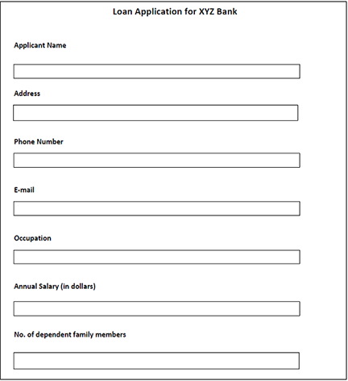
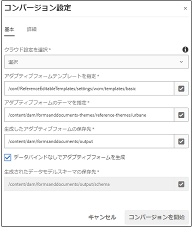
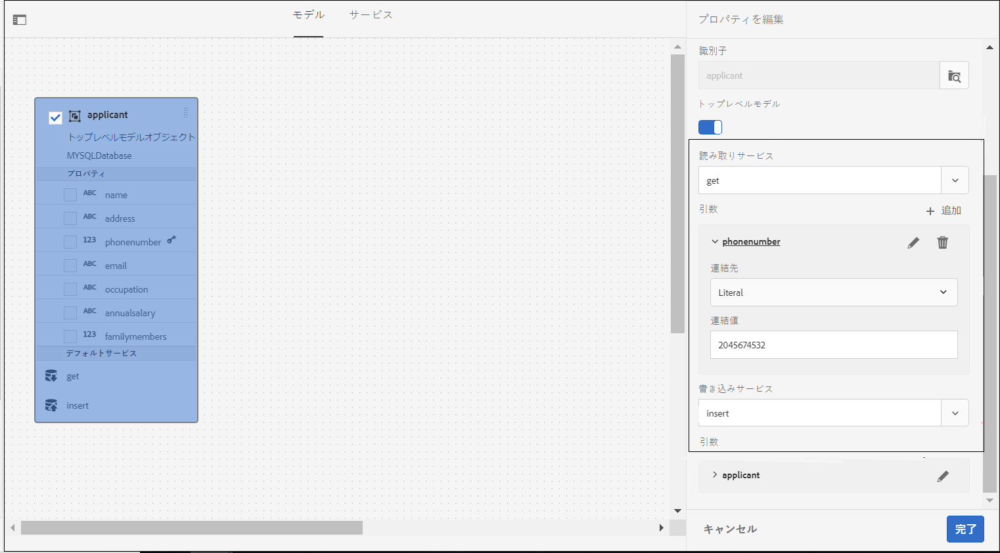
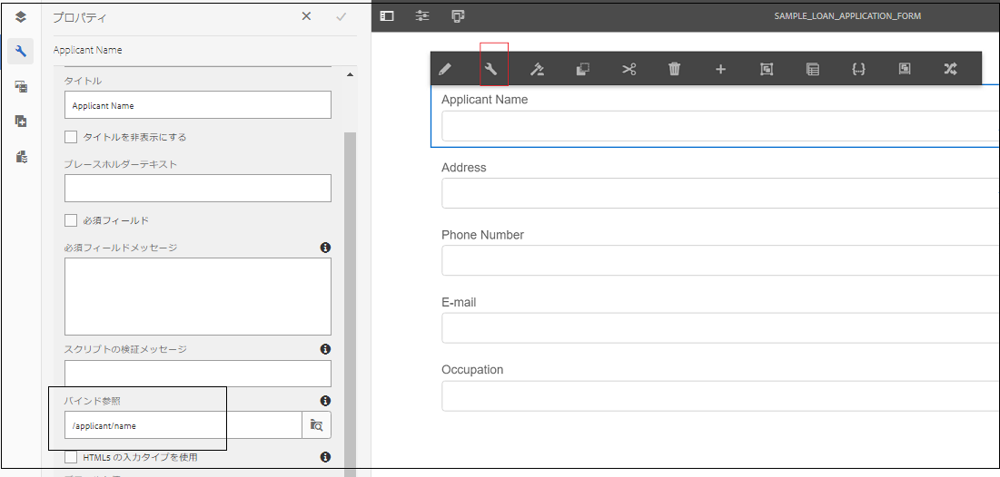
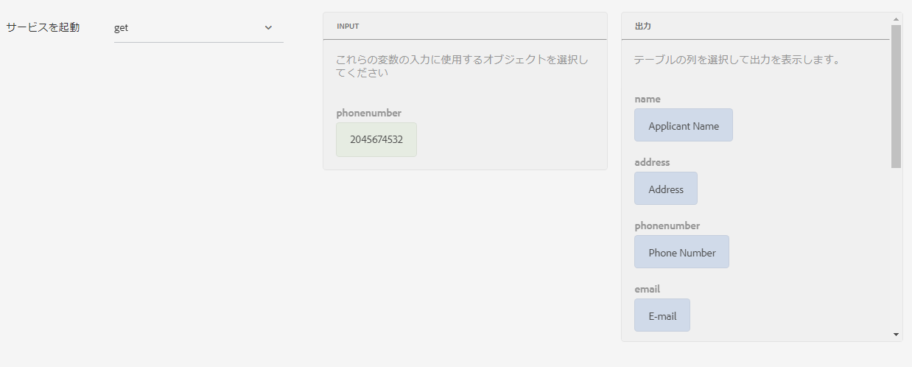

# アダプティブフォームで推奨される、データソースベースの事前入力ワークフローと送信ワークフロー {#recommended-data-source-btased-prefill-and-submit-workflows-for-adaptive-forms}

自動フォーム変換サービスを使用して変換されたアダプティブフォームでは、以下に示すいずれかのデータソースを使用することができます。

* フォームデータモデル、OData、その他のサードパーティ製サービス
* JSON スキーマ
* XSD スキーマ

データソースに基づいて、データモデルを使用してアダプティブフォームを生成することも、データモデルを使用せずにアダプティブフォームを生成することもできます。

この記事では、データソースを選択し、変換サービスを使用してアダプティブフォームを生成してから、フィールド値を事前入力するための推奨ワークフローについて説明します。また、推奨される送信方法についても説明します。

<table> 
 <tbody> 
  <tr> 
   <th><strong>データソース</strong></th> 
   <th><strong>推奨ワークフロー</strong></th> 
  </tr> 
  <tr> 
   <td><p>フォームデータモデル、OData、その他のサードパーティ製サービス</p></td> 
   <td> 
    <p><strong>方法 1</strong>：データソースとして、フォームデータモデル、OData、またはその他のサードパーティ製サービスを選択します。 次に、自動フォーム変換サービスを使用して、<a href="#generate-adaptive-forms-with-no-data-binding">データバインディングがないアダプティブフォームを生成</a>します。 次に、アダプティブフォームの各フィールドをデータモデルの各エンティティに手動でバインドし、「フォームデータモデルの事前入力サービス」オプションを使用して、フィールド値の事前入力を行います。 次に、「フォームデータモデルを使用して送信」オプションを使用して、アダプティブフォームを送信します。</p></td> 
  </tr>
  <tr> 
   <td></td> 
   <td> 
   <p><strong>方法 2</strong>：データソースとして、フォームデータモデル、OData、またはその他のサードパーティ製サービスを選択します。 次に、自動フォーム変換サービスを使用して、<a href="#generate-adaptive-forms-with-no-data-binding">データバインディングがないアダプティブフォームを生成</a>します。 次に、ルールエディターを使用してアダプティブフォームフィールドをバインドし、フィールド値の事前入力を行います。 次に、必要に応じてフィールド値を変更し、crx-repository にデータを送信します。</p>
    </td> 
  </tr>
  <tr> 
   <td></td> 
   <td> 
    <p>これらのワークフローの詳細な手順については、「<a href="#sqldatasource">データベース、OData、またはその他のサードパーティ製サービスをデータソースとして使用する</a>」を参照してください。</p> </td> 
  </tr>
  <tr>
  <td><p>JSON スキーマ</p></td> 
   <td> 
    <p>データソースとして JSON スキーマを選択します。 選択したデータソースに応じて、以下のいずれかの方法を選択します。</p></td> 
  </tr>
  <tr>
  <td></td> 
   <td> 
    <p><strong>方法 1</strong>：自動フォーム変換サービスを使用して、<a href="#generate-adaptive-forms-with-no-data-binding">データバインディングがないアダプティブフォームを生成</a>し、JSON スキーマをデータソースとして設定します。 次に、アダプティブフォームの各フィールドを JSON スキーマに手動でバインドし、<a href="https://helpx.adobe.com/jp/experience-manager/6-5/forms/using/prepopulate-adaptive-form-fields.html#Supportedprotocolsforprefillinguserdata" target="_blank">サポートされているいずれかのプロトコルを使用</a>して、フィールド値の事前入力を行います。 次に、必要に応じてフィールド値を変更し、crx-repository にデータを送信します。</p></td> 
  </tr>
  <tr>
  <td></td> 
   <td> 
    <p>このワークフローの詳細な手順については、次のセクションを参照してください：<a href="#jsondatasource">JSON スキーマをデータソースとして使用する</p></td> 
  </tr>
  <tr>
  <td></td> 
   <td> 
    <p><strong>方法 2</strong>：自動フォーム変換サービスを使用して、<a href="#generate-adaptive-forms-with-json-binding">JSON データバインディングを持つアダプティブフォームを生成</a>します。 事前入力サービスとフォーム送信機能がシームレスに連携します。 設定手順を実行する必要はありません。</p> </td> 
  </tr>
   <tr>
  <td></td> 
   <td> 
    <p>このワークフローの詳細な手順については、「<a href="#jsonwithdatabinding">JSON スキーマをデータソースとして使用する</a>」を参照してください。</p> </td> 
  </tr>
  <tr>
  <td><p>XSD スキーマ</p></td> 
   <td> 
    <p>データソースとして XSD スキーマを選択します。 選択したデータソースに応じて、自動フォーム変換サービスを使用して<a href="#generate-adaptive-forms-with-no-data-binding">データバインディングがないアダプティブフォームを生成</a>し、XSD スキーマをデータソースとして設定します。 次に、アダプティブフォームの各フィールドを XSD スキーマに手動でバインドし、<a href="https://helpx.adobe.com/jp/experience-manager/6-5/forms/using/prepopulate-adaptive-form-fields.html#Supportedprotocolsforprefillinguserdata" target="_blank">サポートされているいずれかのプロトコルを使用</a>して、フィールド値の事前入力を行います。 次に、必要に応じてフィールド値を変更し、crx-repository にデータを送信します。</p>
    </td> 
  </tr>
  <tr>
  <td></td> 
   <td> 
    <p>このワークフローの詳しい手順については、「<a href="#xsddatasource">XSD スキーマをデータソースとして使用する</a>」を参照してください。</p>
    </td> 
  </tr>
 </tbody> 
</table>


自動フォーム変換サービスについて詳しくは、以下の記事を参照してください。

* [自動フォーム変換サービスの概要](introduction.md)
* [自動フォーム変換サービスの設定](configure-service.md)
* [印刷フォームをアダプティブフォームに変換する](convert-existing-forms-to-adaptive-forms.md)
* [変換後のフォームのレビューと修正](review-correct-ui-edited.md)

この記事は、アダプティブフォームに関する基礎的な概念を理解している読者を対象としています。

## 前提条件 {#pre-requisites}

* [AEM オーサーインスタンス](https://helpx.adobe.com/ja/experience-manager/6-5/sites/deploying/using/deploy.html)を設定する
* [AEM オーサーインスタンス上で自動フォーム変換サービスを設定](configure-service.md)する

## サンプルのアダプティブフォーム {#sample-adaptive-form}

アダプティブフォームフィールドに事前に値を入力してデータソースに送信するというユースケースを実行するには、以下のサンプル PDF ファイルをダウンロードする必要があります。

サンプルのローン申し込みフォーム

[ファイルを入手](assets/sample_loan_application_form.pdf)

この PDF ファイルは、自動フォーム変換サービスの入力データとして機能します。 自動フォーム変換サービスを実行すると、このファイルがアダプティブフォームに変換されます。 以下の画像は、PDF 形式のサンプルのローン申し込みフォームです。



## フォームモデルのデータを準備する {#prepare-data-for-form-model}

AEM Forms のデータ統合機能により、複数の異なるデータソースを設定して接続することができます。変換サービスを使用してアダプティブフォームを生成したら、使用するデータモデル（XSD スキーマまたは JSON スキーマ）に応じてフォームモデルを定義します。 データベース、Microsoft Dynamics、またはその他のサードパーティ製サービスを使用して、フォームデータモデルを作成することができます。

このチュートリアルでは、MySQL データベースをデータソースとして使用してフォームデータモデルを作成します。 アダプティブフォーム内の有効なフィールドに基づいて、データベース内に **loanapplication** というスキーマを作成し、このスキーマに **applicant** というテーブルを追加します。


以下の DDL ステートメントを使用して、データベース内に **applicant** というテーブルを作成します。

```sql
CREATE TABLE `applicant` (
   `name` varchar(45) DEFAULT NULL,
   `address` varchar(45) DEFAULT NULL,
   `phonenumber` int(11) NOT NULL,
   `email` varchar(45) DEFAULT NULL,
   `occupation` varchar(45) DEFAULT NULL,
   `annualsalary` varchar(45) DEFAULT NULL,
   `familymembers` int(11) DEFAULT NULL,
   PRIMARY KEY (`phonenumber`)
 ) ENGINE=InnoDB DEFAULT CHARSET=utf8
```

XSD スキーマをフォームモデルとして使用してこのユースケースを実行する場合は、以下のコードが記述された XSD ファイルを作成します。

```xml
<?xml version="1.0" encoding="utf-8" ?>
    <xs:schema targetNamespace="http://adobe.com/sample.xsd"
                    xmlns="http://adobe.com/sample.xsd"
                    xmlns:xs="http://www.w3.org/2001/XMLSchema">

<xs:element name="sample" type="SampleType"/>

  <xs:complexType name="SampleType">
    <xs:sequence>
      <xs:element name="name" type="xs:string"/>
   <xs:element name="address" type="xs:string"/>
   <xs:element name="phonenumber" type="xs:int"/>
   <xs:element name="email" type="xs:string"/>
   <xs:element name="occupation" type="xs:string"/>
   <xs:element name="annualsalary" type="xs:string"/>
   <xs:element name="familymembers" type="xs:string"/>
 </xs:sequence>
  </xs:complexType>

  </xs:schema>
```

または、ローカルのファイルシステムに XSD スキーマをダウンロードします。

サンプルのローン申し込み XSD スキーマ

[ファイルを入手](assets/loanapplication.xsd)

アダプティブフォーム内で XSD スキーマをフォームモデルとして使用する方法については、「[XML スキーマを使用してアダプティブフォームを作成する](https://helpx.adobe.com/jp/experience-manager/6-5/forms/using/adaptive-form-xml-schema-form-model.html)」を参照してください。

JSON スキーマをフォームモデルとして使用してこのユースケースを実行する場合は、以下のコードが記述された JSON ファイルを作成します。

```JSON
{
    "$schema": "http://json-schema.org/draft-04/schema#",
    "definitions": {
        "loanapplication": {
            "type": "object",
            "properties": {
                "name": {
                    "type": "string"
                },
                "address": {
                    "type": "string"
                },
    "phonenumber": {
                    "type": "number"
                },
    "email": {
                    "type": "string"
                },
    "occupation": {
                    "type": "string"
                },
    "annualsalary": {
                    "type": "string"
                },
    "familymembers": {
                    "type": "number"
                }
            }
        }
 },
 "type": "object",
    "properties": {
        "employee": {
            "$ref": "#/definitions/loanapplication"
        }
    }
}
```

または、ローカルのファイルシステムに JSON スキーマをダウンロードします。

サンプルのローン申し込み JSON スキーマ

[ファイルを入手](assets/demo_schema.json)

アダプティブフォーム内で JSON スキーマをフォームモデルとして使用する方法については、「[JSON スキーマを使用してアダプティブフォームを作成する](https://helpx.adobe.com/jp/experience-manager/6-5/forms/using/adaptive-form-json-schema-form-model.html)」を参照してください。

## データバインディングがないアダプティブフォームを生成する {#generate-adaptive-forms-with-no-data-binding}

[自動フォーム変換サービス](convert-existing-forms-to-adaptive-forms.md)を使用して、[サンプルのローン申し込みフォーム](#sample-adaptive-form)をデータバインディングがないアダプティブフォームに変換します。 データバインディングがないアダプティブフォームを生成するには、「**[!UICONTROL データバインディングがないアダプティブフォームを生成]**」チェックボックスを選択します。



データバインディングがないアダプティブフォームを生成したら、アダプティブフォームのデータソースを選択します。

* [データベース、OData、またはその他のサードパーティ製サービス](#sqldatasource)
* [JSON スキーマ](#jsondatasource)
* [XSD スキーマ](#xsddatasource)

>[!NOTE]
> 自動フォーム変換サービスを使用して生成されたアダプティブフォームに、同じ名前のフィールドが複数含まれている場合は、フォームの送信時にデータが失われる可能性があるため、必ずこれらのフィールドをデータソースエンティティにバインドしてください。
>

### データベース、OData、またはその他のサードパーティ製サービスをデータソースとして使用する {#sqldatasource}

ユースケース：自動フォーム変換サービスを使用して、データバインディングがないアダプティブフォームを生成し、MYSQL データベースをデータソースとして設定します。 次に、アダプティブフォームの各フィールドをデータモデルの各エンティティに手動でバインドし、「**[!UICONTROL フォームデータモデルの事前入力サービス]**」オプションを使用して、フィールド値の事前入力を行います。 次に、「**[!UICONTROL フォームデータモデルを使用して送信]**」オプションを使用して、アダプティブフォームを送信します。

このユースケースを実行する前に、以下の処理を行う必要があります。

* [MySQL データベースをデータソースとして設定する](https://helpx.adobe.com/jp/experience-manager/6-5/forms/using/configure-data-sources.html#configurerelationaldatabase)
* [フォームデータモデルを作成する](https://helpx.adobe.com/jp/experience-manager/6-5/forms/using/work-with-form-data-model.html)

このユースケースでは、**loanapplication** というフォームデータモデルを作成し、read サービス引数を **[!UICONTROL Literal]** 値にバインドします。 電話番号のリテラル値は、MySQL データベースの **applicant** スキーマ内で設定されているいずれかのレコードと一致している必要があります。 変換サービスは、この値を引数として使用して、データソースから詳細データをフェッチします。 「[バインド先](https://helpx.adobe.com/jp/experience-manager/6-5/forms/using/work-with-form-data-model.html#bindargument)」ドロップダウンリストで「**[!UICONTROL ユーザプロファイル属性または要求属性]**」を選択することもできます。



>[!NOTE]
>
>このユースケースを実行する前に、**get** サービスと **insert** サービスをフォームデータモデルに追加し、これらのサービスの設定とテストを行ってください。

以下の手順を実行します。

1. 変換後の&#x200B;**サンプルのローン申し込みフォーム**&#x200B;を **[!UICONTROL output]** フォルダーで選択して「**[!UICONTROL プロパティ]**」をタップします。
1. 「**[!UICONTROL フォームモデル]**」タブをタップし、「**[!UICONTROL 選択]**」ドロップダウンリストで「**[!UICONTROL フォームデータモデル]**」を選択します。次に、「**[!UICONTROL フォームデータモデルを選択]**」タブをタップし、データモデルで「**loanapplication**」を選択します。 「**[!UICONTROL 保存して終了]**」をタップしてフォームを保存します。
1. **サンプルのローン申し込みフォーム**&#x200B;を選択して「**[!UICONTROL 編集]**」をタップします。
1. 「**[!UICONTROL コンテンツ]**」タブで、以下の設定アイコンをタップします。

   

   1. 「**[!UICONTROL 基本]**」セクションの「**[!UICONTROL 事前入力サービス]**」ドロップダウンリストで「**[!UICONTROL フォームデータモデル事前入力サービス]**」を選択します。

   1. 「**[!UICONTROL 送信]**」セクションの「**[!UICONTROL 送信アクション]**」ドロップダウンリストで「**[!UICONTROL フォームデータモデルを使用して送信]**」を選択します。

   1. 「**[!UICONTROL 送信するデータモデル]**」フィールドでデータモデルを選択します。
   1.  をタップしてプロパティを保存します。

1. 「申込者名」テキストボックスをタップして設定アイコン（）を選択します。

   1. 「バインド参照」フィールドで&#x200B;**申込者**／**名前**&#x200B;を選択し、 をタップしてプロパティを保存します。 同様に、フォームデータモデルエンティティを使用して、「**住所**」、「**電話番号**」、「**メール**」、「**職業**」、「**年収（ドル）**」、「**扶養家族の数**」フィールドのデータバインディングを作成します。

   

1. 「**[!UICONTROL プレビュー]**」をタップして、事前入力されたアダプティブフォームフィールドの値を確認します。
1. 必要に応じてフィールド値を変更し、アダプティブフォームを送信します。 フィールド値が MySQL データベースに送信されます。 データベースで **applicant** テーブルを更新すると、このテーブル内の更新後の値が表示されます。

**ユースケース**：自動フォーム変換サービスを使用して、データバインディングがないアダプティブフォームを生成し、MYSQL データベースをデータソースとして設定します。 次に、ルールエディターを使用してアダプティブフォームフィールドをバインドし、フィールド値の事前入力を行います。 次に、必要に応じてフィールド値を変更し、crx-repository にデータを送信します。

[ルールエディター](https://helpx.adobe.com/jp/experience-manager/6-5/forms/using/rule-editor.html)を使用してフォームデータモデルサービスを呼び出し、アダプティブフォーム内のフィールドのバインドと値の事前入力を行うには、以下の手順を実行します。

1. **サンプルのローン申し込みフォーム**&#x200B;を **[!UICONTROL output]** フォルダーで選択して「**[!UICONTROL 編集]**」をタップします。
1. 「**[!UICONTROL コンテンツ]**」タブで、以下の設定アイコンをタップします。

   

   「**[!UICONTROL 基本]**」セクションの「**[!UICONTROL 事前入力サービス]**」ドロップダウンリストで「**[!UICONTROL フォームデータモデル事前入力サービス]**」を選択します。

1. 「**[!UICONTROL 申込者名]**」テキストボックスをタップしてから「**[!UICONTROL ルールを編集]**」をタップします。

   

1. ルールエディターページで「**[!UICONTROL 作成]**」をタップします。
1. **[!UICONTROL ルールエディター]**&#x200B;ページで以下の手順を実行します。

   1. 「申込者名」テキストボックスで状態を選択します。 例えば、状態として「**[!UICONTROL 初期化された]**」を選択した場合、「**[!UICONTROL プレビュー]**」モードでフォームをレンダリングすると、「**[!UICONTROL Then]**」条件が実行されます。

   1. 「**[!UICONTROL Then]**」セクションの「**[!UICONTROL アクションの選択]**」ドロップダウンリストで「**[!UICONTROL サービスの呼び出し]**」を選択します。Forms インスタンス上のすべてのサービスがドロップダウンリストに表示されます。

   1. フォームデータモデルが一覧表示されているセクションで「**[!UICONTROL Get]**」サービスを選択します。 「入力」セクションに「**phonenumber**」が表示されます。これは、**applicant** データモデル用に定義されたプライマリーキーです。 このフィールドに基づいて、「出力」セクションのアダプティブフォームフィールド値が事前入力されます。

   1. 「出力」セクションのフォームデータモデルエンティティを使用して、アダプティブフォームフィールドのデータバインディングを作成します。 例えば、アダプティブフォームの「**[!UICONTROL 申込者名]**」フィールドを「**name**」エンティティにバインドします。

   1. 「**[!UICONTROL 完了]**」をタップします。ルールエディターページで、もう一度「**[!UICONTROL 完了]**」をタップします。

   

1. 「**[!UICONTROL プレビュー]**」をタップして、事前入力されたアダプティブフォームフィールドの値を確認します。

   >[!NOTE]
   >
   >アダプティブフォームに関連付けられているフォームデータモデルの **[!UICONTROL get]** サービスプロパティに対して、「**配列を返す**」プロパティがオフに設定されていることを確認してください。

1. 必要に応じてフィールド値を変更し、アダプティブフォームを送信します。 送信後のデータは、crx-repository の以下の場所に保存されます。

   `http://host name:port/crx/de/index.jsp#/content/forms/fp/admin/submit/data/latest file available in the folder`

### JSON スキーマをデータソースとして使用する {#jsondatasource}

**ユースケース**：自動フォーム変換サービスを使用して、データバインディングがないアダプティブフォームを生成し、JSON スキーマをデータソースとして設定します。 次に、アダプティブフォームの各フィールドを JSON スキーマに手動でバインドし、「**データを使用してプレビュー**」オプションを使用して、フィールド値の事前入力を行います。 次に、必要に応じてフィールド値を変更し、crx-repository にデータを送信します。

このユースケースを実行する前に、以下を確認する必要があります。

* [正しい JSON スキーマが JSON スキーマ構造に対応していること](#prepare-data-for-form-model)
* [データバインディングがないアダプティブフォームが生成されていること](#generate-adaptive-forms-with-no-data-binding)

以下の手順を実行します。

1. 変換後の&#x200B;**サンプルのローン申し込みフォーム**&#x200B;を **output** フォルダーで選択して「**[!UICONTROL プロパティ]**」をタップします。
1. 「**[!UICONTROL フォームモデル]**」タブの「**[!UICONTROL 選択]**」ドロップダウンリストで「**[!UICONTROL スキーマ]**」を選択し、「**[!UICONTROL スキーマを選択]**」をタップして、ローカルファイルシステムに保存されている **demo.schema** という JSON スキーマをアップロードします。 「**[!UICONTROL 保存して終了]**」をタップしてフォームを保存します。
1. **サンプルのローン申し込みフォーム**&#x200B;を選択して「**[!UICONTROL 編集]**」をタップします。
1. 「申込者名」テキストボックスをタップして設定アイコン（）を選択します。

   「バインド参照」フィールドで&#x200B;**申込者**／**名前**&#x200B;を選択し、 をタップしてプロパティを保存します。 同様に、JSON スキーマエンティティを使用して、「**住所**」、「**電話番号**」、「**メール**」、「**職業**」、「**年収（ドル）**」、「**扶養家族の数**」フィールドのデータバインディングを作成します。

1. 変換後の&#x200B;**サンプルのローン申し込みフォーム**&#x200B;を **[!UICONTROL output]** フォルダーで選択し、**[!UICONTROL プレビュー]**／**[!UICONTROL データを使用してプレビュー]**&#x200B;を選択します。</br>

   以下のリンクでサンプルデータファイルをダウンロードしてください：</br>

   [ファイルを入手](assets/json_data_file.txt)</br>

1. 必要に応じてフィールド値を変更し、アダプティブフォームを送信します。 送信後のデータは、crx-repository の以下の場所に保存されます。

   `http://host name:port/crx/de/index.jsp#/content/forms/fp/admin/submit/data/latest file available in the folder`

### XSD スキーマをデータソースとして使用する {#xsddatasource}

**ユースケース**：自動フォーム変換サービスを使用して、データバインディングがないアダプティブフォームを生成し、XSD スキーマをデータソースとして設定します。 次に、アダプティブフォームの各フィールドを XSD スキーマに手動でバインドし、「**データを使用してプレビュー**」オプションを使用して、フィールド値の事前入力を行います。 次に、必要に応じてフィールド値を変更し、crx-repository にデータを送信します。

このユースケースを実行する前に、以下を確認する必要があります。

* [正しい XSD スキーマが XML スキーマ構造に対応していること](#prepare-data-for-form-model)
* [データバインディングがないアダプティブフォームが生成されていること](#generate-adaptive-forms-with-no-data-binding)

以下の手順を実行します。

1. 変換後の&#x200B;**サンプルのローン申し込みフォーム**&#x200B;を **[!UICONTROL output]** フォルダーで選択して「**[!UICONTROL プロパティ]**」をタップします。
1. 「**[!UICONTROL フォームモデル]**」タブの「**[!UICONTROL 選択]**」ドロップダウンリストで「**[!UICONTROL スキーマ]**」を選択し、「**[!UICONTROL スキーマを選択]**」をタップして、ローカルファイルシステムに保存されている **loanapplication** という XSD スキーマをアップロードします。 次に、XSD スキーマのルート要素を選択し、「**[!UICONTROL 保存して終了]**」をタップしてフォームを保存します。
1. **サンプルのローン申し込みフォーム**&#x200B;を選択して「**[!UICONTROL 編集]**」をタップします。
1. 「申込者名」テキストボックスをタップして設定アイコン（）を選択します。
「バインド参照」フィールドで**申込者**／**名前**&#x200B;を選択し、 をタップしてプロパティを保存します。 同様に、XSD スキーマエンティティを使用して、「**住所**」、「**電話番号**」、「**メール**」、「**職業**」、「**年収（ドル）**」、「**扶養家族の数**」フィールドのデータバインディングを作成します。

1. 変換後の&#x200B;**サンプルのローン申し込みフォーム**&#x200B;を **output** フォルダーで選択し、**[!UICONTROL プレビュー]**／**[!UICONTROL データを使用してプレビュー]**&#x200B;を選択します。</br>

   以下のリンクでサンプルデータファイルをダウンロードしてください：</br>

   [ファイルを入手](assets/loan-application-data-xml-data.zip)</br>


1. 必要に応じてフィールド値を変更し、アダプティブフォームを送信します。 送信後のデータは、crx-repository の以下の場所に保存されます。

   `http://host name:port/crx/de/index.jsp#/content/forms/fp/admin/submit/data/latest file available in the folder`

## JSON バインディングを持つアダプティブフォームを生成する {#generate-adaptive-forms-with-json-binding}

[自動フォーム変換サービス](convert-existing-forms-to-adaptive-forms.md)を使用して、[サンプルのローン申し込みフォーム](#sample-adaptive-form)を、データバインディングを持つアダプティブフォームに変換します。 アダプティブフォームを生成する際に、「**[!UICONTROL データバインディングがないアダプティブフォームを生成]**」チェックボックスが無効になっていることを確認してください。


### JSON スキーマをデータソースとして使用する {#jsonwithdatabinding}

**ユースケース**：自動フォーム変換サービスを使用して、JSON データバインディングを持つアダプティブフォームを生成します。 事前入力サービスとフォーム送信機能がシームレスに連携します。 設定手順を実行する必要はありません。

以下の手順を実行する前に、[データバインディングを持つアダプティブフォーム](#generate-adaptive-forms-with-json-binding)が生成されていることを確認してください。

以下の手順を実行します。

1. 変換後の&#x200B;**サンプルのローン申し込みフォーム**&#x200B;を **[!UICONTROL output]** フォルダーで選択し、**[!UICONTROL プレビュー]**／**[!UICONTROL データを使用してプレビュー]**&#x200B;を選択します。</br>

   以下のリンクでサンプルデータファイルをダウンロードしてください：</br>

   [ファイルを入手](assets/loan_application_data_source_json_data_binding.txt)</br>

1. 必要に応じてフィールド値を変更し、アダプティブフォームを送信します。 送信後のデータは、crx-repository の以下の場所に保存されます。

   `http://host name:port/crx/de/index.jsp#/content/forms/fp/admin/submit/data/latest file available in the folder`

## 送信後のアダプティブフォームの JSON データを XML 形式に変換する {#convert-submitted-adaptive-form-data-to-xml}

アダプティブフォームのフィールドに値を入力してフォームを送信すると、そのデータが crx-repository 内で JSON 形式に変換されます。 JSON データを XML 形式に変換するには、[org.apache.sling.commons.json.xml](https://sling.apache.org/apidocs/sling5/org/apache/sling/commons/json/xml/XML.html#toString) という API を使用するか、以下のサンプルコードを使用します。

```
import org.apache.sling.commons.json.JSONException;
import org.apache.sling.commons.json.JSONObject;
import org.apache.sling.commons.json.xml.XML;
 
public class ConversionUtils {
 
    public static String jsonToXML(String jsonString) throws JSONException {
        //https://sling.apache.org/apidocs/sling5/org/apache/sling/commons/json/xml/XML.html#toString(java.lang.Object)
        //jar - http://maven.ibiblio.org/maven2/org/apache/sling/org.apache.sling.commons.json/2.0.18/
        //Note: Need to extract boundData part before converting to XML
        return XML.toString(new JSONObject(jsonString));
    }
}
```
