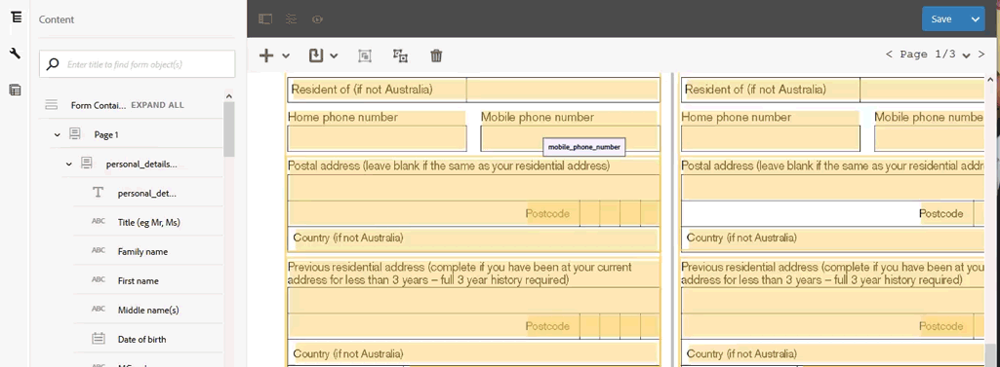

# 変換後のフォームのレビューと修正{#review-and-correct-converted-forms}

AEM Forms 自動フォーム変換サービス（AFCS）では、入力 PDF ドキュメントのフィールド、コンテンツ、レイアウトを識別し、PDF ドキュメントをアダプティブフォームに変換します。変換後のアダプティブフォームには、いくつかのフィールドが欠落していたり、正しく変換されていないフィールドが含まれていたりする場合があります。 「レビューと修正」エディターを使用してこれらのフィールドを修正し、品質の高いアダプティブフォームを再生成することができます。 最初の変換処理が完了したら、「レビューと修正」エディターで PDF 入力ドキュメントを開き、以下の操作を実行します。

* 変換処理で識別されたすべてのフィールドとコンテンツを確認する
* 変換処理でスキップされたフィールドとコンテンツを特定する
* フィールドのタイプを確認し、必要に応じて変更する
* 識別されたテーブルを確認し、列のサイズとセルのコンテンツを変更する
* 間違って識別されたフィールドを削除する

エディター上で必要な変更を行い、PDF ドキュメントの変換処理をもう一度実行します。 変換処理が正常に完了すると、アダプティブフォームが含まれている更新後のアセットが、スキーマとともに AEM Forms インスタンスにダウンロードされます。 満足できるアダプティブフォームが作成されるまで、この処理を繰り返します。

「レビューと修正」エディターは、Google Chrome、Mozilla FireFox、Microsoft Edge の各ブラウザーでサポートされています。 Internet Explorer ではサポートされていません。

## 「レビューと修正」エディターへようこそ {#welcome-to-review-and-correct-editor}

「レビューと修正」エディターには、使いやすいユーザーインターフェイスが付属しています。 このエディターは、以下のコンポーネントから構成されています。

* コンテンツブラウザー：このブラウザーを使用して、要素の位置を変更することができます。 具体的には、ドラッグ＆ドロップ操作でフォームオブジェクトを移動して、オブジェクトの位置を変更します。 例えば、テーブルをテキストボックスの前に移動する場合などに、コンテンツブラウザーを使用します。 操作の内容に応じて、出力アダプティブフォームのタブの順序が変更されます。
* プロパティブラウザー：このブラウザーには、選択したフィールドのプロパティが表示されます。 このブラウザーでプロパティを変更することもできます。
* ツールバー：エディターの上部にツールバーが表示されます。 このツールバーには、フィールドの追加、修正、グループ化、グループ解除、削除を行うためのツールが表示されます。
* 「プロパティを開く」オプション： アイコンをタップすると、このオプションが表示されます。 「プロパティを開く」オプションをクリックすると、フォームのプロパティと追加のオプションが表示されます。
* フィルターボタン：エディターの上部にフィルターボタン（）が表示されます。 このボタンを使用してフィールドをフィルタリングすることにより、テキスト、フィールド、選択グループだけを表示したり、すべてのコンポーネントを表示したりすることができます。
* 保存ボタン：エディターの右上隅に&#x200B;**[!UICONTROL 保存]**&#x200B;ボタンが表示されます。 保存ボタンの横に表示されている矢印を使用して、フォームを変換用に送信するためのオプションを表示することもできます。

* PDF フォーム：エディターにはソース PDF ドキュメントが表示され、そのドキュメントの上に重なる形で、識別されたフィールドが表示されます。 ツールバーに表示されている各種ツールを使用して、これらのフィールドを編集することができます。
* ページ：1 つのソースフォームに複数のページを含めることができます。 エディターの右上隅には、ページ間を移動するためのボタンが表示されます。

**A.** コンテンツブラウザー&#x200B;**B.** プロパティブラウザー&#x200B;**C.** ツールバー&#x200B;**D.** プロパティボタン&#x200B;**E.** フィルターボタン&#x200B;**F.** 保存ボタン&#x200B;**G.** 識別されたフィールドがオーバーレイ表示された PDF フォーム

最初の変換処理が正常に完了すると、識別されたフィールドとコンポーネントが、ソース PDF ドキュメント上にオーバーレイ表示されます。 オーバーレイ表示されるフィールドやコンポーネントのタイプは、テキスト、フィールド、パネル、選択グループ、テーブルです。

* テキスト：ソース PDF ドキュメント内のプレーンテキスト。 例えば、上図の「Loan Application」というタイトルがテキストになります。
* フィールド：値または入力ボックスに関連付けられたテキストまたはアイコンラベルの組み合わせ。 例えば、上図の「First name」欄がフィールドになります。 フィールドは、テキストラベルと入力ボックスから構成されています。 フィールドでサポートされるデータタイプは、テキスト、数値、ドロップダウン、日付、メールアドレス、電話番号、署名、通貨、パスワードです。
* パネル：コンテンツとコンポーネントの論理的な集合体。 例えば、上図の「Personal Details - Person 1」と「Personal Details - Person 2」を組み合わせたものがパネルになります。
* 選択グループ：複数選択オプション（チェックボックスとラジオボタン）に関連付けられたテキストの組み合わせ。 例えば、上図の「Marital status」と「Existing customer」が選択グループになります。\
  変換サービスにより、選択グループのキャプションと複数選択オプションに基づき、選択グループが単一選択型ラジオボタンまたは複数選択型チェックボックスに自動的に変換されます。 例えば、「**いずれかを選択**」というテキストが選択グループのキャプションまたは複数選択オプションとして設定されていて、選択できるオプションが「**はい**」または「**いいえ**」のいずれかだけである場合、変換サービスにより、その選択グループが自動的に単一選択型ラジオボタンに変換されます。 同様に、「**該当する項目をすべて選択**」や「**複数の項目を選択**」などのテキストが選択グループのキャプションまたは複数選択オプションとして設定されていて、複数のオプションを選択できる場合、変換サービスにより、その選択グループが自動的に複数選択型チェックボックスに変換されます。

* テーブル：列と行に情報が表示される 2 次元テーブル。 テーブルに列や行を追加したり、テーブルから列や行を削除したりすることができます。

## 変換後のレビューを開始 {#start-reviewing-a-conversion}

最初の変換処理が正常に完了すると、識別されたフィールドとコンポーネントが、ソース PDF ドキュメント上にオーバーレイ表示されます。 変換処理で識別されたフィールドを修正してアダプティブフォームを再生成することにより、アダプティブフォームの品質を高めることができます。 フォームのレビューを行うには、最初に変換処理を実行する必要があります。

### 事前準備 {#before-you-start}

* 「レビューと修正」エディターでは、フラグメントはサポートされていません。 「**フラグメントを抽出**」オプションを有効にして変換処理を実行した場合、「レビューと修正」エディターを使用して変換結果をレビューしないでください。 このような変換結果をレビューする場合は、[アダプティブフォームエディター](https://helpx.adobe.com/jp/experience-manager/6-5/forms/using/introduction-forms-authoring.html)を使用してください。

* 「レビューと修正」エディターには、編集操作を元に戻すオプションは用意されていません。 そのため、編集内容を最終的に確定する場合にのみ、保存ボタンを使用してください。

### レビューを開始 {#start-the-review}

変換後のフォームのレビューを開始するには、変換処理で使用したソース PDF ドキュメントを選択し、「**変換を確認**」を選択してタップします。 新しいタブに「レビューと修正」エディターが表示されます。 これで、変換後のフォームのレビューを開始することができます。 問題の修正を行う前に、以下の基本的なチェック手順を実行してください。

1. **すべてのフィールドのタイプを確認する**：変換サービスを実行すると、正しくないフィールドタイプが設定される場合があります。 例えば、携帯電話番号フィールドに、電話番号タイプではなくテキストタイプが割り当てられる場合があります。 フィールドにカーソルを置くと、そのフィールドのタイプが表示されます。

   フィールドタイプを変更するには、目的のフィールドを選択してプロパティブラウザーを開き、「**[!UICONTROL タイプ]**」ドロップダウンで値を選択して「**[!UICONTROL 保存]**」をタップします。 この操作により、フィールドタイプが変更されます。

   

1. **余分なパネルを削除する**：変換サービスを実行すると、余分なパネルが生成される場合があります。 例えば、親パネル内に余分なサブパネルが作成されたり、空白のスペースがパネルに変換されたり、チェックボックスがパネルに変換されたりする場合があります。 そのため、すべてのパネルの境界線を確認して、余分なパネルを削除する必要があります。 フィルターボタン（）またはコンテンツブラウザーを使用して、すべてのパネルを表示することができます。

   余分なパネルを削除するだけでなく、パネルのグループ化を解除することもできます。 削除オプションを使用すると、パネルに含まれている子フィールドや子コンポーネントも削除されます。

   * パネルを削除する場合は、目的のパネルを選択し、ツールバーの削除アイコン（）をタップします。 確認ダイアログが表示されたら、「**[!UICONTROL 確認]**」をタップします。 次に「**[!UICONTROL 保存]**」をタップして、編集内容を保存します。

   * パネルのグループ化を解除する場合は、目的のパネルを選択し、ツールバーのグループ解除アイコンをタップします。 パネルのグループが解除され、そのパネルの子フィールドが親フィールドに合わせて調整されます。 「[!UICONTROL 保存]」をタップして、編集内容を保存します。

1. 「**テキストの論理グループを作成する**：テキストが正しく識別されているかどうかを確認します。 また、正しいパネルやグループにテキストが論理的に配置されているかどうかを確認します。 例えば、複数の列から構成されるレイアウトの場合、特定の論理グループのテキストが別のグループ内に配置されていないかどうかを確認します。

   * テキストが正しく配置されているかどうかを確認するには、フィルターボタン（）を使用してテキストだけを表示し、各テキストをクリックして確認します。 その際に、スペルミス、タイポ、文法的な間違いがあれば修正します。

   * フォームにテキストを追加する場合は、「+」ボタンをタップしてから「**[!UICONTROL テキスト]**」をタップします。 次にボックスを描画してプロパティブラウザーを起動し、コンテンツボックスに追加するテキストを入力します。

1. **テーブルを確認する**：テーブルのすべての境界線が正しく識別されているかどうかを確認します。 また、セルの内容が正しく識別されているかどうかを確認します。

   * 正しく識別されていない境界線を識別させるには、「**[!UICONTROL 列を追加]**」オプションまたは「**[!UICONTROL 行を追加]**」オプションを使用します。

   * 余分な境界線を削除するには、「**[!UICONTROL 列を削除]**」オプションまたは「**[!UICONTROL 行を削除]**」オプションを使用します。

必要な変更を行ったら、「**[!UICONTROL 保存して変換]**」ボタンをタップして PDF フォームを再度変換します。 各フィールドが、対応するアダプティブフォームのフィールドコンポーネントに変換されます。 変換処理が正常に完了すると、アダプティブフォームが含まれている更新後のアセットが、スキーマとともに AEM Forms インスタンスにダウンロードされます。 フォームが複雑な場合は、変換が終了するまで時間がかかる可能性があります。

基本的なチェック処理が完了したら、フォームのレビューを行い、組織固有の問題点を修正します。 例えば、欠落しているフィールドの追加などを行います。 「[「レビューと修正」エディターのツールを使用する](review-correct-ui-edited.md#use-the-review-and-correct-editor-tools)」セクションで、問題を修正するためのすべてのエディターツールについて確認することができます。

また、「レビューと修正」エディターでは、ほぼすべてのフォームで発生する共通の問題を修正し、それらの問題をアドビに報告することができます。 満足できるフォームが完成するまで、「レビューと修正」エディターを使用して繰り返し修正を行ってください。

## 「レビューと修正」エディターのツールを使用 {#use-the-review-and-correct-editor-tools}

「レビューと修正」エディターを使用して、以下の操作を行うことができます。

* [フォームにコンポーネントを追加](review-correct-ui-edited.md#add-a-component-to-the-form)
* [テーブルを追加および編集](review-correct-ui-edited.md)
* [コンポーネントのタイプを変更](review-correct-ui-edited.md#change-type-a-component)

* [パネルを作成および削除](review-correct-ui-edited.md#create-or-remove-a-panel)
* [パネルやコンポーネントを削除](review-correct-ui-edited.md#delete-a-panel-or-component)
* [コンポーネントのプロパティを設定](review-correct-ui-edited.md#set-properties-of-a-component)
* [フォームを変換用に送信](review-correct-ui-edited.md#send-a-form-for-conversion)

### フォームにコンポーネントを追加 {#add-a-component-to-the-form}

変換サービスは、印刷フォームの一部のコンポーネントを正しく識別できない場合があります。 例えば、フォームの「**Date of birth**」コンポーネントは、変換時に正しく識別されません。 「**+**」ツールを使用すると、こうしたコンポーネントを正しく識別させることができます。 このツールを使用して、各種のコンポーネント（テキスト、フィールド、選択グループ、テーブル、パネル）を追加することができます。

フォームにコンポーネントを追加するには、「**[!UICONTROL +]**」をタップしてから「**[!UICONTROL フィールド]**」をタップします。 次に、フィールドのラベルと入力領域用のボックスを描画します。 例えば上の画像では、フィールドコンポーネントを使用して「**Date of Birth**」ラベルをフォームに追加し、その下に入力ボックスを作成しています。 ボックスを描画すると、変換サービスによってそのフィールドのタイプが識別されます。 必要な場合は、プロパティブラウザーでフィールドタイプを変更することができます。 コンポーネントを作成したら、プロパティブラウザーを開いて、そのコンポーネントのプロパティを設定します。

編集内容を保存する場合は「**[!UICONTROL 保存]**」ボタンをタップし、PDF フォームの再変換を行う場合は「**[!UICONTROL 保存して変換]**」ボタンをタップします。

### テーブルを追加または編集 {#addedittable}

変換時に、テーブルのセル、セルの内容、境界線が識別されない場合があります。 例えば、テーブル内の行が識別されないことがあります。 こうした項目を変換サービスに識別させるには、「レビューと修正」エディターを使用します。 テーブルに対して、以下の操作を実行することができます。

* テーブルを選択する場合は、テーブル内の任意のセルをクリックします。
* 名前、タイトル、タイプなど、セルのプロパティを変更する場合は、目的のセルをダブルクリックします。 また、セルの内容を変更する場合、フィールドを必須にする場合、別のプロパティを選択する場合も、セルをダブルクリックします。
* まったく識別されないテーブルを識別させる場合や、新しいテーブルをフォームに追加する場合は、「**[!UICONTROL +]**」ツールを使用します。
* テーブルのセルや行のサイズを変更する場合は、テーブル内の空白の領域をシングルクリックして、目的の行または列の境界線にカーソルを置き、カーソルポインターの形状が変わったら、境界線を選択してドラッグします。 サイズを変更したら、「**[!UICONTROL 完了]**」をクリックして変更を確定します。 サイズの変更をキャンセルする場合は、**[!UICONTROL ESC]** キーを押します。

* テーブル内の列または行の追加や削除を行う場合は、列または行内のセルを選択し、 メニューで、「**[!UICONTROL 行を追加]**」、「**[!UICONTROL 列を追加]**」、「**[!UICONTROL 行を削除]**」、「**[!UICONTROL 列を削除]**」のいずれかのオプションを選択します。

* テーブル内のセルを分割する場合は、 メニューで、「**[!UICONTROL 縦に分割]**」オプションまたは「**[!UICONTROL 横に分割]**」オプションを選択します。

* テーブル内のセルを結合する場合は、結合するセルを選択し、 メニューで「**[!UICONTROL セルを結合]**」オプションを選択します。

### コンポーネントのタイプを変更 {#change-type-a-component}

変換サービスを実行すると、間違ったタイプのフィールドが作成される場合があります。 例えば、「**性別**」フィールドは選択フィールドであるにもかかわらず、誤って&#x200B;**テキスト**&#x200B;タイプのフィールドとして識別される場合があります。 また、ラベルの内容が正しくない場合もあります。 フィールドのタイプは選択フィールド、ラベルは性別である必要があります。 コンポーネントのタイプを変更してラベルを修正するには、以下の操作を実行します。

変換するフィールドを選択して  をタップし、次にフィールドタイプをタップします。 フィールドのタイプが、選択したタイプに変換されます。 以下の表に、変換可能なフィールドタイプを示します。これ以外のタイプに変換することはできません。 パネルコンポーネントの場合、可能な操作はグループ化の解除だけで、変換することはできません。

| **コンポーネント** | **変換可能なタイプ** |
|---|---|
| テキスト | フィールドまたは選択グループ |
| フィールド | テキストまたは選択グループ |
| 選択グループ | テキストまたはパネル |

変換が完了したら、プロパティブラウザーを開いてラベルを入力し、その他の必須プロパティを指定します。 編集内容を保存する場合は「**[!UICONTROL 保存]**」ボタンをタップし、PDF フォームの再変換を行う場合は「保存して変換」ボタンをタップします。

### パネルを作成または削除 {#create-or-remove-a-panel}

変換サービスを実行すると、印刷フォーム上の関連コンポーネントと関連コンテンツが 1 つのパネルに集約されます。 例えば、国、郵便番号、都道府県、市区町村、番地などのフィールドがフォームに含まれているとします。 この場合、これらのフィールドは 1 つのパネルとしてグループ化されます。 1 つのフォームに複数のパネルを含めることができます。

変換サービスを実行すると、関係のないコンポーネントがグループ化されたパネルが作成されたり、関連するコンポーネントがパネルから除外されたりする場合があります。 こうしたパネルを修正するには、グループ化ツールとグループ化解除ツールを使用します。

* パネルを削除する場合は、削除するパネルを選択して  をタップします。 パネルが削除され、パネルの子コンポーネントが親コンポーネントに移動します。 また、[コンポーネントを削除](review-correct-ui-edited.md#delete-a-panel-or-component)するためのオプションを使用して、パネルとその子パネルを削除することもできます。

* パネルを作成する場合は、Ctrl キー（Windows と Linux の場合）または Control キー（Mac の場合）を使用して関連コンポーネントを選択し、 をタップします。 次にプロパティブラウザーを開いて、パネルのプロパティを指定します。

編集内容を保存する場合は「**[!UICONTROL 保存]**」ボタンをタップし、PDF フォームの再変換を行う場合は「**[!UICONTROL 保存して変換]**」ボタンをタップします。

### パネルやコンポーネントを削除 {#delete-a-panel-or-component}

変換サービスを実行すると、間違ったパネルやコンポーネントが識別される場合があります。 こうしたパネルのほとんどのコンポーネントは、関連していないコンポーネントです。 このようなパネルやコンポーネントは、削除してかまいません。

パネルやコンポーネントを削除する場合は、目的のパネルまたはコンポーネントを選択して削除アイコン（）をタップします。 確認ダイアログボックスが表示されたら、「**[!UICONTROL 確認]**」をタップします。 選択したパネルまたはコンポーネントが削除されます。 パネルを削除すると、そのパネルの子パネルもすべて削除されます。 Ctrl キー（Windows と Linux の場合）または Control キー（Mac の場合）を使用すると、複数のコンポーネントや複数のパネルを選択することができます。

### コンポーネントのプロパティを設定 {#set-properties-of-a-component}

フォームのすべてのコンポーネントには、名前、タイトル、タイプなど、一連のプロパティが設定されています。 コンポーネントのプロパティを設定するには、目的のコンポーネントを選択してプロパティブラウザーを開きます。 選択したコンポーネントのプロパティが表示されたら、 プロパティを編集します。

編集内容を保存する場合は「**[!UICONTROL 保存]**」ボタンをタップし、PDF フォームの再変換を行う場合は「**[!UICONTROL 保存して変換]**」ボタンをタップします。

### フォームを変換用に送信 {#send-a-form-for-conversion}

「レビューと修正」エディターで必要な変更をすべて行ったら、フォームを変換用に送信します。 フォームを変換用に送信するには、「**[!UICONTROL 保存して変換]**」をタップします。 **[!UICONTROL 変換用に送信されたことを示すラベルが]**、ソースドキュメントが保管されているフォルダーに適用され、Adobe I/O が稼働している変換サービスに更新後のソースフォームがアップロードされます。

フォームが複雑な場合は、フォームの変換が終了するまで時間がかかる可能性があります。 変換が完了すると、変換後のアダプティブフォームとそれに関連するアセットがローカルマシンにダウンロードされます。 変換後のアダプティブフォームを[アダプティブフォームエディター](https://helpx.adobe.com/jp/experience-manager/6-5/forms/using/introduction-forms-authoring.html)で開き、必要に応じて最終的な修正を行います。

アダプティブフォームエディターでフォームを修正してから変換用に再送信すると、アダプティブフォーム上で行った変更内容がすべて失われます。 そのため、必ず変換処理が正常に完了してから、「レビューと修正」エディターでフォームを開くようにしてください。

<!--
Comment Type: draft

<h3>Open adaptive forms editor</h3>
-->

<!--
Comment Type: draft

There can be instances where you require adaptive forms editor to make the changes like, applying a different theme to the form or fixing tables. Once you have made all the required changes in Review and Correct editor and converted the form, you can open your form in adaptive forms editor to make the final set of changes.

To open the form with adaptive forms editor, tap the  icon, and tap <strong>Open Adaptive Form Editor</strong>. The form opens in adaptive form editor. 

## Previous {#previous}

[Use Automated Forms Conversion service](convert-existing-forms-to-adaptive-forms.md)
-->
