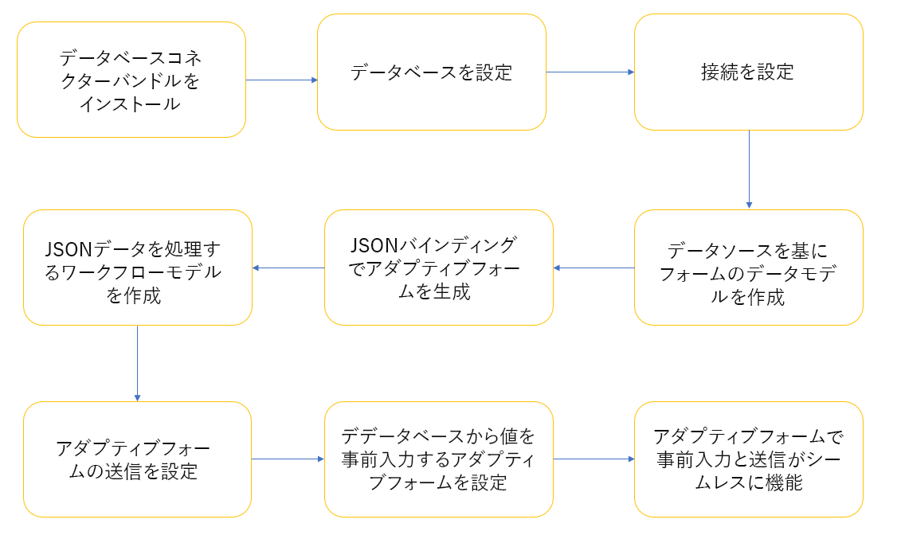
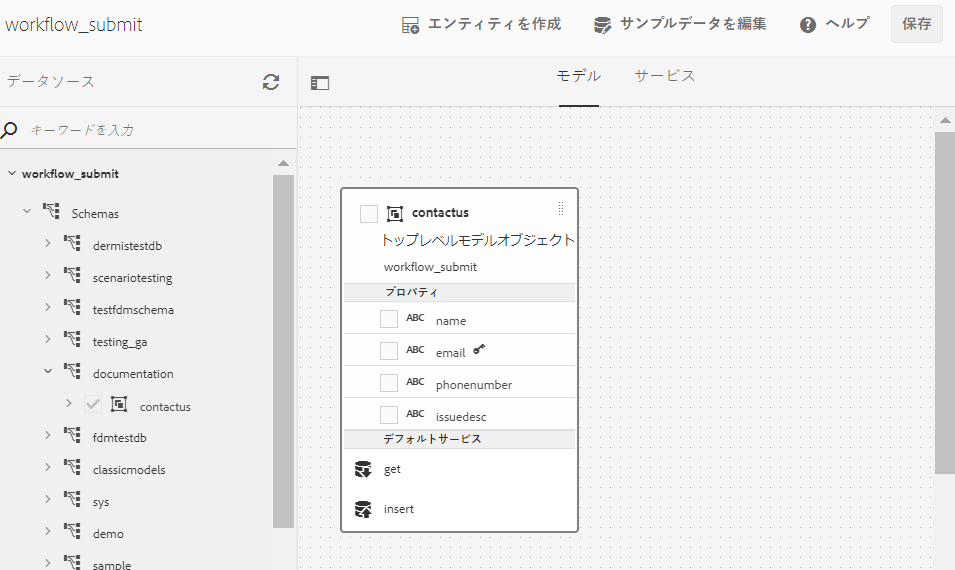
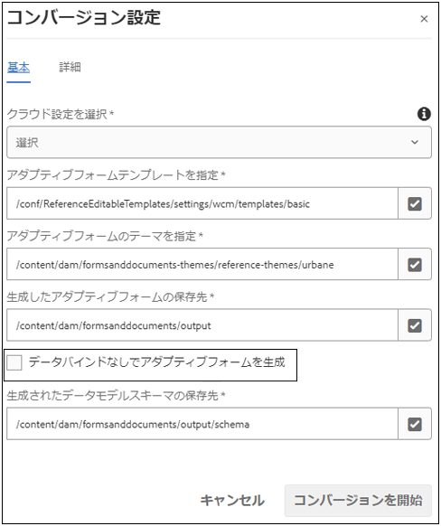
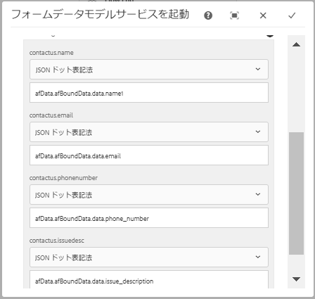
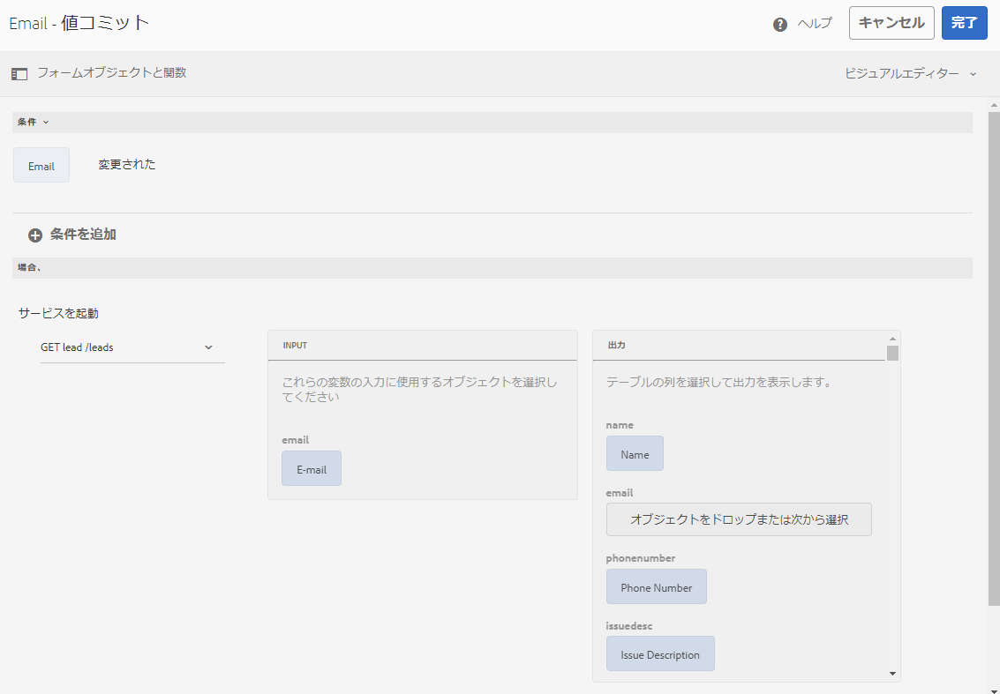

# AEM ワークフローを使用してアダプティブフォームをデータベースに統合 {#submit-forms-to-database-using-forms-portal}

自動フォーム変換サービス（AFCS）を使用すると、非インタラクティブ PDF フォーム、AcroForms、XFA ベースの PDF フォームをアダプティブフォームに変換できます。変換サービスを実行する際に、データバインディングを持つアダプティブフォームを生成するのか、データバインディングのないアダプティブフォームを生成するのかを指定することができます。

データバインディングがないアダプティブフォームを生成する場合は、変換処理の完了後に、フォームデータモデル、XML スキーマ、または JSON スキーマに、変換後のアダプティブフォームを統合することができます。 フォームデータモデルの場合、アダプティブフォームの各フィールドを、手動でフォームデータモデルにバインドする必要があります。 ただし、データバインディングを持つアダプティブフォームを生成すると、アダプティブフォームが自動的に JSON スキーマに関連付けられ、アダプティブフォームと JSON スキーマのフィールド間でデータバインディングが作成されます。 その後、任意のデータベースにアダプティブフォームを統合し、フォーム内のフィールドに値を設定して、データベースにフォームを送信することができます。 同様に、データベースとの統合後に、データベースから値を取得してアダプティブフォームフィールドにその値が事前に入力されるように、変換後のアダプティブフォームフィールドを設定することができます。

以下の図は、変換後のアダプティブフォームをデータベースに統合する手順をステージ別に示しています。



この記事では、これらの統合ステージを正しく実行するための手順について説明します。

## 前提条件 {#pre-requisites}

* バージョン 6.4 および 6.5 の AEM オーサーインスタンスのセットアップ
* AEM インスタンスの[最新のサービスパック](https://helpx.adobe.com/jp/experience-manager/aem-releases-updates.html)をインストールする
* 最新バージョンの AEM Forms アドオンパッケージ
* [自動フォーム変換サービス](configure-service.md)の設定
* データベースを設定します。 サンプルの実装環境では MySQL 5.6.24 データベースを使用しますが、変換後のアダプティブフォームは任意のデータベースに統合することができます。

## サンプルのアダプティブフォーム {#sample-adaptive-form}

AEM ワークフローを使用してこのユースケースを実行し、変換後のアダプティブフォームをデータベースに統合するには、以下のサンプル PDF ファイルが必要になります。

以下のリンクから、サンプルの「Contact Us」フォームをダウンロードしてください。

[ファイルを入手](assets/sample_contact_us_form.pdf)

PDF ファイルは、自動フォーム変換サービス（AFCS）への入力として機能します。自動フォーム変換サービスを実行すると、このファイルがアダプティブフォームに変換されます。 以下の画像は、PDF 形式のサンプルの「Contact Us」フォームを示しています。


## mysql-connector-java-5.1.39-bin.jar ファイルをインストール {#install-mysql-connector-java-file}

すべてのオーサーインスタンスとパブリッシュインスタンスで、次の手順を実行し、mysql-connector-java-5.1.39-bin.jar ファイルをインストールします。

1. `http://server:port/system/console/depfinder` にアクセスして com.mysql.jdbc パッケージを検索します。
1. 「次による書き出し」列で、パッケージがバンドルで書き出されているかどうかを確認します。パッケージがバンドルで書き出されていない場合は、先に進みます。
1. `http://server:port/system/console/bundles` に移動して「**[!UICONTROL Install/Update]**」をクリックします。
1. 「**[!UICONTROL ファイルを選択]**」をクリックし、mysql-connector-java-5.1.39-bin.jar を探して選択します。また、「**[!UICONTROL Start Bundle]**」チェックボックスと「**[!UICONTROL Refresh Packages]**」チェックボックスを選択します。
1. 「**[!UICONTROL Install]**」または「**[!UICONTROL Update]**」をクリックします。完了したら、サーバーを再起動します。
1. （Windows のみ）オペレーティングシステムのシステムファイアウォールをオフにします。

## フォームモデルのデータを準備 {#prepare-data-for-form-model}

AEM Forms のデータ統合機能により、複数の異なるデータソースを設定して接続することができます。変換サービスを使用してアダプティブフォームを生成したら、使用するデータモデル（XSD スキーマまたは JSON スキーマ）に応じてフォームモデルを定義します。 データベース、Microsoft Dynamics、またはその他のサードパーティ製サービスを使用して、フォームデータモデルを作成することができます。

このチュートリアルでは、MySQL データベースをデータソースとして使用してフォームデータモデルを作成します。 アダプティブフォーム内の有効なフィールドに基づいて、データベース内にスキーマを作成し、このスキーマに **contactus** というテーブルを追加します。


以下の DDL ステートメントを使用して、データベース内に **contactus** というテーブルを作成します。

```sql
CREATE TABLE `contactus` (
   `name` varchar(45) NOT NULL,
   `email` varchar(45) NOT NULL,
   `phonenumber` varchar(10) DEFAULT NULL,
   `issuedesc` varchar(1000) DEFAULT NULL,
   PRIMARY KEY (`email`)
 ) ENGINE=InnoDB DEFAULT CHARSET=utf8
```

## AEM インスタンスとデータベース間の接続を設定 {#configure-connection-between-aem-instance-and-database}

AEM インスタンスと MYSQL データベース間の接続を作成するには、以下の手順を実行します。

1. AEM Web コンソールの設定ページ（`http://server:port/system/console/configMgr`）に移動します。
1. Web コンソールの設定ページで、「**[!UICONTROL Apache Sling Connection Pooled DataSource]**」をクリックして編集モードで開きます。次の表の説明に従って、プロパティの値を指定します。

   <table> 
    <tbody> 
    <tr> 
    <th><strong>プロパティ</strong></th> 
    <th><strong>値</strong></th> 
    </tr> 
    <tr> 
    <td><p>データソース名</p></td> 
    <td><p>データソースプールからドライバーをフィルターするためのデータソース名。</p></td>
    </tr>
    <tr> 
    <td><p>JDBC ドライバークラス</p></td> 
    <td><p>com.mysql.jdbc.Driver</p></td>
    </tr>
    <tr> 
    <td><p>JDBC 接続 URI</p></td> 
    <td><p>jdbc:mysql://[host]:[port]/[schema_name]</p></td>
    </tr>
    <tr> 
    <td><p>ユーザー名</p></td> 
    <td><p>データベース表でのアクションを認証・実行するためのユーザー名</p></td>
    </tr>
    <tr> 
    <td><p>パスワード</p></td> 
    <td><p>ユーザー名に関連するパスワード</p></td>
    </tr>
    <tr> 
    <td><p>トランザクションの分離</p></td> 
    <td><p>READ_COMMITTED</p></td>
    </tr>
    <tr> 
    <td><p>最大アクティブ接続数</p></td> 
    <td><p>1000</p></td>
    </tr>
    <tr> 
    <td><p>最大アイドル接続数</p></td> 
    <td><p>100</p></td>
    </tr>
    <tr> 
    <td><p>最小アイドル接続数</p></td> 
    <td><p>10</p></td>
    </tr>
    <tr> 
    <td><p>初期サイズ</p></td> 
    <td><p>10</p></td>
    </tr>
    <tr> 
    <td><p>最大待機時間</p></td> 
    <td><p>100000</p></td>
    </tr>
     <tr> 
    <td><p>Test on Borrow</p></td> 
    <td><p>チェック</p></td>
    </tr>
     <tr> 
    <td><p>Test while Idle</p></td> 
    <td><p>チェック</p></td>
    </tr>
     <tr> 
    <td><p>検証クエリ</p></td> 
    <td><p>値の例：SELECT 1（mySQL）、select 1 from dual（Oracle）、SELECT 1（MS SQL Server）（validationQuery）</p></td>
    </tr>
     <tr> 
    <td><p>検証クエリタイムアウト</p></td> 
    <td><p>10000</p></td>
    </tr>
    </tbody> 
    </table>

## フォームデータモデルを作成 {#create-form-data-model}

MYSQL をデータソースとして設定したら、以下の手順を実行してフォームデータモデルを作成します。

1. AEM オーサーインスタンスで、**[!UICONTROL フォーム]**／**[!UICONTROL データ統合]**&#x200B;に移動します。

1. **[!UICONTROL 作成]**／**[!UICONTROL フォームデータモデル]**&#x200B;の順にタップします。

1. **[!UICONTROL フォームデータモデル作成]**&#x200B;ウィザードで、フォームデータモデルの名前として「**workflow_submit**」と入力します。 「**[!UICONTROL 次へ]**」をタップします。

1. 前のセクションで設定した MYSQL データソースを選択して「**[!UICONTROL 作成]**」をタップします。

1. 「**[!UICONTROL 編集]**」をタップして左側のウィンドウのデータソースを展開し、**contactus** テーブル、**[!UICONTROL get]** サービス、**[!UICONTROL insert]** サービスを選択して「**[!UICONTROL 選択項目を追加]**」をタップします。

   

1. 右側のウィンドウでデータモデルオブジェクトを選択して「**[!UICONTROL プロパティの編集]**」をタップします。 「**[!UICONTROL 読み取りサービス]**」ドロップダウンリストと「**[!UICONTROL 書き込みサービス]**」ドロップダウンリストで **[!UICONTROL get]** サービスと **[!UICONTROL insert]** サービスを選択します。 読み取りサービスの引数を指定して「**[!UICONTROL 完了]**」をタップします。

1. 「**[!UICONTROL サービス]**」タブで **[!UICONTROL get]** サービスを選択して「**[!UICONTROL プロパティの編集]**」をタップします。 「**[!UICONTROL 出力モデルオブジェクト]**」を選択し、「**[!UICONTROL 配列を返す]**」の切り替えを無効にして「**[!UICONTROL 完了]**」をタップします。

1. **[!UICONTROL Insert]** サービスを選択して「**[!UICONTROL プロパティの編集]**」をタップします。「**[!UICONTROL 入力モデルオブジェクト]**」を選択して「**[!UICONTROL 完了]**」をタップします。

1. 「**[!UICONTROL 保存]**」をタップして、フォームデータモデルを保存します。

以下のリンクから、サンプルのフォームデータモジュールをダウンロードしてください。

[ファイルを入手](assets/DownloadedFormsPackage_1497728018502500.zip)

## JSON バインディングを持つアダプティブフォームを生成 {#generate-adaptive-forms-with-json-binding}

[自動フォーム変換サービス（AFCS）](convert-existing-forms-to-adaptive-forms.md)を使用して、[お問い合わせフォーム](#sample-adaptive-form)をデータバインディング付きのアダプティブフォームに変換します。アダプティブフォームを生成する際に、「**[!UICONTROL データバインディングがないアダプティブフォームを生成]**」チェックボックスが無効になっていることを確認してください。



変換後の&#x200B;**「Contact Us」フォーム**&#x200B;を「**[!UICONTROL フォームとドキュメント]**」の **[!UICONTROL output]** フォルダーで選択して「**[!UICONTROL 編集]**」をタップします。 次に「**[!UICONTROL プレビュー]**」をタップし、アダプティブフォームフィールドに値を入力して「**[!UICONTROL 送信]**」をタップします。

**crx-repository** にログインして */content/forms/fp/admin/submit/data* に移動し、JSON 形式で送信された値を表示します。 変換後の「**Contact Us**」アダプティブフォームを送信すると、サンプルデータが以下のような JSON 形式になります。

```json
{
  "afData": {
    "afUnboundData": {
      "data": {}
    },
    "afBoundData": {
      "data": {
        "name1": "Gloria",
        "email": "abc@xyz.com",
        "phone_number": "2346578965",
        "issue_description": "Test message"
      }
    },
    "afSubmissionInfo": {
      "computedMetaInfo": {},
      "stateOverrides": {},
      "signers": {},
      "afPath": "/content/dam/formsanddocuments/docs_conversion/output/sample_form_json",
      "afSubmissionTime": "20191204014007"
    }
  }
}
```

このデータを処理するためのワークフローモデルを作成し、このワークフローモデルを、前のセクションで作成したフォームデータモデルを使用して MYSQL データベースに送信する必要があります。

## JSON データを処理するためのワークフローモデルを作成 {#create-workflow-model}

アダプティブフォームデータをデータベースに送信するためのワークフローモデルを作成するには、以下の手順を実行します。

1. ワークフローモデルコンソールを開きます。デフォルトの URL は `https://server:port/libs/cq/workflow/admin/console/content/models.html/etc/workflow/models` です。

1. 「**[!UICONTROL 作成]**」を選択してから、「**[!UICONTROL モデルを作成]**」を選択します。**[!UICONTROL ワークフローモデルを追加]**&#x200B;ダイアログが表示されます。

1. 「**[!UICONTROL タイトル]**」と「**[!UICONTROL 名前]**」（オプション）を入力します。例えば、「**workflow_json_submit**」などを入力します。 「**[!UICONTROL 完了]**」をタップしてモデルを作成します。

1. ワークフローモデルを選択して「**[!UICONTROL 編集を]**」タップします。選択したモデルが編集モードで開きます。 「+」をタップし、「**[!UICONTROL フォームデータモデルサービスを起動]**」ステップをワークフローモデルに追加します。

1. 「**[!UICONTROL フォームデータモデルサービスを起動]**」ステップをタップして「」をタップします。

1. 「**[!UICONTROL フォームデータモデル]**」タブで、「**[!UICONTROL フォームデータモデルのパス]**」フィールドで作成したフォームデータモデルを選択し、「**[!UICONTROL サービス]**」ドロップダウンリストで **[!UICONTROL insert]** サービスを選択します。

1. 「**[!UICONTROL サービスの入力]**」タブのドロップダウンリストで「**[!UICONTROL リテラル、変数またはワークフローメタデータ、および JSON ファイルを使用して入力データを指定]**」を選択し、「**[!UICONTROL 入力 JSON からのマップ入力フィールド]**」チェックボックスを選択して「**[!UICONTROL ペイロードを基準とする]**」を選択します。次に、「**次を使用して入力 JSON ドキュメントを選択**」フィールドの値として「**[!UICONTROL data.xml]**」を入力します。

1. 「**[!UICONTROL サービス引数]**」セクションで、フォームデータモデル引数の値として以下のように入力します。

   

   「contactus.name」などのフォームデータモデルフィールドは、**afData.afBoundData.data.name1** 変数にマップされます。この変数は、送信されたアダプティブフォームの JSON スキーマバインディングを参照します。

## アダプティブフォームの送信を設定 {#configure-adaptive-form-submission}

前のセクションで作成したワークフローモデルにアダプティブフォームを送信するには、以下の手順を実行します。

1. 変換後の「Contact Us」フォームを「**[!UICONTROL フォームとドキュメント]**」の **[!UICONTROL output]** フォルダーで選択して「**[!UICONTROL 編集]**」をタップします。

1. **[!UICONTROL フォームコンテナ]**／の順にタップしてアダプティブフォームのプロパティを開きます。

1. 「**[!UICONTROL 送信]**」セクションの&#x200B;**[!UICONTROL 送信アクション]**」ドロップダウンリストで「**[!UICONTROL AEM ワークフローを起動]**」を選択し、前のセクションで作成したワークフローモデルを選択して、「**[!UICONTROL データファイルのパス]**」フィールドに「**data.xml**」を入力します。

1. 「」をタップして、プロパティを保存します。

1. 次に「**[!UICONTROL プレビュー]**」をタップし、アダプティブフォームフィールドに値を入力して「**[!UICONTROL 送信]**」をタップします。 送信された値が、**crx-repository** ではなく、MYSQL データベーステーブルに表示されます。

## データベースの値が事前に入力されるようにアダプティブフォームを設定する

テーブル内で定義されたプライマリーキー（この場合はメールアドレス）に基づいて、MYSQL データベースの値が事前に入力されるようにアダプティブフォームを設定するには、以下の手順を実行します。

1. アダプティブフォームの「**メール**」フィールドをタップして「」をタップします。

1. 「**[!UICONTROL 作成]**」をタップし、「**[!UICONTROL When]**」セクションの「**[!UICONTROL 状態の選択]**」ドロップダウンリストで「**[!UICONTROL 変更済み]**」を選択します。

1. 「**[!UICONTROL Then]**」セクションで「**[!UICONTROL サービスを起動]**」を選択し、前のセクションで作成したフォームデータモデルのサービスとして「**get**」を選択します。

1. 「**入力**」セクションで「**[!UICONTROL メール]**」を選択し、「**[!UICONTROL 出力]**」セクションで、フォームデータモデルの残り 3 つのフィールド（「**名前**」、「**電話番号**」、「**問題の説明**」）を選択します。 「**[!UICONTROL 完了]**」をタップして、設定を保存します。

   

   これで、MYSQL データベース内の既存のメールエントリーに基づき、アダプティブフォームの「**[!UICONTROL プレビュー]**」モードで、残り 3 つのフィールドの値を事前に入力することができます。 例えば、「**メール**」フィールドで「aya.tan@xyz.com」と入力し（「[フォームモデルのデータを準備する](#prepare-data-for-form-model)」セクションの画像を参照）、Tab キーを使用してそのフィールドから離れると、残り 3 つのフィールド（「**名前**」、「**電話番号**」、「**問題の説明**」）がアダプティブフォームに自動的に表示されます。

以下のリンクから、サンプルの変換済みアダプティブフォームをダウンロードしてください。

[ファイルを入手](assets/DownloadedFormsPackage_1498226829041200.zip)
